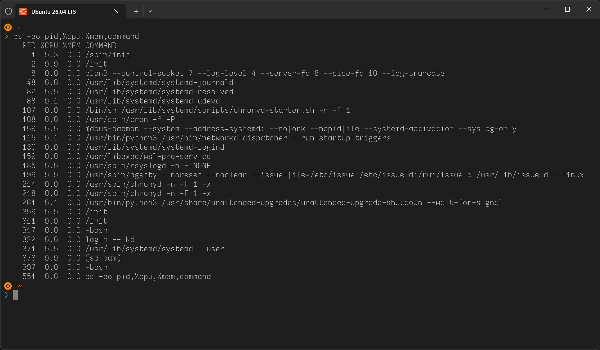
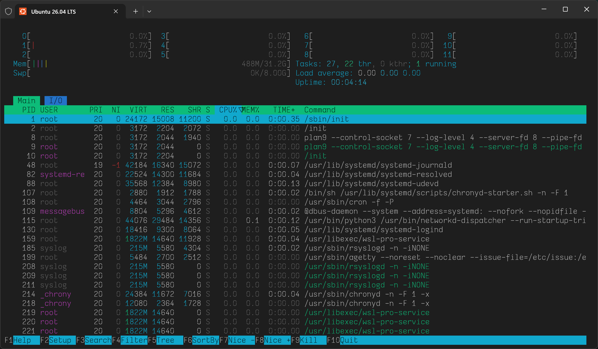
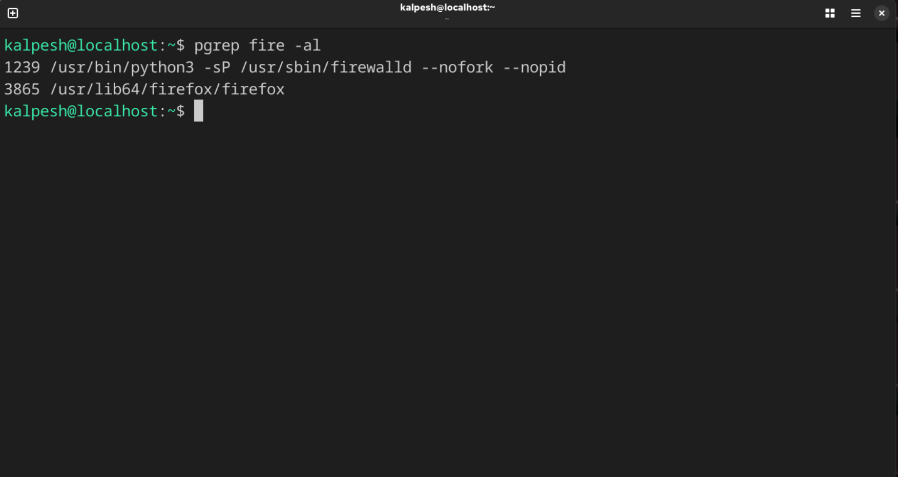
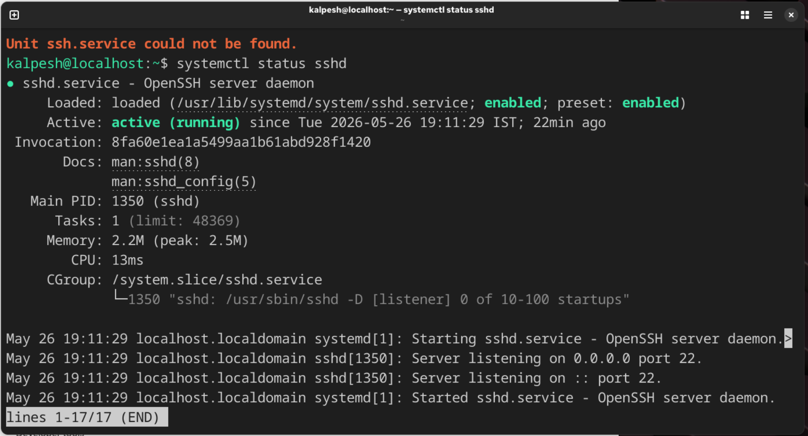
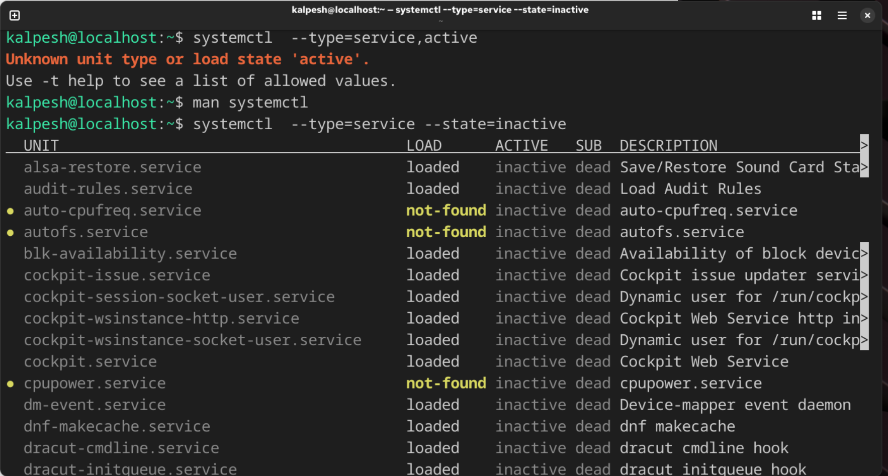
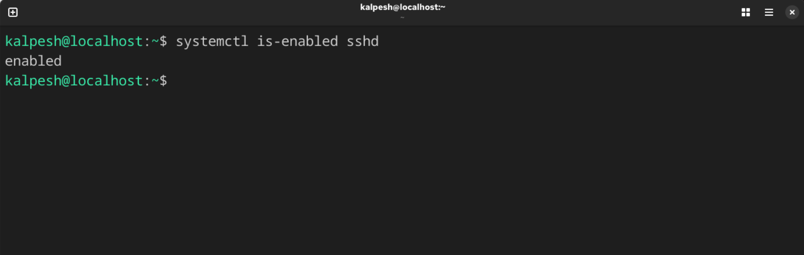
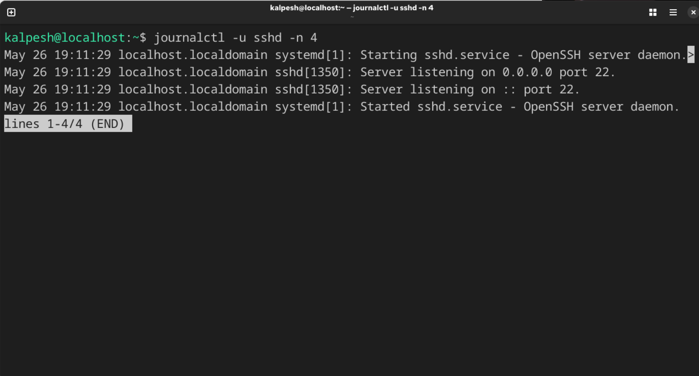
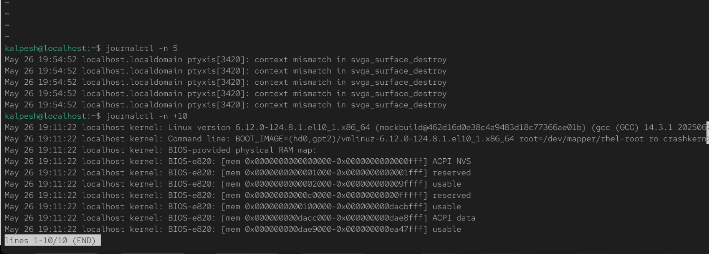
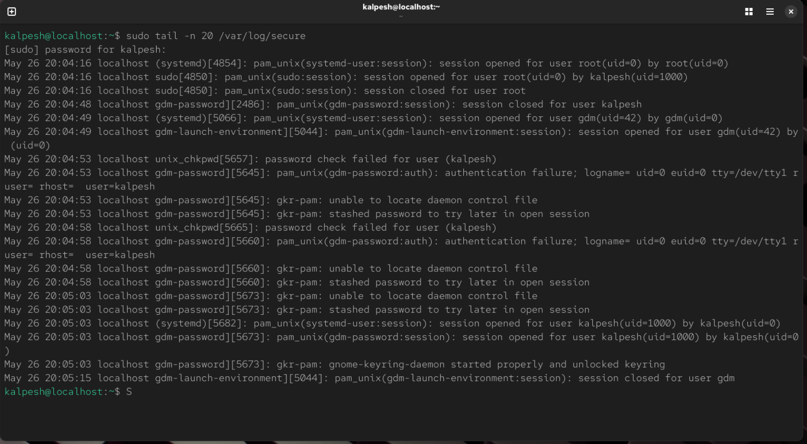

# Day04

### Process checks

1. `ps` - Display all running processes
   

2. `htop` - Interactive process viewer
   

3. `pgrep` - find process with and return pid
   

---

### Service checks

1. `systemctl` - check status of process `sshd`
   

2. `sytemctl --type=services --state=inactive` - list all inactive services
   

3. `systemstl -is-enabled sshd` - to check service is enabled to start on boot
   

---

### Log checks

1. `journalctl -u sshd -n 4` - view recent 4 ssh logs
   

2. `journalctl -n +10` - display oldest 10 logs if `+` removed then recent 10 logs
   

### Mini troubleshooting steps

`sudo tail -n 20 /var/log/secure` checked why user logon was failed in authentication log

