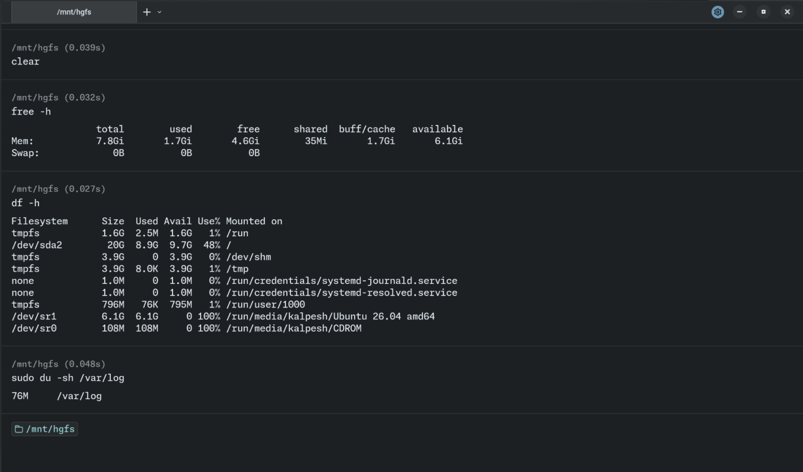
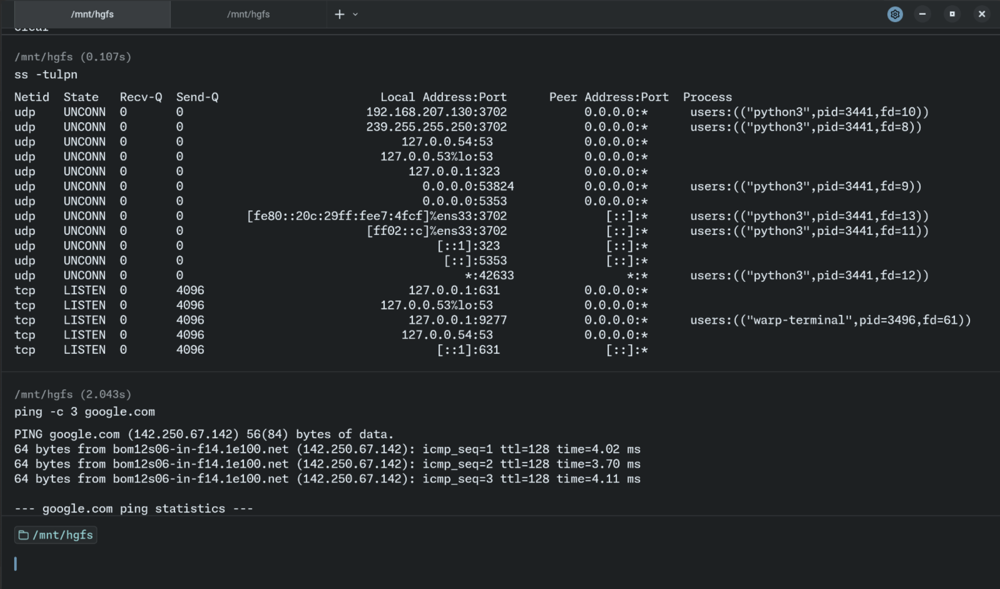
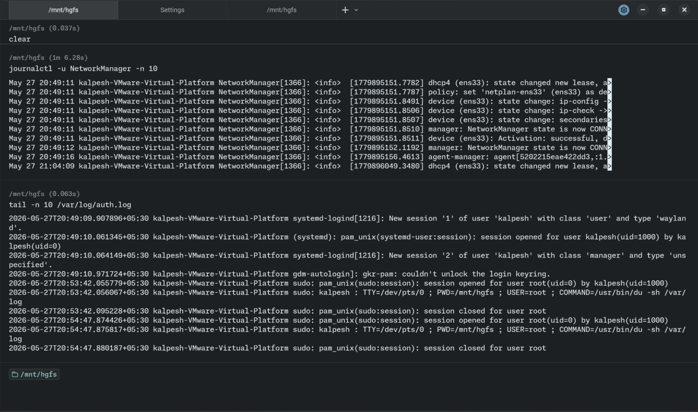

## Commands I have tried / practiced today

### Environment basics

1. `uname -a`
2. `lsb_release -a`
3. `cat /etc/os-release`

### Filesystem sanity

1. `mkdir /tmp/runbook-demo`
2. `cp /etc/hosts /tmp/runbook-demo && ls -l /tmp/runbook-demo/`

### CPU & memory

1. `pgrep ssh`
2. `ps -o pid,pcpu,pmem,comm -p 2289 2291`
3. `free -h`

### Disk & IO

1. `df -h`
2. `sudo du -sh /var/log`

### Network

1. `ss -tulpn`
2. `ping -c 3 google.com`

### LOGS

1. `journalctl -u NetworkManager -n 10`
2. `tail -n 10 /var/log/auth.log`

