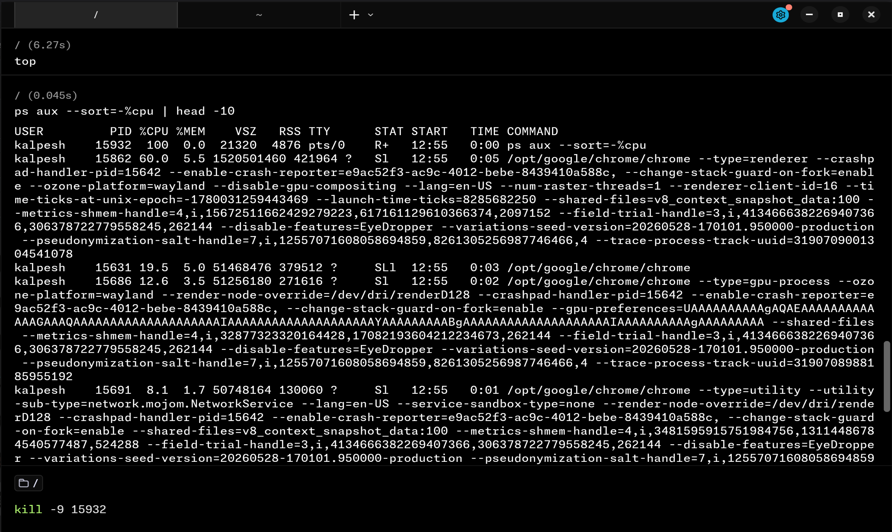
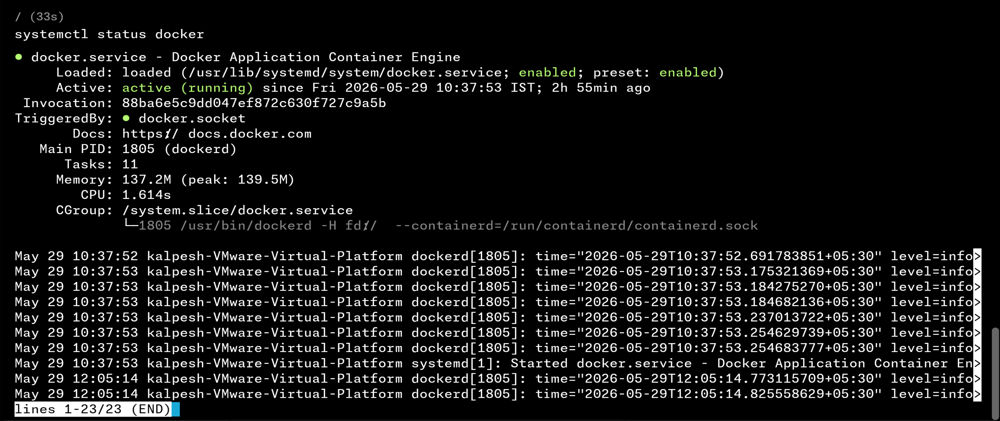
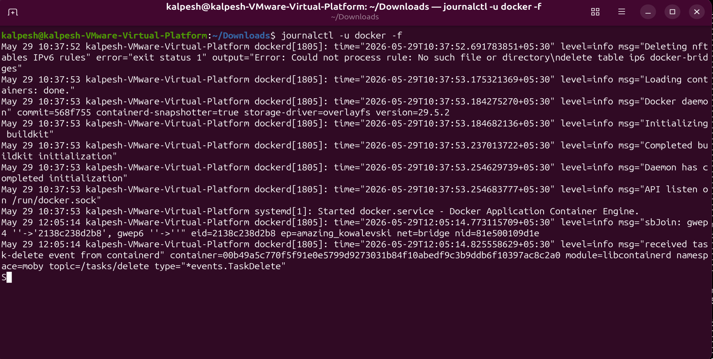
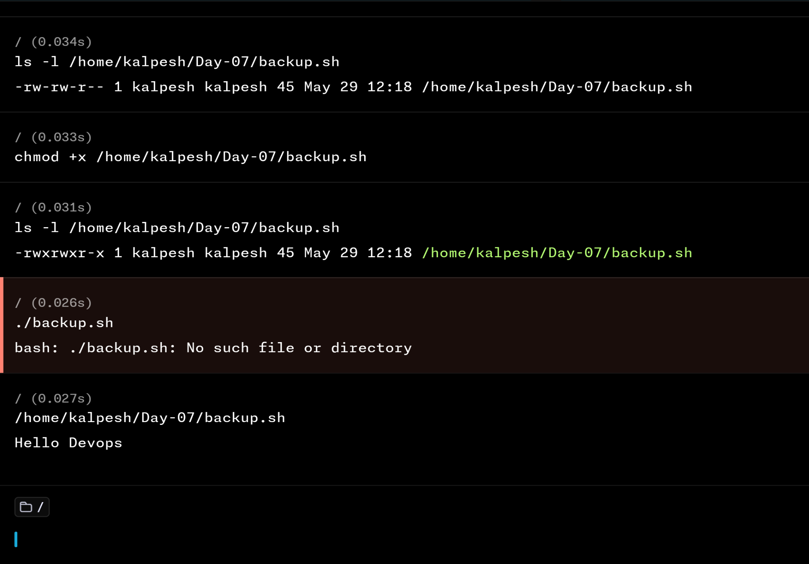

# Day 07 – Linux File System Hierarchy & Scenario-Based Practice

## Part 1: Linux File System Hierarchy

---

### Core Directories (Must Know)

#### `/` — Root

The starting point of the entire Linux filesystem. Every path begins here.  
**Command run:** `ls -l /`  
I would use this when navigating from scratch or tracing where an absolute path begins.

---

#### `/home` — User Home Directories

Contains personal directories for all regular users (e.g. `/home/username`).  
**Command run:** `ls -l /home`  
I would use this when managing user files or deploying app configs per user.

---

#### `/root` — Root User's Home

Home directory exclusively for the superuser (root) account.  
**Command run:** `ls -la /root`  
I would use this when logged in as root and storing admin-level scripts.

---

#### `/etc` — Configuration Files

Stores system-wide configuration files for the OS and installed applications.  
**Command run:** `ls -l /etc`  
I would use this when editing configs like `nginx.conf`, `/etc/hosts`, or `sshd_config`.

```bash
cat /etc/hostname
# Output: my-server (your machine's hostname)
```

---

#### `/var/log` — Log Files

Contains log files written by the OS, services, and applications. Most important directory for DevOps debugging.  
**Command run:** `ls -l /var/log`  
I would use this when an application crashes and I need to trace the error.

```bash
du -sh /var/log/* 2>/dev/null | sort -h | tail -5
# Shows the 5 largest log files — useful to spot which service logs the most
```

---

#### `/tmp` — Temporary Files

Stores temporary files used by running processes. Cleared automatically on reboot.  
**Command run:** `ls -l /tmp`  
I would use this when a script needs a short-lived working space.

---

### Additional Directories (Good to Know)

#### `/bin` — Essential Binaries

Contains core system commands available to all users: `ls`, `cat`, `echo`, `cp`, etc.  
I would use this when checking if a fundamental command exists on the system.

#### `/usr/bin` — User Command Binaries

Contains user-installed binaries like `git`, `python3`, `curl`, `wget`.  
I would use this when looking for where a tool is installed (`which git` → `/usr/bin/git`).

#### `/opt` — Optional/Third-Party Applications

Used for software not managed by the package manager — e.g. Jenkins, Grafana, custom tools.  
I would use this when manually installing third-party DevOps tools.

---

### Home Directory Check

```bash
ls -la ~
# Lists all files including hidden dotfiles like .bashrc, .bash_history, .ssh/
```

---

## Part 2: Scenario-Based Practice

---

### Scenario 1: Service Not Starting After Reboot

**Situation:** A web application service called `myapp` failed to start after a server reboot.

> **Note:** During practice, `myapp` did not exist on my system. Steps 2–4 are written as recommended practice — what I would do if the service was installed but still failing. This reflects real-world troubleshooting where you follow the full checklist regardless of what the first command returns.

**Step 1:** Check if the service is running or failed

```bash
systemctl status myapp
```

**Why:** Shows current state — active, failed, or stopped. Also shows recent log snippets inline.  
**Observation:** Since `myapp` is not installed, this returned `Unit myapp.service could not be found`. This is different from a "failed" state — it means the service was never installed or the name is wrong.

**Step 2:** Check if the service even exists on the system

```bash
systemctl list-units --type=service | grep -i myapp
```

**Why:** Lists all loaded services and filters for `myapp`. If nothing is returned, the service is not installed at all — not just stopped or failed.  
**Recommended practice:** Always run this when `systemctl status` returns "could not be found". It confirms whether the service exists or needs to be installed first.

**Step 3:** Read the last 50 lines of service logs

```bash
journalctl -u myapp -n 50
```

**Why:** Gives the exact error message from journald. This is where you find _why_ it failed.  
**Recommended practice:** If the service existed but was failing, this would show the exact error — missing config file, port conflict, permission issue, etc.

**Step 4:** Check if the service is added to startup/boot

```bash
systemctl is-enabled myapp
```

**Why:** Returns `enabled` or `disabled`. If disabled, the service will not start automatically after a reboot — even if you start it manually now.  
**Recommended practice:** Always check this. A service can be running right now but still not survive the next reboot if it was never enabled.

**What I learned:** Even when a service doesn't exist, always follow the full troubleshooting checklist:

- Is it running? → `systemctl status`
- Does it even exist? → `systemctl list-units`
- What do the logs say? → `journalctl -u`
- Is it added to startup? → `systemctl is-enabled`


---

### Scenario 2: High CPU Usage — Server Is Slow

**Situation:** Manager reports the server is slow. I SSH in to investigate.  
**Practice:** Used Chrome as the test process — opened Chrome, it went to high CPU usage, then terminated it using the steps below.

**Step 1:** Check live CPU usage

```bash
top
```

**Why:** Shows all processes sorted by CPU in real time. Note the PID of the top process. Press `q` to quit.  
**Observation:** Chrome appeared at the top of the list with high CPU percentage. The PID was visible in the first column.

**Step 2:** Get a sorted snapshot of top CPU consumers

```bash
ps aux --sort=-%cpu | head -10
```

**Why:** Non-live snapshot of the 10 highest CPU processes. Easier to read than `top` and useful for scripting.  
**Observation:** Chrome showed up at the top of this list as well, confirming it was the highest CPU consumer.

**Step 3:** Kill the process by PID

```bash
kill -9 <PID>
```

**Why:** Force-terminates a stuck or runaway process using its PID noted from the steps above.  
**Observation:** After running this with Chrome's PID, the Chrome process was terminated immediately.

**Step 4 (My observation):** Kill a process by name — no PID needed

```bash
pkill chrome
# or
killall chrome
```

**Why:** Both commands terminate all processes matching the given name without needing to find the PID manually. Faster when you already know the process name.  
**Difference:**

- `pkill chrome` — matches by partial name pattern
- `killall chrome` — matches exact process name

**What I learned:** `top` is for live investigation; `ps aux --sort=-%cpu` is better for logging or scripting. When you know the process name, `pkill` or `killall` is faster than finding the PID and running `kill -9` manually.



---

### Scenario 3: Finding Logs for the Docker Service

**Situation:** A developer asks "where are the logs for the docker service?"  
**Practice:** Ran all three commands. Used `docker run hello-world` to generate live log activity.

**Step 1:** Check service status (includes recent log snippet)

```bash
systemctl status docker
```



**Why:** Quick way to see if docker is running and get the last few log lines instantly.  
**Observation:** Output showed Docker was active and running, with a few recent log lines visible directly in the status output.

**Step 2:** View last 50 log lines via journald

```bash
journalctl -u docker -n 50
```

**Why:** systemd-managed services log to journald, not to `/var/log` files directly. `-n 50` limits output to 50 lines.  
**Observation:** Showed the last 50 log entries for the Docker service — including container start/stop events.

**Step 3:** Follow logs in real time

```bash
journalctl -u docker -f
```



**Why:** The `-f` flag streams new log lines as they are written — like `tail -f` but for systemd services. Press `Ctrl+C` to stop.  
**Observation:** While this command was running in one terminal, I ran `docker run hello-world` in another terminal. The new log entries generated by the hello-world container appeared live in the `journalctl -f` output in real time — exactly as they were written. This confirmed that `-f` truly follows logs as they happen.

**What I learned:** For any systemd service, logs live in `journalctl -u <service>`, not in `/var/log`. The `-f` flag is essential during live incidents — you can watch exactly what a service is doing as it happens.

---

### Scenario 4: File Permissions Issue — Script Won't Execute

**Situation:** Running `./backup.sh` returns `Permission denied`.

**Step 1:** Check current permissions

```bash
ls -l /home/user/backup.sh
```

**Output:**

```
-rw-r--r-- 1 user user 128 May 28 10:00 backup.sh
```

**Why:** No `x` (execute) bit in the permissions = file cannot be run as a script.

**Step 2:** Add execute permission

```bash
chmod +x /home/user/backup.sh
```

**Why:** Grants execute permission to owner, group, and others. This is the standard fix for "Permission denied" on scripts.

**Step 3:** Verify the fix

```bash
ls -l /home/user/backup.sh
```

**Output:**

```
-rwxr-xr-x 1 user user 128 May 28 10:00 backup.sh
```

**Why:** Confirm that `x` now appears in the permissions before running.

**Step 4:** Run the script

```bash
./backup.sh
```

**Why:** Should now execute without errors.

**What I learned:** `Permission denied` on a script almost always means missing execute bit. `chmod +x` is the fix. Always verify with `ls -l` before and after.

## 

## Key Takeaways

| Directory  | Purpose          | Used When                    |
| ---------- | ---------------- | ---------------------------- |
| `/etc`     | Config files     | Editing app/system config    |
| `/var/log` | Log files        | Debugging crashes or errors  |
| `/tmp`     | Temp files       | Short-lived script workspace |
| `/home`    | User directories | Managing user data           |
| `/opt`     | Third-party apps | Manual tool installations    |

**Troubleshooting flow to remember:**  
`status → logs → fix → verify`  
This works for almost every incident in production.

---
