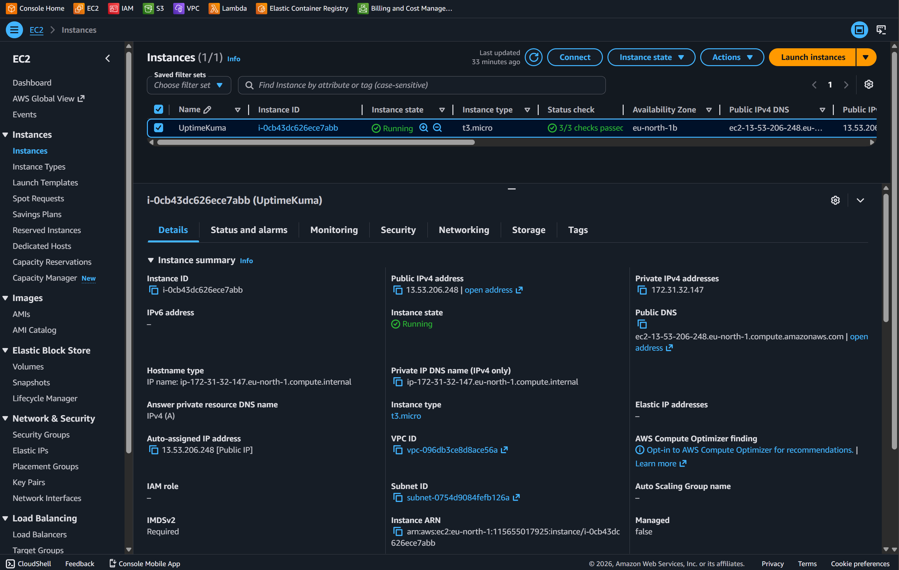
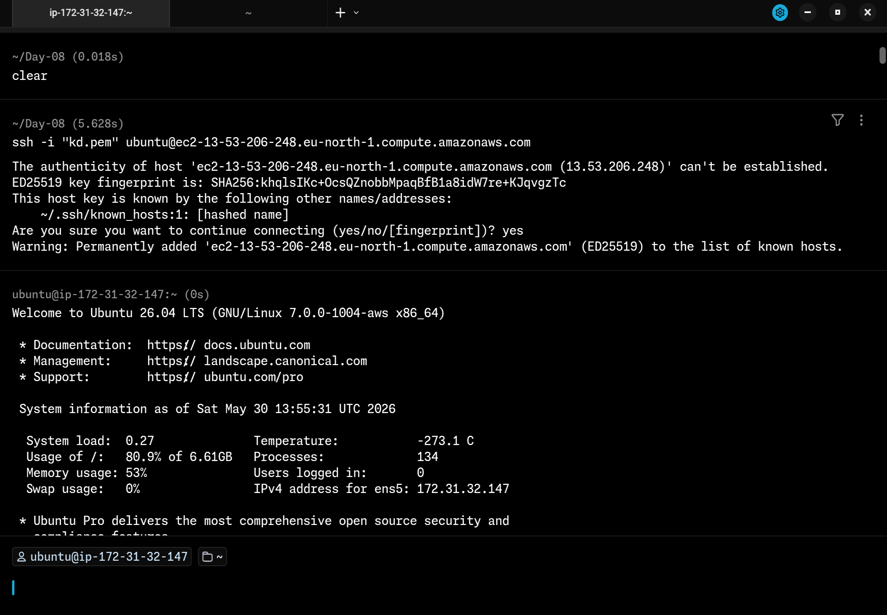
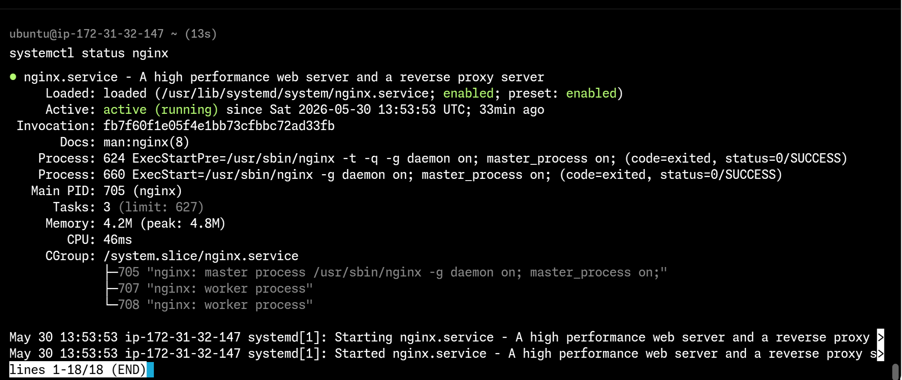
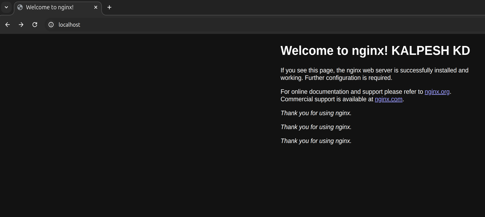
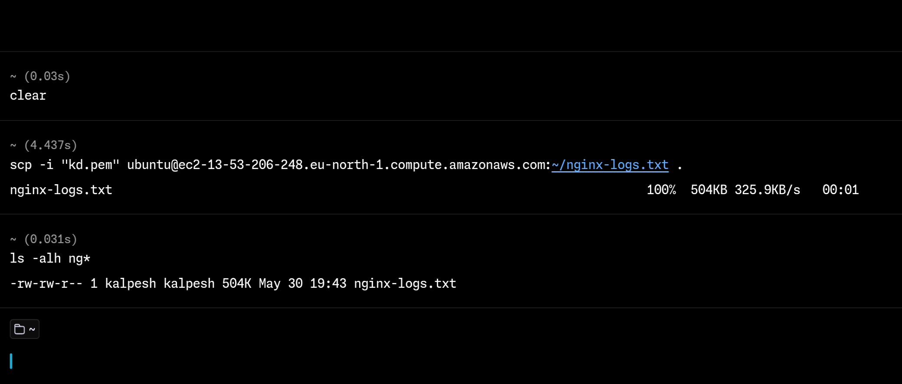

# Day 08 – Cloud Server Setup: Docker, Nginx & Web Deployment

## Environment

- Cloud Provider: AWS (EC2 Free Tier)
- OS: Ubuntu 26.04 LTS
- Instance Type: t2.micro

---

## Part 1: Launch Cloud Instance & SSH Access

### Task 1.1 — Create EC2 Instance

Launched a new EC2 instance on AWS Free Tier:

- AMI: Ubuntu 26.04 LTS
- Instance type: t3.micro (free tier eligible)
- Created a new key pair (kd.pem file) and downloaded it locally
- Noted the Public IPv4 address from the EC2 dashboard after launch



### Task 1.2 — Connect via SSH

Before connecting, fixed the permissions on the .pem key file. SSH refuses to connect if the key file is too open (world-readable).

```bash
chmod 400 kd.pem
ssh -i kd.pem ubuntu@<your-instance-ip>
```

**Observation:** `chmod 400` sets the key file to read-only for the owner only. Without this step, SSH throws a "Permissions are too open" error and refuses the connection. After setting permissions, SSH connected successfully.

## 

## Part 2: Install & Verify Nginx

### Task 2.1 — Update System Packages

```bash
sudo apt update && sudo apt upgrade -y
```

Updated the package index and upgraded all installed packages before installing anything new. Good practice to always do this first on a fresh server.

### Task 2.2 — Install Nginx

```bash
sudo apt install nginx -y
```

Nginx installed successfully. On Ubuntu, Nginx starts automatically after installation — no need to start it manually.

### Task 2.3 — Verify Nginx is Running

```bash
systemctl status nginx
```

**Observation:** Status showed `active (running)` confirming Nginx was up. This reuses the same `systemctl status` command practiced in Day 07 Scenario 1 — the troubleshooting skills are already connecting.



---

## Part 3: Security Group & Web Access

### Task 3.1 — Open Port 80 in Security Group

By default, AWS EC2 only allows port 22 (SSH). To serve web traffic, port 80 (HTTP) must be opened explicitly.

**Steps in AWS Console:**

1. EC2 → Instances → click instance → Security tab
2. Click the Security Group link
3. Edit Inbound Rules → Add Rule
4. Type: HTTP | Protocol: TCP | Port: 80 | Source: 0.0.0.0/0
5. Save rules

**Test:**
Opened browser and visited `http://<your-instance-ip>` — Nginx welcome page loaded successfully.

**Observation:** The security group acts as a cloud-level firewall. Even though Nginx was running, the page was not accessible until port 80 was explicitly opened. This is an important security concept — least privilege by default.



---

## Part 4: Extract & Save Nginx Logs

### Task 4.1 — View Nginx Logs

Nginx stores logs in `/var/log/nginx/`. When I listed the directory I found four files:

```bash
ls -lh /var/log/nginx/
```

```
access.log
access.log.1
error.log
error.log.1
```

**Observation:** `access.log` and `error.log` were empty. The actual log content was in `access.log.1` and `error.log.1`. This is because of **log rotation** — Linux automatically archives the current log file (renaming it to `.1`) and creates a fresh empty file. This prevents log files from growing indefinitely. The `.1` files contained the actual HTTP request entries.

```bash
sudo cat /var/log/nginx/access.log.1
sudo cat /var/log/nginx/error.log.1
```

### Task 4.2 — Save Logs to File

Combined both log files into a single `nginx-logs.txt` file using redirection — skills from Day 06 applied directly here:

```bash
sudo cat /var/log/nginx/access.log.1 > ~/nginx-logs.txt
sudo cat /var/log/nginx/error.log.1 >> ~/nginx-logs.txt
```

- `>` to create the file and write the access log
- `>>` to append the error log without overwriting

**Verified the file was created:**

```bash
cat ~/nginx-logs.txt
```

### Task 4.3 — Download Log File via scp

Ran this from a new terminal on my **local machine** (not the server):

```bash
scp -i kd.pem ubuntu@ec2-13-53-206-248.eu-north-1.compute.amazonaws.com>:~/nginx-logs.txt .
```

**Observation:** `scp` works exactly like `ssh` but transfers files instead of opening a shell. The `.` at the end means "copy to current local directory". File downloaded successfully.



---

## Commands Used

| Command                                      | Purpose                                    |
| -------------------------------------------- | ------------------------------------------ |
| `chmod 400 kd.pem`                           | Set secure permissions on SSH key          |
| `ssh -i your-key.pem ubuntu@<instance-ip>`   | Connect to EC2 instance via SSH            |
| `sudo apt update && sudo apt upgrade -y`     | Update system packages                     |
| `sudo apt install nginx -y`                  | Install Nginx web server                   |
| `systemctl status nginx`                     | Verify Nginx is running                    |
| `ls -lh /var/log/nginx/`                     | List nginx log files with sizes            |
| `sudo cat /var/log/nginx/access.log.1`       | View access logs                           |
| `sudo cat /var/log/nginx/error.log.1`        | View error logs                            |
| `>` and `>>`                                 | Write and append logs to file              |
| `scp -i key.pem user@ec2-instance-ip:file .` | Download file from server to local machine |

---

## Key Learnings

- AWS Security Groups act as a cloud firewall — ports must be explicitly opened. Nginx was running but unreachable until port 80 was added to the inbound rules.
- SSH key permissions matter — `chmod 400` is required before connecting. A key that is too open is rejected by SSH as a security measure.
- Log rotation is automatic — active log files may be empty while the real content is in `.log.1`. Always run `ls -lh /var/log/<service>/` first to see which files have content.
- `scp` extends SSH for file transfer — same key, same syntax, but copies files instead of opening a shell.
- Skills connect across days — `systemctl status` from Day 07 and `>` / `>>` redirection from Day 06 were used directly in today's tasks.

---

## Challenges Faced

No major blockers encountered. One discovery worth noting: initially ran `cat` on `access.log` and `error.log` and got empty output. Investigated by listing the full `/var/log/nginx/` directory with `ls -lh` and found the actual logs were in the `.1` rotated files. Switched to those files and got the expected content.

---
