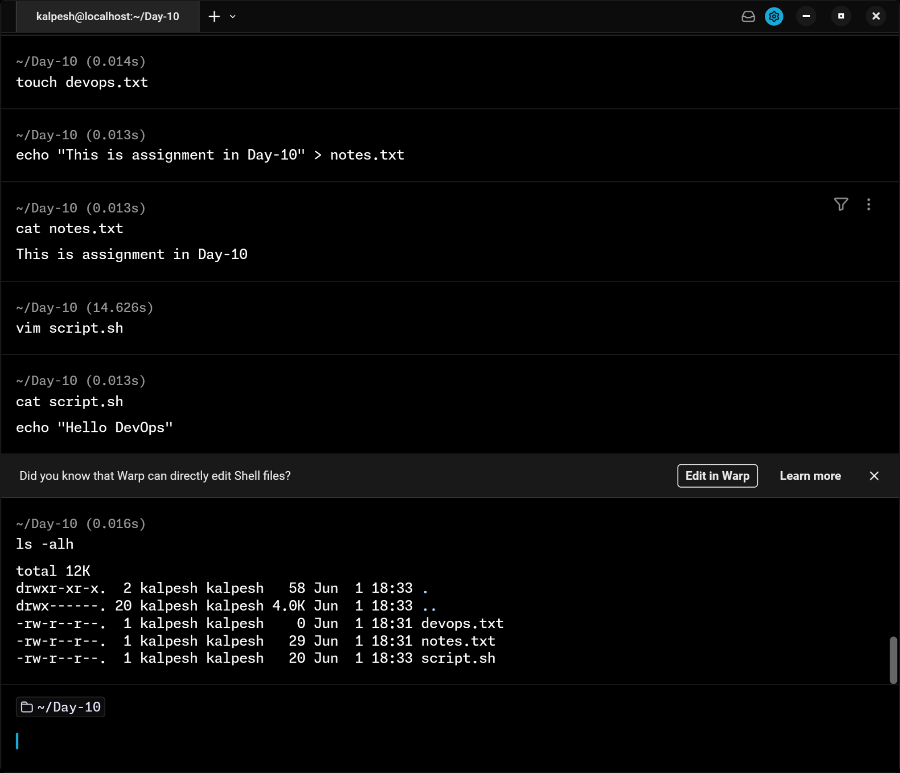

# Day 10 – File Permissions & File Operations Challenge

## Files Created

| File         | Created Using           |
| ------------ | ----------------------- |
| `devops.txt` | `touch`                 |
| `notes.txt`  | `echo` with redirection |
| `script.sh`  | `vim`                   |
| `project/`   | `mkdir` with `-m` flag  |

---

## Task 1: Create Files

**devops.txt — empty file:**

```bash
touch devops.txt
```

Creates an empty file instantly. If the file already exists, it only updates the timestamp — nothing is overwritten.

**notes.txt — file with content:**

```bash
echo "Day 10: Learning file permissions" > notes.txt
```

`>` creates the file and writes the content. From Day 06 — redirection in action.

**script.sh — using vim:**

```bash
vim script.sh
```

Inside vim:

```
Press i                   → enter insert mode
Type: echo "Hello DevOps"
Press Esc                 → exit insert mode
Type: :wq                 → save and quit
```

Vim has two modes — command mode (default, for navigation) and insert mode (for typing). You can only type content in insert mode. `:wq` = write + quit.

**Verify all files:**

```bash
ls -l devops.txt notes.txt script.sh
```

---

## Task 2: Read Files

```bash
cat notes.txt
```

Prints full file content to terminal.

```bash
vim -R script.sh
```

Opens the file in vim read-only mode. Any attempt to save is blocked. Useful for safely inspecting files without risk of accidental edits. Press `:q` to quit.

```bash
head -n 5 /etc/passwd
tail -n 5 /etc/passwd
```

`head` shows the first 5 lines, `tail` shows the last 5 lines. `/etc/passwd` stores one entry per user — useful for verifying users exist on the system (practiced in Day 09).

---

## Task 3: Understanding Default Permissions

```bash
ls -l devops.txt notes.txt script.sh
```

Output:

```
-rw-r--r-- 1 ubuntu ubuntu    0 ... devops.txt
-rw-r--r-- 1 ubuntu ubuntu   35 ... notes.txt
-rw-r--r-- 1 ubuntu ubuntu   20 ... script.sh
```

**Default permission for newly created files is `644`:**

```
rw-  r--  r--
6    4    4

owner : rw- = 4+2+0 = 6  → read + write
group : r-- = 4+0+0 = 4  → read only
others: r-- = 4+0+0 = 4  → read only
```

No file has the `x` (execute) bit set by default. This is why running `./script.sh` at this stage would give "Permission denied" — files are not executable unless explicitly set.

---

## Task 4: Modify Permissions

### 4.1 — Make script.sh executable

```bash
chmod +x script.sh
./script.sh
```

Output:

```
Hello DevOps
```

After `chmod +x`, `ls -l script.sh` shows `-rwxr-xr-x` — the `x` bit is now set. The script ran successfully and printed the expected output.

**Verify:**

```bash
ls -l script.sh
```

```
-rwxr-xr-x 1 ubuntu ubuntu 20 ... script.sh
```

---

### 4.2 — Make devops.txt read-only

```bash
chmod -w devops.txt
```

Or using octal:

```bash
chmod 444 devops.txt
```

**Verify:**

```bash
ls -l devops.txt
```

```
-r--r--r-- 1 ubuntu ubuntu 0 ... devops.txt
```

No `w` anywhere — fully read-only for owner, group, and others.

---

### 4.3 — Set notes.txt to 640

```bash
chmod 640 notes.txt
```

**Verify:**

```bash
ls -l notes.txt
```

```
-rw-r----- 1 ubuntu ubuntu 35 ... notes.txt
```

Permission `640` breakdown:

```
owner : rw- = 6  → read + write
group : r-- = 4  → read only
others: --- = 0  → no access at all
```

**Observation:** A permission of `0` for others means they cannot read, write, view, or interact with the file in any way. This is commonly used for sensitive config files — only the owner and their group should ever access them.

---

### 4.4 — Create directory project/ with 755

**Method 1 — two separate commands:**

```bash
mkdir project
chmod 755 project
```

**Method 2 — create with permissions in one command using `-m`:**

```bash
mkdir -m 755 project
```

The `-m` flag sets permissions at creation time — no need for a separate `chmod` step. Cleaner and safer in scripts since the directory never exists momentarily with wrong permissions.

**Verify:**

```bash
ls -ld project/
```

```
drwxr-xr-x 2 ubuntu ubuntu 4096 ... project/
```

Permission `755` breakdown:

```
owner : rwx = 7  → full access
group : r-x = 5  → read + enter only
others: r-x = 5  → read + enter only
```

`755` is the standard permission for directories — owner has full control, everyone else can read and navigate into it but cannot create or delete files inside.

---

## Task 5: Testing Permissions — Error Messages

### Test 1 — write to a read-only file:

```bash
echo "test" >> devops.txt
```

Error:

```
-bash: devops.txt: Permission denied
```

### Test 2 — execute a file without execute permission:

```bash
./noexec.sh
```

Error:

```
-bash: ./noexec.sh: Permission denied
```

**Observation:** Both tests give the same "Permission denied" error — but for different reasons. The first is a missing write (`w`) bit, the second is a missing execute (`x`) bit. The error message alone doesn't tell you which bit is missing. Always run `ls -l` first to check the actual permissions before trying to diagnose the issue.

---

## Commands Reference

| Command              | Purpose                                       |
| -------------------- | --------------------------------------------- |
| `touch filename`     | Create an empty file                          |
| `echo "text" > file` | Create file with content                      |
| `vim file`           | Create or edit file in vim                    |
| `vim -R file`        | Open file in vim read-only mode               |
| `cat file`           | Read full file content                        |
| `head -n 5 file`     | Read first 5 lines                            |
| `tail -n 5 file`     | Read last 5 lines                             |
| `ls -l`              | List files with permissions                   |
| `chmod +x file`      | Add execute permission                        |
| `chmod -w file`      | Remove write permission                       |
| `chmod 644 file`     | Set rw-r--r-- permissions                     |
| `chmod 640 file`     | Set rw-r----- permissions                     |
| `chmod 444 file`     | Set read-only for all                         |
| `chmod 755 dir`      | Set standard directory permissions            |
| `mkdir -m 755 dir`   | Create directory with permissions in one step |

---

## Key Learnings

- Default permission for newly created files is `644` (`rw-r--r--`) — owner can read and write, group and others can only read. No execute bit is set by default on any file.
- `chmod` can be used two ways — symbolic (`+x`, `-w`) for quick relative changes, or octal (`755`, `640`) for setting exact permissions. Octal is more precise and preferred in scripts.
- Permission `0` for others (as in `640`) means completely no access — they cannot read, write, or even view the file exists from a permission standpoint.
- Both "write to read-only file" and "execute without permission" return the same "Permission denied" error. The error gives no hint about which bit is missing — always use `ls -l` to diagnose before acting.
- `mkdir -m 755 dirname` creates a directory and sets its permissions in one command, avoiding a separate `chmod` step. Useful in scripts where the directory should never exist with incorrect permissions even briefly.
- Vim has two modes — insert mode (`i` to enter) for typing content, and command mode (`Esc` to return) for navigation and saving. `:wq` saves and quits, `:q!` discards changes and quits.

---

> Some Screenshots

---

## 

## 

## 

_Day 10 of #90DaysOfDevOps — TrainWithShubham_
