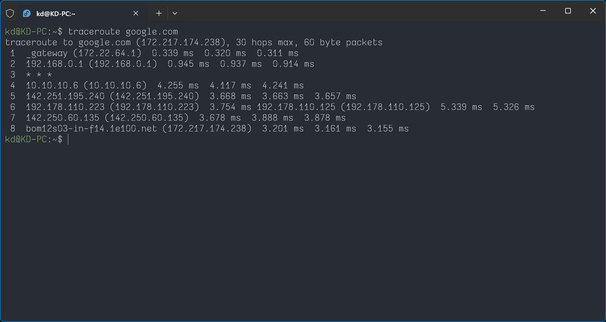

# Day 14 – Networking Fundamentals & Hands-on Checks

## Target Host

`google.com` and `trainwithshubham.com` — used consistently across all checks.

---

## Concepts: OSI vs TCP/IP

### OSI Model (7 layers)

| Layer | Name         | Protocols / Examples   |
| ----- | ------------ | ---------------------- |
| 7     | Application  | HTTP, HTTPS, DNS, SSH  |
| 6     | Presentation | TLS/SSL, encoding      |
| 5     | Session      | Session management     |
| 4     | Transport    | TCP, UDP, ports        |
| 3     | Network      | IP, ICMP, routing      |
| 2     | Data Link    | Ethernet, MAC          |
| 1     | Physical     | Cables, signals, Wi-Fi |

### TCP/IP Stack (4 layers)

| Layer | Name        | Maps to OSI |
| ----- | ----------- | ----------- |
| 4     | Application | L5–L7       |
| 3     | Transport   | L4          |
| 2     | Internet    | L3          |
| 1     | Link        | L1–L2       |

### Real example

`curl https://google.com` = Application (HTTPS + DNS) → Transport (TCP port 443) → Internet (IP routing) → Link (Ethernet/Wi-Fi)

---

## Part 1: Identity & Reachability

### Check IP address

```bash
hostname -I
ip addr show
```


### Ping — reachability and latency

```bash
ping -c 5 google.com
```


**Observation:** `ping` gives live connectivity status — shows latency in ms and packet loss percentage per packet. Fastest way to know if a host is reachable. Uses ICMP at the Network layer (L3).

---

## Part 2: Path & Ports

### Traceroute — network path

```bash
traceroute google.com
```



**Observation:** Traceroute did not work on this VMware session due to NAT — ICMP probes are blocked at the NAT boundary and cannot map hops beyond the VM's gateway. This is expected behaviour in a NAT-based VM setup, not a network fault.

**Workaround attempted:**

```bash
traceroute -T -p 80 google.com
```

`-T` uses TCP instead of ICMP, which sometimes bypasses NAT restrictions.

### Listening ports

```bash
ss -tulpn
```


**Observation:** Several ports found listening on the RHEL VM:

- Port 22 — SSH
- Port 631 — CUPS (print service)
- Port 5353 — mDNS (multicast DNS)
- Port 323 — chronyd (time sync)

Both TCP and UDP services were visible. `ss -tulpn` is the modern replacement for `netstat -tulpn`.

---

## Part 3: DNS & HTTP

### DNS resolution

```bash
dig google.com
dig trainwithshubham.com
nslookup google.com
```

**Observation:** Both `google.com` and `trainwithshubham.com` resolved successfully. The ANSWER SECTION showed the A record (IPv4 address) for each domain. DNS operates at the Application layer (L7) — if this fails, no other domain-based command will work.


### HTTP response headers

```bash
curl -I https://google.com
curl -I https://www.google.com
```


**Observation:** `curl -I https://google.com` returns `301 Moved Permanently` — redirecting to `www.google.com`. Running `curl -I https://www.google.com` directly returns `200 OK`, skipping the redirect entirely. Key headers observed:

- `Server: gws` — Google Web Server
- `Content-Security-Policy-Report-Only` — security headers
- `Set-Cookie` — session cookies with expiry
- `X-Frame-Options: SAMEORIGIN` — clickjacking protection

Status codes: 200 = OK, 301 = permanent redirect, 302 = temporary redirect, 403 = forbidden, 404 = not found, 500 = server error.

---

## Part 4: Connections Snapshot & Port Probe

### Active connections snapshot

```bash
netstat -an | head -20
netstat -an | grep ESTABLISHED | wc -l
netstat -an | grep LISTEN | wc -l
```


**Observation:** LISTEN = port is open waiting for connections. ESTABLISHED = active connection in progress. `wc -l` counts the number of matching lines.

### Port probe

```bash
nc -zv localhost 22
nc -zv <ec2-public-ip> 80
```


**Observation:** `nc -zv localhost 80` returned "Connection refused" — Nginx is not running on the local RHEL VM, it is installed on the AWS EC2 instance from Day 08. Port 22 (SSH) succeeded locally as expected. To test Nginx, the EC2 public IP must be used.

---

## Reflection

**Q1 — Which command gives the fastest signal when something is broken?**

`ping` — it gives live connectivity status immediately. Each line shows latency and whether the packet was received. Zero output or 100% packet loss = host is unreachable. It's the first command to run in any network incident.

**Q2 — Which layer do you inspect if DNS fails? If HTTP 500 shows up?**

- DNS failure → Application layer (L7). Run `dig` or `nslookup` to check if the domain resolves. If it doesn't, the problem is in DNS configuration or the DNS server itself — not routing or the service.
- HTTP 500 → Application layer (L7). The network path is fine (HTTP response was received), but the server-side application failed. Next step is to check application logs with `journalctl -u servicename` or `tail -f /var/log/app.log`.

**Q3 — Two follow-up commands in a real network incident:**

```bash
traceroute <target>     # find where the path breaks
ip addr show            # verify your own IP and interface are up
```

---

## Commands Reference

| Command            | Purpose                         | Layer |
| ------------------ | ------------------------------- | ----- |
| `hostname -I`      | Show machine IP                 | L3    |
| `ip addr show`     | Show all interfaces             | L3    |
| `ping -c 5 host`   | Check reachability and latency  | L3    |
| `traceroute host`  | Trace network path hop by hop   | L3    |
| `ss -tulpn`        | List all listening ports        | L4    |
| `netstat -an`      | Snapshot all connections        | L4    |
| `nc -zv host port` | Test if a specific port is open | L4    |
| `dig domain`       | Resolve domain to IP            | L7    |
| `nslookup domain`  | Alternative DNS lookup          | L7    |
| `curl -I url`      | Check HTTP response headers     | L7    |

---

## Key Learnings

- Mapping commands to OSI layers makes troubleshooting systematic — start at L3 (ping), move to L4 (ss/nc), then L7 (dig/curl). Each layer narrows down where the fault is.
- `curl -I https://google.com` returns `301` while `curl -I https://www.google.com` returns `200` — both are correct. The first redirects, the second is the final destination. Status codes tell the real story, not just success or failure.
- Traceroute fails in VMware NAT setups because ICMP probes are blocked at the NAT boundary. Using `-T` flag (TCP mode) can sometimes bypass this. Understanding environment constraints is part of real-world troubleshooting.
- `nc -zv localhost 80` returning "Connection refused" is not a bug — it means Nginx is on the EC2 server, not the local VM. Always know which machine a service is running on before testing a port.
- DNS is always the first application-layer check. If `dig` fails, `curl`, `ping hostname`, and `traceroute hostname` will all fail too — the IP can't be resolved.

---

_Day 14 of #90DaysOfDevOps — TrainWithShubham_
