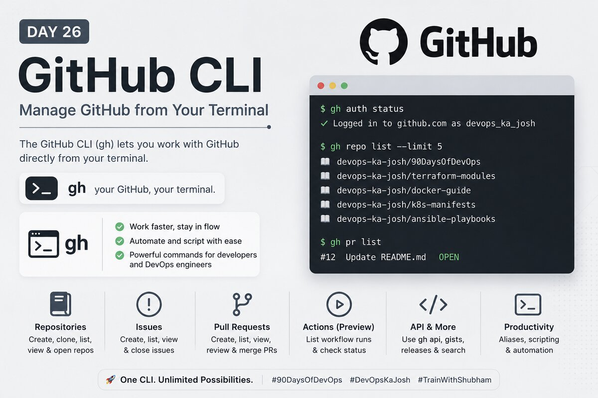

# Day 26 – GitHub CLI: Manage GitHub from Your Terminal

## What is `gh`?

GitHub CLI (`gh`) is the official command-line tool for interacting with the **GitHub platform** — not just Git. While `git` handles local repo operations and the remote Git protocol, `gh` talks to GitHub's API: issues, pull requests, Actions, releases, and more.

| Tool  | Talks to                                                |
| ----- | ------------------------------------------------------- |
| `git` | Local repo + remote Git protocol                        |
| `gh`  | GitHub platform (PRs, issues, Actions, gists, releases) |

---

## Task 1: Install and Authenticate

### Installation (Ubuntu/Debian)

```bash
(type -p wget >/dev/null || (sudo apt update && sudo apt install wget -y)) \
  && sudo mkdir -p -m 755 /etc/apt/keyrings \
  && wget -qO- https://cli.github.com/packages/githubcli-archive-keyring.gpg \
     | sudo tee /etc/apt/keyrings/githubcli-archive-keyring.gpg > /dev/null \
  && sudo chmod go+r /etc/apt/keyrings/githubcli-archive-keyring.gpg \
  && echo "deb [arch=$(dpkg --print-architecture) signed-by=/etc/apt/keyrings/githubcli-archive-keyring.gpg] https://cli.github.com/packages stable main" \
     | sudo tee /etc/apt/sources.list.d/github-cli.list > /dev/null \
  && sudo apt update && sudo apt install gh -y

gh --version
```

### Authentication

```bash
gh auth login
# GitHub.com → SSH → select existing key → Login with browser

gh auth status   # verify active account
```

### Authentication methods `gh` supports

- **Browser (OAuth)** — opens github.com, pastes a one-time code
- **Token (PAT)** — `gh auth login --with-token` → paste a Personal Access Token
- **SSH** — uses your SSH key for Git operations
- **GitHub Enterprise** — same methods against a self-hosted GHE instance

---

## Task 2: Working with Repositories

```bash
# Create a new public repo with README
gh repo create devops-gh-test --public --add-readme --description "Day 26 GitHub CLI test"

# Clone using gh (uses your auth, defaults to SSH)
gh repo clone <username>/devops-gh-test

# View repo details
gh repo view <username>/devops-gh-test

# List all your repos
gh repo list
gh repo list --limit 20 --json name,visibility,updatedAt

# Open in browser
gh repo view <username>/devops-gh-test --web

# Delete the test repo
gh repo delete <username>/devops-gh-test --yes
```

**Observation:** `gh repo clone` is functionally similar to `git clone` but uses your GitHub auth automatically — no SSH URL copying needed.

---

## Task 3: Issues

```bash
# Create an issue
gh issue create \
  --title "Day 26: Test issue via GitHub CLI" \
  --body "Created using gh CLI as part of 90 Days of DevOps." \
  --label "documentation"

# List all open issues
gh issue list

# View a specific issue
gh issue view 1

# Close an issue
gh issue close 1

# Verify
gh issue list --state closed
```

### How `gh issue` can be used in automation

```bash
# Auto-create a bug report from a script
gh issue create \
  --title "Build failed on $(date +%Y-%m-%d)" \
  --body "Pipeline failed at $(date). Check logs." \
  --label "bug" \
  --assignee "@me"

# List issues as JSON and parse with jq
gh issue list --json number,title,state | jq '.[] | .title'

# Bulk close issues by label
gh issue list --label "wontfix" --json number \
  | jq '.[].number' \
  | xargs -I {} gh issue close {}
```

Use cases: incident reporting, automated triage, sprint cleanup scripts, ChatOps integrations.

---

## Task 4: Pull Requests

### Full PR lifecycle from terminal

```bash
# 1. Create and switch to a new branch
git checkout -b day-26/gh-cli-practice

# 2. Make a change
mkdir -p 2026/day-26
echo "# Day 26" > 2026/day-26/day-26-notes.md

# 3. Commit
git add .
git commit -m "feat: add day 26 notes"

# 4. Push branch
git push -u origin day-26/gh-cli-practice

# 5. Create PR from terminal
gh pr create \
  --title "Day 26: GitHub CLI notes" \
  --body "Adding notes from Day 26 of 90 Days of DevOps." \
  --base main

# Auto-fill from commit message
gh pr create --fill --base main
```

```bash
# List open PRs
gh pr list

# View PR details (status, checks, reviewers)
gh pr view
gh pr view --web   # open in browser

# Merge the PR
gh pr merge --squash

# Clean up
git checkout main && git pull
git branch -d day-26/gh-cli-practice
```

### Merge methods `gh pr merge` supports

| Flag       | Method           | Best for                                        |
| ---------- | ---------------- | ----------------------------------------------- |
| `--merge`  | Merge commit     | Preserving full history with a merge node       |
| `--squash` | Squash and merge | Condensing all PR commits into one clean commit |
| `--rebase` | Rebase and merge | Linear history, no merge commit                 |

### Reviewing someone else's PR

```bash
# Check out their branch locally
gh pr checkout 42

# Add a review comment
gh pr review 42 --comment --body "Tested locally, looks good"

# Approve
gh pr review 42 --approve

# Request changes
gh pr review 42 --request-changes --body "Please add input validation"
```

---

## Task 5: GitHub Actions (Preview)

```bash
# List workflow runs on a public repo
gh run list --repo cli/cli

# View a specific run
gh run view <run-id> --repo cli/cli

# Watch a run in real time
gh run watch <run-id>

# List available workflows
gh workflow list --repo cli/cli

# Manually trigger a workflow (needs workflow_dispatch)
gh workflow run deploy.yml --ref main
```

### How `gh run` / `gh workflow` fits into CI/CD

- **Deployment gating** — script waits for a run to succeed before proceeding to the next stage
- **Remote triggers** — kick off `gh workflow run` from an external system or another pipeline
- **Health dashboards** — `gh run list --json conclusion,createdAt` to track pipeline success rate
- **Fail-fast scripts** — check run conclusion; exit non-zero if pipeline failed, notify Slack

---

## Task 6: Useful `gh` Tricks

```bash
# gh api — raw GitHub API calls
gh api user                         # your account info
gh api rate_limit                   # check API rate limits
gh api repos/<owner>/<repo>         # repo metadata as JSON

# gh gist — manage GitHub Gists
gh gist create day-26-notes.md --public --desc "Day 26 notes"
gh gist list

# gh release — create releases
git tag v0.1.0 && git push origin v0.1.0
gh release create v0.1.0 --title "v0.1.0" --notes "GitHub CLI practice"
gh release list

# gh alias — command shortcuts
gh alias set prc 'pr create --fill'
gh alias set prl 'pr list'
gh alias list

# gh search — search GitHub from terminal
gh search repos "devops 90days" --limit 5
gh search repos devops --language shell --sort stars
```

---

## Key Observations

- `gh` was completely new to me today — didn't know it existed before this challenge
- The mental model shift: `git` = version control protocol, `gh` = GitHub platform layer
- `--json` flag on almost every command makes `gh` very scriptable — pairs well with `jq`
- `gh pr create --fill` is genuinely useful — no context switching to the browser at all
- `gh alias` is underrated — create short aliases for your daily commands
- `gh api` is the escape hatch for anything not covered by dedicated subcommands

---

## Resources

- [GitHub CLI Docs](https://cli.github.com/manual/)
- [gh on GitHub](https://github.com/cli/cli)
