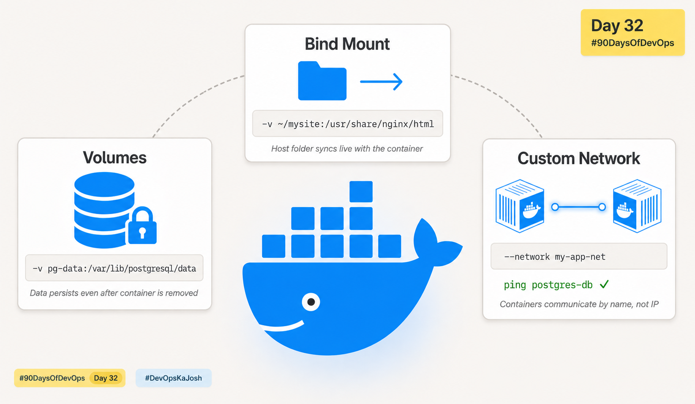

# Day 32 – Docker Volumes & Networking



## Task 1 – The Problem: Containers Are Ephemeral

### What I did

Ran a Postgres container without any volume, created a `users` table and inserted two rows. Then stopped and removed the container. Started a brand new container from the same image and tried to query the table.

### What happened

```
$ docker exec -it pg-no-vol psql -U postgres
psql (15.18 (Debian 15.18-1.pgdg13+1))
Type "help" for help.

postgres=# SELECT * FROM users;
ERROR:  relation "users" does not exist
LINE 1: SELECT * FROM users;
```

No data available — the table and all rows were gone.

### Why

A container has a **writable layer** on top of its image. All changes — files, database rows, configs — live in that layer. When you run `docker rm`, that layer is permanently deleted. The image itself is untouched, but your data is gone.

This is by design. Containers are meant to be stateless and disposable. Data persistence is your responsibility — Docker does not do it automatically.

---

## Task 2 – Named Volumes

### Commands used

```bash
# Create the volume
docker volume create pg-data

# Run Postgres with volume attached
docker run -d \
  --name pg-vol \
  -e POSTGRES_PASSWORD=secret \
  -v pg-data:/var/lib/postgresql/data \
  postgres:15

# Create data inside
docker exec -it pg-vol psql -U postgres
# Inside psql:
CREATE TABLE cities (id SERIAL, name TEXT);
INSERT INTO cities (name) VALUES ('Mumbai'), ('Pune');
\q

# Stop and remove the container
docker stop pg-vol && docker rm pg-vol

# New container, same volume
docker run -d \
  --name pg-vol-2 \
  -e POSTGRES_PASSWORD=secret \
  -v pg-data:/var/lib/postgresql/data \
  postgres:15

# Verify data is still there
docker exec -it pg-vol-2 psql -U postgres
SELECT * FROM cities;
```

### Verification

```bash
docker volume ls
docker volume inspect pg-data
```

### What happened

The `SELECT * FROM cities` on the new container returned both rows — `Mumbai` and `Pune`. The data survived container removal because it was stored in the named volume, not in the container's writable layer.

`docker volume inspect` showed the `Mountpoint` — the actual path on disk where Docker stores the volume data (`/var/lib/docker/volumes/pg-data/_data`).

---

## Task 3 – Bind Mounts

### Commands used

```bash
# Create a folder and HTML file on the host
mkdir -p ~/mysite
echo "<h1>Day 32 - KD's Site</h1>" > ~/mysite/index.html

# Run Nginx with a bind mount
docker run -d \
  --name my-nginx \
  -p 8080:80 \
  -v ~/mysite:/usr/share/nginx/html \
  nginx

# Edit the file on the host (no container restart needed)
echo "<h1>Live edit works!</h1><p>No restart needed.</p>" > ~/mysite/index.html
```

Visited `http://localhost:8080` — page updated instantly on browser refresh.

### Named Volume vs Bind Mount — what's the difference?

|                    | Named Volume                      | Bind Mount                          |
| ------------------ | --------------------------------- | ----------------------------------- |
| Path managed by    | Docker                            | You (host path)                     |
| Best for           | Database data, persistent storage | Development, live file editing      |
| Portability        | Works on any OS                   | Depends on host directory structure |
| Direct host access | Harder (deep Docker path)         | Easy — it's your own folder         |
| Direction          | Container writes, Docker stores   | Two-way live sync                   |

**When to use what:**

- Named volume → any data that needs to survive container restarts (databases, uploads)
- Bind mount → development workflows where you want to edit files and see changes immediately

---

## Task 4 – Docker Networking Basics

### Commands used

```bash
# List all networks
docker network ls

# Inspect the default bridge
docker network inspect bridge

# Run two containers on default bridge
docker run -d --name c1 alpine sleep 3600
docker run -d --name c2 alpine sleep 3600

# Try ping by name — fails
docker exec c1 ping -c 3 c2

# Get c2's IP — correct format for named networks
docker inspect c2 --format='{{.NetworkSettings.Networks.bridge.IPAddress}}'
# Output: 172.17.0.6

# Ping by IP — works
docker exec c1 ping -c 3 172.17.0.6
```

### Findings

- Default bridge network subnet: `172.17.0.0/16`
- Pinging by container name **failed**: `ping: bad address 'c2'`
- Got c2's actual IP using: `docker inspect c2 --format='{{.NetworkSettings.Networks.bridge.IPAddress}}'` → `172.17.0.6`
- Pinging by IP **worked**

> **Note:** The shorter `{{.NetworkSettings.IPAddress}}` format returns empty on newer Docker versions for named networks. Always use `{{.NetworkSettings.Networks.bridge.IPAddress}}` to get the correct IP.

### Why name-based ping fails on default bridge

The default `bridge` network has no embedded DNS. It was created before Docker introduced DNS resolution and is kept for backward compatibility. Containers on it can only reach each other via IP, which is fragile — IPs change every time a container restarts.

---

## Task 5 – Custom Networks

### Commands used

```bash
# Create custom bridge network
docker network create my-app-net

# Run two containers on it
docker run -d --name box1 --network my-app-net alpine sleep 3600
docker run -d --name box2 --network my-app-net alpine sleep 3600

# Ping by name — works!
docker exec box1 ping -c 3 box2
```

### Result

```
PING box2 (172.x.x.x): 56 data bytes
64 bytes from 172.x.x.x: seq=0 ttl=64 time=0.1 ms
```

### Why custom networks allow name-based communication

When you create a custom bridge network, Docker automatically runs an **embedded DNS server** for it. Every container joining that network is registered by its container name. So `ping box2` resolves to the correct IP without any manual configuration.

The default `bridge` network skips this DNS layer entirely — which is why it only works with IPs.

**Rule of thumb:** Always create a custom network for any multi-container application.

---

## Task 6 – Put It Together

### Architecture

- Custom network: `my-app-net`
- Database container: `postgres-db` (Postgres 15 + named volume `pg-data`)
- App container: `my-app` (Alpine) — communicates with DB by name

### Commands used

```bash
# Create network and volume
docker network create my-app-net
docker volume create pg-data

# Run database with volume + network
docker run -d \
  --name postgres-db \
  --network my-app-net \
  -v pg-data:/var/lib/postgresql/data \
  -e POSTGRES_PASSWORD=secret \
  postgres:15

# Run app container on same network
docker run -d \
  --name my-app \
  --network my-app-net \
  alpine sleep 3600

# Verify: app can reach DB by name
docker exec my-app ping -c 3 postgres-db
```

### Result

```
PING postgres-db (172.x.x.x): 56 data bytes
64 bytes from 172.x.x.x: seq=0 ttl=64 time=0.1 ms
```

The app container resolved `postgres-db` by name and reached it successfully — no hardcoded IPs needed.

---

## Key Takeaways

1. **Containers are ephemeral** — data is lost on `docker rm` unless you use a volume
2. **Named volumes** give data a lifecycle independent of any container
3. **Bind mounts** are for development — live two-way sync between host and container
4. **Default bridge** has no DNS — containers can only communicate by IP
5. **Custom bridge networks** come with embedded DNS — containers reach each other by name
6. **The Task 6 pattern** (custom network + named volume + DB container + app container) is exactly what Docker Compose automates

---

_#90DaysOfDevOps #DevOpsKaJosh #TrainWithShubham_
