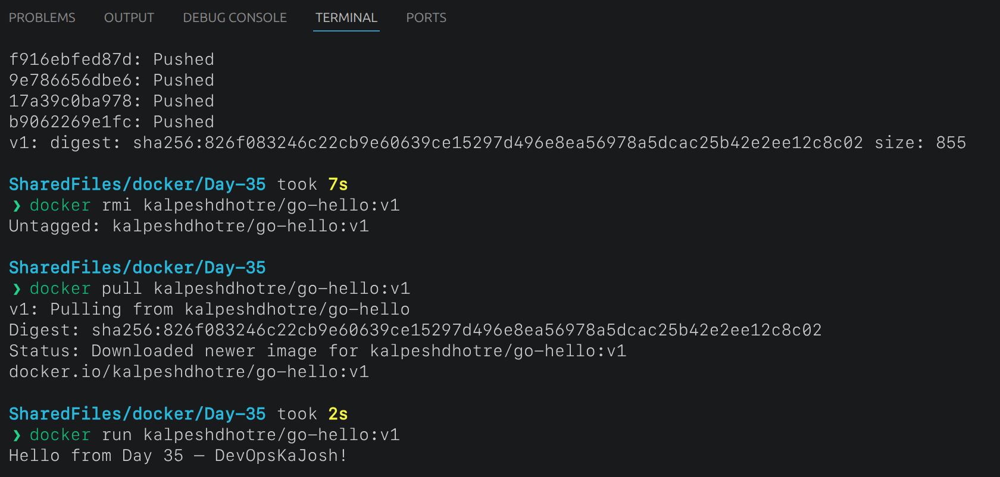
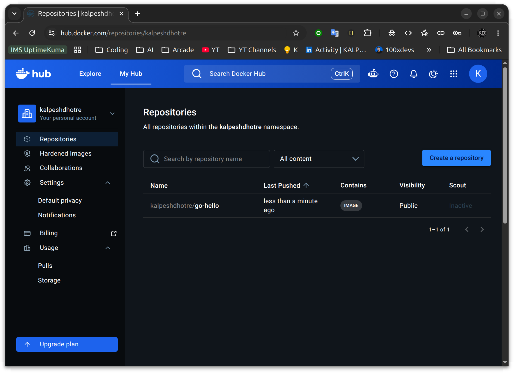

# Day 35 — Multi-Stage Builds & Docker Hub

## Overview

Built and compared single-stage vs multi-stage Docker images for a Go app,
applied image best practices, and pushed to Docker Hub.

---

## Task 1 — Single Stage Build (the fat image)

**Dockerfile.single**

```dockerfile
FROM golang:1.22-alpine

WORKDIR /app
COPY . .
RUN go mod init hello && go build -o hello .

CMD ["./hello"]
```

**Image size:** ~300MB+
**Why so large?** The entire Go toolchain (compiler, stdlib, build cache) ships
inside the final image — even though none of it is needed at runtime.

---

## Task 2 — Multi-Stage Build (the slim image)

**Dockerfile.multi**

```dockerfile
# Stage 1 — Builder (has the Go compiler)
FROM golang:1.22-alpine AS builder

WORKDIR /app
COPY . .
RUN go mod init hello && go build -o hello .

# Stage 2 — Runner (tiny, no compiler)
FROM alpine:3.19

WORKDIR /app
COPY --from=builder /app/hello .

CMD ["./hello"]
```

**Image size:** 14.6MB
**Size reduction:** ~95% smaller than the single-stage image

**Why so much smaller?**
Docker discards Stage 1 entirely after the build. The final image contains
only Alpine Linux (~8MB) + the compiled Go binary (~6MB). No compiler,
no source code, no build cache makes it to production.

---

## Task 3 — Push to Docker Hub

```bash
docker login
docker tag go-hello-slim kalpeshdhotre/go-hello:v1
docker push kalpeshdhotre/go-hello:v1

# Verify by pulling fresh
docker rmi kalpeshdhotre/go-hello:v1
docker pull kalpeshdhotre/go-hello:v1
docker run kalpeshdhotre/go-hello:v1
```

**Docker Hub:** https://hub.docker.com/repositories/kalpeshdhotre



## Task 4 — Docker Hub Repository Observations

- Tags tab shows all pushed versions (`v1`, `v2`, `latest`)
- `latest` does NOT auto-update — must be tagged and pushed separately
- Pulling a specific tag (`v1`) pins you to a known good build
- Pulling `latest` always gives the most recently pushed `latest` tag



## Task 5 — Best Practices Applied

**Dockerfile (final)**

```dockerfile
# Stage 1 — Build
FROM golang:1.22-alpine AS builder

WORKDIR /app
COPY . .
RUN go mod init hello && \
    go build -o hello .

# Stage 2 — Minimal runtime
FROM alpine:3.19

RUN addgroup -S appgroup && \
    adduser -S appuser -G appgroup

WORKDIR /app
COPY --from=builder /app/hello .

USER appuser

CMD ["./hello"]
```

| Practice               | Applied | Detail                                   |
| ---------------------- | ------- | ---------------------------------------- |
| Minimal base image     | ✅      | `alpine:3.19` (~8MB) vs `ubuntu` (~77MB) |
| Non-root user          | ✅      | `adduser appuser` + `USER appuser`       |
| Combined RUN commands  | ✅      | `&&` chaining reduces layers             |
| Pinned base image tags | ✅      | `alpine:3.19` not `alpine:latest`        |

---

## Size Comparison Summary

| Image          | Base               | Size   | Non-root | Notes                  |
| -------------- | ------------------ | ------ | -------- | ---------------------- |
| Single stage   | golang:1.22-alpine | ~300MB | No       | Compiler ships to prod |
| Multi-stage    | alpine:3.19        | 14.6MB | No       | Binary only            |
| Best practices | alpine:3.19        | 14.6MB | Yes      | Production-ready       |

---

## Key Learnings

### The go.mod lesson

Go 1.16+ requires a `go.mod` file — `go build` won't run without it.
Since Go isn't installed on the host machine, `go mod init` must run
_inside_ the builder stage where Go exists:

```dockerfile
RUN go mod init hello && go build -o hello .
```

Trying to run `go mod init` in the terminal first = error, because Go
isn't installed on the host. The container is the build environment.

### Multi-stage mental model

- Stage 1 = build environment (bring all the tools)
- Stage 2 = runtime environment (bring only the artifact)
- `COPY --from=builder` is the bridge between them
- Everything in Stage 1 that isn't explicitly copied is discarded

### Docker Hub versioning

Always push a specific tag AND `latest`:

```bash
docker push kalpeshdhotre/go-hello:v1
docker tag kalpeshdhotre/go-hello:v1 kalpeshdhotre/go-hello:latest
docker push kalpeshdhotre/go-hello:latest
```

---

## Docker Hub

https://hub.docker.com/repositories/kalpeshdhotre

`#90DaysOfDevOps` `#DevOpsKaJosh` `#TrainWithShubham`
