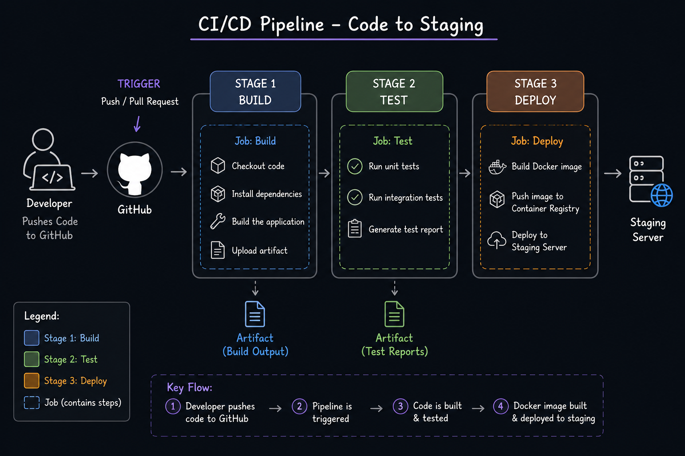

# Day 39 – CI/CD Concepts

## Task 1: The Problem with Manual Deployments

### What can go wrong with 5 devs deploying manually?

- **Merge conflicts** — two devs change the same file, one overwrites the other's work
- **No shared truth** — nobody knows exactly what's running in production at any moment
- **No rollback plan** — if something breaks, reverting is manual and slow
- **Skipped testing** — when deployment is painful, people skip steps under pressure
- **Human error** — copy-paste the wrong config, forget an env variable, deploy to wrong server

### "It works on my machine" — why is this a real problem?

Every developer's laptop has a unique environment: different OS, different library versions, different environment variables, different Node/Python/Java versions. Code that works perfectly locally can crash on the server because of a version mismatch or missing config. Without a standardised environment (Docker solves this), you can never guarantee that what you tested locally is what runs in production.

### How many times a day can a team safely deploy manually?

Realistically: **1–2 times maximum**, and most teams doing it manually end up with infrequent "big bang" releases every few weeks — which means bigger, riskier changes each time.

---

## Task 2: CI vs CD vs CD

### Continuous Integration (CI)

Every developer pushes code frequently (multiple times a day). On each push, an automated system pulls the code, runs tests, and reports back — in minutes, not days. This catches bugs early before they compound with other people's changes.

**Real-world example:** A developer pushes a commit to GitHub. GitHub Actions automatically runs the test suite. If a test fails, the developer gets a notification immediately and fixes it before merging.

### Continuous Delivery (CD)

Extends CI — after tests pass, the code is automatically packaged and made _ready to deploy_ to production. A human still decides when to release, but the release is always a single button press away.

**Real-world example:** Every merged PR automatically builds a Docker image, runs integration tests, and pushes the image to Docker Hub. The team clicks "deploy to production" when they're ready.

### Continuous Deployment (CD)

Goes one step further — if all automated tests pass, the code goes to production automatically, no human approval needed. Used by teams with very high test coverage and confidence.

**Real-world example:** GitHub and Netflix deploy to production dozens of times per day. Every commit that passes the full test suite is automatically live within minutes.

---

## Task 3: Pipeline Anatomy

| Concept      | What it does                                                                                       |
| ------------ | -------------------------------------------------------------------------------------------------- |
| **Trigger**  | The event that starts the pipeline — usually a `git push` or a pull request                        |
| **Stage**    | A logical phase in the pipeline — e.g. `Test`, `Build`, `Deploy`                                   |
| **Job**      | A unit of work inside a stage — e.g. "run unit tests" inside the Test stage                        |
| **Step**     | A single command inside a job — e.g. `npm test` or `docker build`                                  |
| **Runner**   | The machine (VM or container) that actually executes the job                                       |
| **Artifact** | Output produced by a job that is passed to the next stage — e.g. a Docker image, a compiled binary |

---

## Task 4: Pipeline Diagram

**Scenario:** Developer pushes code → app is tested → built into a Docker image → deployed to staging.



<!-- ```
TRIGGER: git push to GitHub
         │
         ▼
┌─────────────────────────────────────────────────┐
│  STAGE 1: TEST                                  │
│                                                  │
│  Job: Install deps  →  Job: Run tests  →  Artifact: test report ✓
└─────────────────────────────────────────────────┘
         │ (if tests pass)
         ▼
┌─────────────────────────────────────────────────┐
│  STAGE 2: BUILD                                 │
│                                                  │
│  Job: docker build  →  Job: docker push  →  Artifact: Docker image ✓
└─────────────────────────────────────────────────┘
         │ (image ready)
         ▼
┌─────────────────────────────────────────────────┐
│  STAGE 3: DEPLOY                                │
│                                                  │
│  Job: docker pull  →  Job: docker run  →  Staging server live ✓
└─────────────────────────────────────────────────┘
``` -->

**Key points:**

- Each stage only runs if the previous one succeeded
- The pipeline fails fast — if tests fail in Stage 1, Stages 2 and 3 are skipped
- The Docker image is the _artifact_ that travels from Build → Deploy
- The runner is a fresh Ubuntu VM that spins up for each job

---

## Task 5: Open-Source Repo Exploration

**Repo explored:** FastAPI (`tiangolo/fastapi`)

**Workflow file:** `.github/workflows/test.yml`

### What triggers it?

- `push` events to the `master` branch
- `pull_request` events to the `master` branch

### How many jobs does it have?

- **2 jobs:** `test` and `coverage`

### What does it do?

The `test` job runs the full test suite across multiple Python versions (3.8, 3.9, 3.10, 3.11) using a matrix strategy — meaning it runs in parallel on all four versions simultaneously. It installs dependencies with pip, then runs `pytest` with coverage reporting. The `coverage` job uploads the results. If any Python version fails, the whole job is marked as failed. This is textbook CI — every PR is validated across the entire supported Python range before it can be merged.

---

## Key Takeaways

- CI/CD is a **practice**, not a tool — GitHub Actions, Jenkins, GitLab CI are just tools that implement it
- A failing pipeline is **not a problem** — it's CI/CD doing its job by catching bugs early
- The goal is to make deployments so automated and reliable that releasing code is _boring_
- Docker + CI/CD is a powerful combination: Docker standardises the environment, CI/CD automates the process
