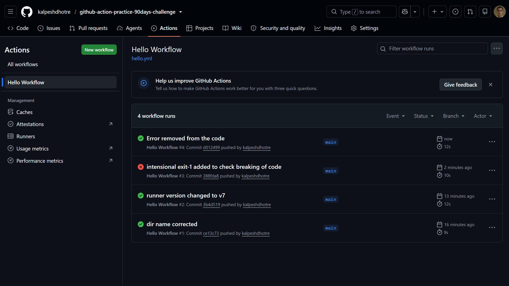

# Day 40 – Your First GitHub Actions Workflow

## Task

Wrote my first GitHub Actions CI/CD pipeline and watched it run in the cloud on every push to `github-action-practice-90days-challenge`.

---

## Workflow File: `.github/workflows/hello.yml`

```yaml
name: Hello Workflow

on: push

jobs:
    greet:
        runs-on: ubuntu-latest
        steps:
            - name: Checkout code
              uses: actions/checkout@v4

            - name: Print greeting
              run: echo "Hello from GitHub Actions!"

            - name: Print current date and time
              run: date

            - name: Print triggering branch
              run: echo "Triggered by branch -> ${{ github.ref_name }}"

            - name: List files in repo
              run: ls -la

            - name: Print runner OS
              run: echo "Runner OS -> ${{ runner.os }}"
```

---

## Screenshot



> 4 workflow runs visible in the Actions tab:
>
> - ✅ Run #1 — `dir name corrected` (9s)
> - ✅ Run #2 — `runner version changed to v7` (12s)
> - ❌ Run #3 — `intensional exit-1 added to check breaking of code` (10s) — intentional failure for Task 5
> - ✅ Run #4 — `Error removed from the code` (12s) — back to green

---

## Anatomy of a Workflow — In My Own Words

| Key                 | What it does                                                                                                                                                                                    |
| ------------------- | ----------------------------------------------------------------------------------------------------------------------------------------------------------------------------------------------- |
| `on:`               | Defines the **trigger** — the event that kicks off the workflow. In my case, `push`, meaning any push to any branch starts a run.                                                               |
| `jobs:`             | A workflow is made of one or more jobs. Each job runs independently (in parallel by default) on its own fresh runner.                                                                           |
| `runs-on:`          | Specifies the **runner environment** — the OS/VM the job executes on. I used `ubuntu-latest`.                                                                                                   |
| `steps:`            | The ordered list of actions/commands inside a job. Steps run sequentially, top to bottom, on the same runner.                                                                                   |
| `uses:`             | Pulls in a **pre-built action** from the GitHub Marketplace (or a repo) instead of writing raw shell. `actions/checkout@v4` clones my repo onto the runner so later steps can access the files. |
| `run:`              | Executes a raw **shell command** directly on the runner.                                                                                                                                        |
| `name:` (on a step) | A human-readable label for the step — shows up in the Actions UI log so I can tell steps apart at a glance.                                                                                     |

---

## Task 5 — Breaking the Pipeline on Purpose

Added a step:

```yaml
- name: Intentionally break the pipeline
  run: exit 1
```

**What a failed pipeline looks like:**

- The job turns **red** ❌ instead of green in the Actions tab.
- The specific step that failed is marked with a red X, while steps before it stay green (they already succeeded).
- Steps _after_ the failing one are skipped by default — GitHub Actions stops the job as soon as a step returns a non-zero exit code.
- Clicking into the failed step expands the log and shows the exact command and its exit code (e.g. `Process completed with exit code 1.`).

**How I read the error:**

1. Open the **Actions** tab → click the failed run (red ❌).
2. Click the failed job (`greet`).
3. Expand the red step — the log shows stdout/stderr right up to the failure point.
4. For a misspelled command, the error is usually something like `exiit: command not found`, which is an easy giveaway of a typo vs an intentional `exit 1`.

**Fix:** removed the bad step, committed, pushed again — pipeline went green.

---

## Key Takeaway

CI/CD stopped being a buzzword today. Every `git push` now triggers an automated, observable, reproducible run in the cloud — and a failing step doesn't bring down working steps before it, which is exactly the kind of feedback loop that makes CI useful for catching issues early.

---

`#90DaysOfDevOps` `#DevOpsKaJosh` `#TrainWithShubham`
