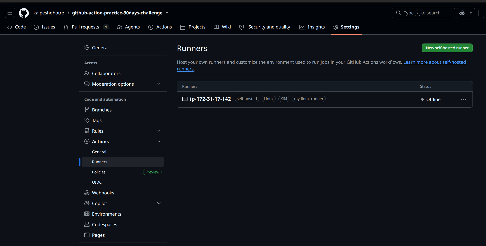

# Day 42 – Runners: GitHub-Hosted & Self-Hosted

## What I Did Today

Explored the two flavors of GitHub Actions runners — GitHub-hosted (ephemeral VMs GitHub manages) and self-hosted (a machine I own and register myself). Set up a self-hosted runner on an **AWS EC2 instance**, registered it to my repo, and ran a real workflow job on it end-to-end.

---

## Task 1: GitHub-Hosted Runners (Matrix)

Created a workflow with 3 parallel jobs — `ubuntu-latest`, `windows-latest`, `macos-latest` — each printing OS name, hostname, and current user. All 3 ran in parallel since there's no `needs:` dependency between them.

**What is a GitHub-hosted runner? Who manages it?**
A GitHub-hosted runner is a temporary virtual machine that GitHub provisions fresh for each job and destroys once the job finishes. GitHub owns the entire lifecycle — provisioning, OS patching, toolchain updates, and teardown. I just consume it via `runs-on: ubuntu-latest` (or windows/macos).

## 

## Task 2: Pre-installed Tools

Checked `docker --version`, `python3 --version`, `node --version`, and `git --version` on `ubuntu-latest` — all pre-installed and ready to use with no setup steps.

**Why does it matter that runners come with tools pre-installed?**
It saves build time on every single run — no need to install Docker/Node/Python from scratch each time, which speeds up CI and removes a common source of flaky builds (failed installs, version drift).

## 

## Task 3: Self-Hosted Runner Setup (AWS EC2)

- Spun up an AWS EC2 instance (Linux/x64) as the runner machine
- Registered it via **Settings → Actions → Runners → New self-hosted runner**, ran the generated `config.sh` script on the EC2 box
- Installed it as a persistent background service with `sudo ./svc.sh install && sudo ./svc.sh start` so it survives reboots
- Verified: runner shows green dot + **Idle** in GitHub


## Task 4: Job on Self-Hosted Runner

Created `.github/workflows/self-hosted.yml` with `runs-on: self-hosted`, triggered manually via `workflow_dispatch`. The job printed the EC2 instance's hostname and working directory, created `proof.txt`, and echoed its contents back in the log.

Verified on the EC2 instance itself (via SSH) that `proof.txt` existed inside the runner's `_work/` directory — confirming the job genuinely ran on my own infrastructure, not GitHub's.

📸 _Screenshot: job log showing EC2 hostname + proof.txt output — [insert screenshot here]_

## 

## Task 5: Labels

Added label `my-linux-runner` to the EC2 self-hosted runner, then updated the workflow to:

```yaml
runs-on: [self-hosted, my-linux-runner]
```

Re-triggered — job still picked up correctly.

**Why are labels useful when you have multiple self-hosted runners?**
Labels let you target a specific runner's capabilities (e.g., GPU box, high-RAM instance, a runner inside a private network) instead of any random self-hosted runner picking up the job. Without labels, `runs-on: self-hosted` matches _any_ registered self-hosted runner — imprecise once you scale past one machine.

## 

## Task 6: GitHub-Hosted vs Self-Hosted

|                         | GitHub-Hosted                                                    | Self-Hosted                                                                           |
| ----------------------- | ---------------------------------------------------------------- | ------------------------------------------------------------------------------------- |
| **Who manages it?**     | GitHub — provisions, patches, and destroys a fresh VM per job    | I do — installed, configured, and secured the EC2 instance myself                     |
| **Cost**                | Free minutes on public repos; billed per-minute on private repos | EC2 instance cost (compute + storage), but no per-minute Actions billing              |
| **Pre-installed tools** | Large curated toolkit out of the box                             | Nothing pre-installed — I set up exactly what's needed                                |
| **Good for**            | Standard CI/CD, quick builds, open source                        | Custom infra needs, cost control at scale, specific hardware/network access           |
| **Security concern**    | Isolated per job, low persistence risk                           | I own patching, hardening, and cleanup — state can persist across runs if not managed |

---

## Bonus Fix: Old Workflow Triggers

Noticed that with `on: push` on every day's workflow file, a single commit anywhere in the repo was triggering _all_ previous days' workflows at once. Went back and changed all earlier workflow files to `workflow_dispatch` (with a comment noting the change and date) so they only run when manually triggered, instead of firing on unrelated pushes.

---

## Key Takeaway

Self-hosted runners persist between jobs — unlike GitHub-hosted runners' fresh-VM-per-job model — which means the responsibility for cleanup, security, and uptime shifts to me. Real ops ownership, not just consuming someone else's compute.

---

## Submission

- Repo: `2026/day-42/`
- Files: `day-42-runners.md`, `hosted-runners.yml`, `self-hosted.yml`

`#90DaysOfDevOps` `#DevOpsKaJosh` `#TrainWithShubham`
