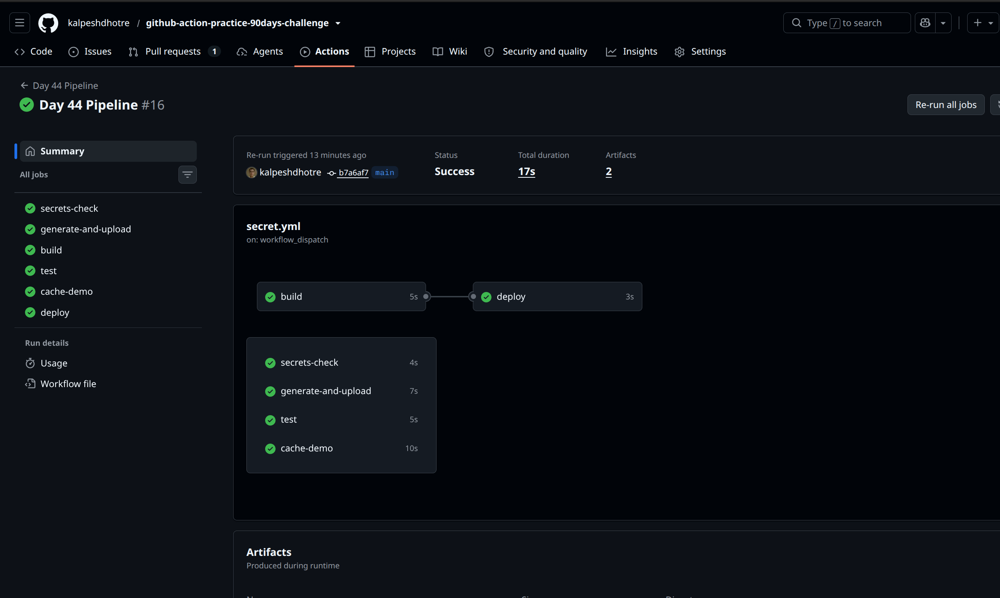

# Day 44 – Secrets, Artifacts & Running Real Tests in CI

## What I Did Today

Moved from "toy" pipelines to a workflow that handles sensitive values, saves
build outputs, runs a real script from earlier days, and caches dependencies.

---

## Task 1: GitHub Secrets

- Created `MY_SECRET_MESSAGE` under **Settings → Secrets and Variables → Actions**
- Workflow printed `The secret is set: true` without ever exposing the value
- Tried printing `${{ secrets.MY_SECRET_MESSAGE }}` directly → GitHub
  automatically masked it in the logs as `***`

**Why never print secrets in CI logs:**
Logs are often more widely accessible than the secret store itself — visible
to anyone with repo/workflow read access, sometimes cached, sometimes shipped
to third-party log aggregators. Once a value hits a log line it's effectively
public. GitHub's masking helps, but it's a safety net, not a guarantee, so the
real rule is: never deliberately echo a secret, and treat any accidental
print as a leak requiring rotation.

## Task 2: Secrets as Environment Variables

- Passed `MY_SECRET_MESSAGE` and `DOCKER_USERNAME` into a step via `env:`
- Used them inside the shell command through `$SECRET_MSG` / `$DOCKER_USER`
  instead of hardcoding anything
- Added `DOCKER_USERNAME` and `DOCKER_TOKEN` as repo secrets, ready for Day 45

## Task 3: Upload Artifacts

- Generated `reports/test-report.txt` in a step
- Uploaded it with `actions/upload-artifact@v4`
- Verified: downloaded it successfully from the Actions run summary page

## Task 4: Download Artifacts Between Jobs

- Job 1 (`build`) generated `build/output.txt` and uploaded it
- Job 2 (`deploy`) used `needs: build`, downloaded the artifact, and printed
  its contents

**When I'd use this in a real pipeline:**
Anytime work needs to move from one job to another without rebuilding it —
e.g. a compiled binary from a build job handed to a deploy job, or test
reports/coverage files handed to a reporting job. Keeps jobs isolated while
still sharing outputs, and avoids redoing expensive work in every downstream job.

## Task 5: Run Real Tests in CI

- Used my `log-analyzer.sh` script from the Day 16–27 shell scripting block
- Workflow checks out code, makes the script executable, runs it against a
  sample log file, and fails the job if it exits non-zero
- Confirmed pipeline fails (red ❌) when broken, passes (green ✅) once fixed

### 🐛 Real issue I hit (and the actual lesson of the day)

Mistakenly pasted `log-analyzer.sh` directly into the `.github/workflows/`
folder first — wrong location entirely, and the filename ended up wrong too.
Moved it to the correct path (`2026/day-44/scripts/log-analyzer.sh`), but the
workflow still couldn't find it: `chmod: cannot access 'scripts/log-analyzer.sh':
No such file or directory`.

Root cause: I'd been running `git add .` **from inside the workflows folder**,
so only files in that folder were getting staged — the script sitting in the
correct location never actually made it into the commit. It looked committed
locally but was never actually pushed to the path the workflow expected.

**What I learned about `git add`:**

- `git add .` only stages files from the current directory downward — if
  you're sitting inside a subfolder, anything outside it gets silently skipped
- `git add -A` (or `git add --all`) stages **all** changes across the entire
  repo — new files, modified files, deleted files — regardless of which
  directory you're in when you run it
- This is exactly why I normally target adds like `git add 2026/day-44/`
  from the repo root — it's deliberate and predictable. The mistake today
  was running the add command from the wrong working directory, which
  quietly broke that habit
- Lesson: always confirm you're at the repo root (or explicitly path the
  add) before committing, and use `git status` right after `git add` to
  see exactly what got staged — don't assume

## Task 6: Caching

- Added `actions/cache@v4` keyed on `requirements.txt` hash for pip packages
- First run: cache miss, dependency install took noticeably longer
- Second run: cache hit, install step finished almost instantly

**What's being cached and where:**
`actions/cache` stores the `~/.cache/pip` directory (pip's local package
cache) as a compressed archive in GitHub's cache storage, scoped to the repo.
On a cache hit, GitHub Actions restores that archive to the runner before the
install step runs, so pip finds packages already downloaded instead of
fetching them from PyPI again. The key includes a hash of `requirements.txt`,
so any dependency change automatically invalidates the old cache.

---

## Key Takeaways

- Secrets are masked in logs by default, but that's a safety net — never
  rely on it as the actual control
- Artifacts are the standard way to move files between jobs and off the
  runner entirely
- A pipeline is only useful once it can actually fail — today's setup gave
  a real red/green signal instead of just "it ran"
- `git add .` stages relative to your current directory, not the repo root —
  `git add -A` stages everything, everywhere. Knowing the difference would've
  saved me a good chunk of debugging today

---

**#90DaysOfDevOps #DevOpsKaJosh #TrainWithShubham**
