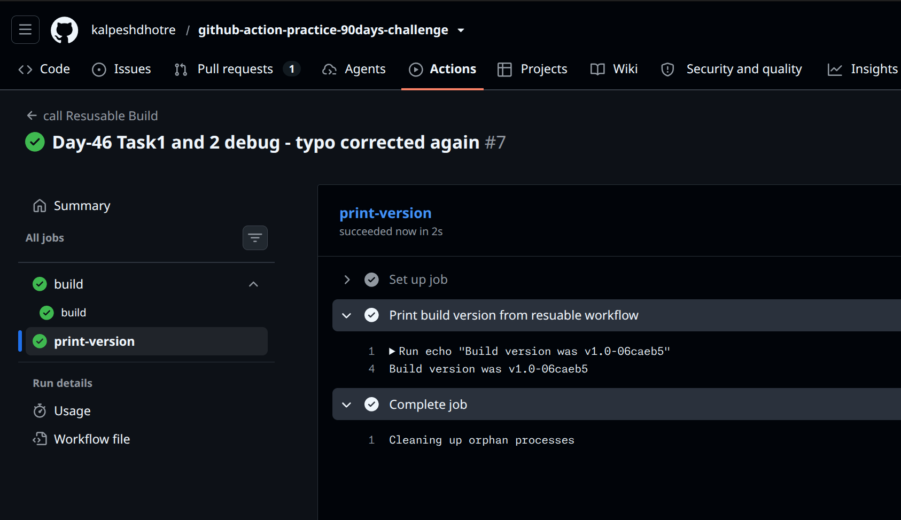
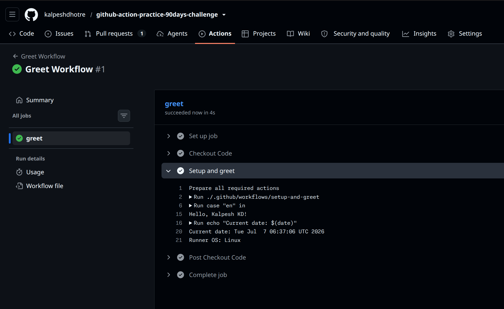

# Day 46 – Reusable Workflows & Composite Actions

`#90DaysOfDevOps` `#DevOpsKaJosh` `#TrainWithShubham`

---

## 1. Study Guide (Task 1 answers)

**1. What is a reusable workflow?**
A complete `.yml` workflow file that other workflows can call like a function, instead of copy-pasting the same jobs/steps everywhere. You write the build/test/deploy logic once, and any workflow — in the same repo or a different one — can call it with `uses:`.

**2. What is the `workflow_call` trigger?**
It's a special entry under `on:` that makes a workflow _callable_ rather than _run-on-its-own_. A workflow with `on: workflow_call` doesn't fire on push or PR by itself — it only runs when another workflow references it.

**3. How is calling a reusable workflow different from a regular action (`uses:` in a step)?**

- A **composite/regular action** is used _inside a step_, runs in the _same job_, and shares that job's runner/environment.
- A **reusable workflow** is used _at the job level_ (`jobs.<id>.uses:`), and runs as its **own separate job** (its own runner, own `runs-on`). It can contain multiple jobs internally, has its own `inputs:`/`secrets:`/`outputs:` contract, and shows up in the Actions UI as a distinct job graph — not just a step.

**4. Where must a reusable workflow file live?**
Same rule as any workflow: inside `.github/workflows/` (in the same repo, or a repo it's called from cross-repo). It cannot live in `.github/actions/` — that's reserved for composite/Docker/JS actions.

---

## 2. Reusable Workflow — `.github/workflows/reusable-build.yml`

```yaml
name: Reusable Build Workflow

on:
  workflow_call:
    inputs:
      app_name:
        description: "Name of the application being built"
        required: true
        type: string
      environment:
        description: "Target deployment environment"
        required: true
        type: string
        default: "staging"
    secrets:
      docker_token:
        description: "Docker Hub token used for authenticated pushes"
        required: true
    outputs:
      build_version:
        description: "Generated version string for this build"
        value: ${{ jobs.build.outputs.version }}

jobs:
  build:
    runs-on: ubuntu-latest
    outputs:
      version: ${{ steps.set_version.outputs.version }}
    steps:
      - name: Checkout code
        uses: actions/checkout@v6

      - name: Print build info
        run: |
          echo "Building ${{ inputs.app_name }} for ${{ inputs.environment }}"
          echo 'Docker token is set: true'

      - name: Generate version string
        id: set_version
        run: |
          SHORT_SHA=$(git rev-parse --short HEAD)
          VERSION="v1.0-${SHORT_SHA}"
          echo "Generated version: ${VERSION}"
          echo "version=${VERSION}" >> "$GITHUB_OUTPUT"
```

**Notes:**

- `inputs` and `secrets` under `workflow_call` are the reusable workflow's public "function signature."
- Never `echo` the actual secret value — only ever print `true`/`false` to confirm it's set, exactly like the task asks.
- `outputs.build_version` at the workflow level just points to a job output (`jobs.build.outputs.version`) — the workflow-level output is a pass-through.

---

## 3. Caller Workflow — `.github/workflows/call-build.yml`

```yaml
name: Call Reusable Build

on:
  push:
    branches: [main]

jobs:
  build:
    uses: ./.github/workflows/reusable-build.yml
    with:
      app_name: "my-web-app"
      environment: "production"
    secrets:
      docker_token: ${{ secrets.DOCKER_TOKEN }}

  print-version:
    needs: build
    runs-on: ubuntu-latest
    steps:
      - name: Print build version from reusable workflow
        run: echo "Build version was ${{ needs.build.outputs.build_version }}"
```

**Screenshot — Task 2, caller triggering the reusable workflow:**



---

## 4. Composite Action — `.github/actions/setup-and-greet/action.yml`

```yaml
name: "Setup and Greet"
description: "Greets a user in a given language and prints runner info"

inputs:
  name:
    description: "Name of the person to greet"
    required: true
  language:
    description: "Language code for the greeting"
    required: false
    default: "en"

outputs:
  greeted:
    description: "Whether the greeting step ran successfully"
    value: ${{ steps.greet.outputs.greeted }}

runs:
  using: "composite"
  steps:
    - name: Greet in requested language
      id: greet
      shell: bash
      run: |
        case "${{ inputs.language }}" in
          hi) echo "Namaste, ${{ inputs.name }}!" ;;
          es) echo "Hola, ${{ inputs.name }}!" ;;
          fr) echo "Bonjour, ${{ inputs.name }}!" ;;
          *)  echo "Hello, ${{ inputs.name }}!" ;;
        esac
        echo "greeted=true" >> "$GITHUB_OUTPUT"

    - name: Print date and runner OS
      shell: bash
      run: |
        echo "Current date: $(date)"
        echo "Runner OS: ${{ runner.os }}"
```

### Workflow that uses the composite action — `.github/workflows/greet.yml`

```yaml
name: Greet Workflow

on:
  workflow_dispatch:

jobs:
  greet:
    runs-on: ubuntu-latest
    steps:
      - name: Checkout code
        uses: actions/checkout@v6

      - name: Setup and greet
        id: greeting
        uses: ./.github/actions/setup-and-greet
        with:
          name: "Kalpesh"
          language: "hi"

      - name: Confirm greeted output
        run: echo "Greeted output was ${{ steps.greeting.outputs.greeted }}"
```

**Screenshot — Greet workflow run:**



---

## 5. Task 6 — Reusable Workflow vs Composite Action

|                              | Reusable Workflow                                                                                                     | Composite Action                                                                                      |
| ---------------------------- | --------------------------------------------------------------------------------------------------------------------- | ----------------------------------------------------------------------------------------------------- |
| Triggered by                 | `on: workflow_call`                                                                                                   | `uses:` inside a step                                                                                 |
| Can contain jobs?            | ✅ Yes — one or more jobs, each with its own runner                                                                   | ❌ No — no `jobs:` concept, only steps                                                                |
| Can contain multiple steps?  | ✅ Yes, per job                                                                                                       | ✅ Yes, directly                                                                                      |
| Lives where?                 | `.github/workflows/*.yml`                                                                                             | `.github/actions/<name>/action.yml` (or any repo path referenced via `uses:`)                         |
| Can accept secrets directly? | ✅ Yes — explicit `secrets:` block, passed explicitly by caller                                                       | ❌ No — inherits whatever secrets are already in the calling job's env; no dedicated `secrets:` input |
| Best for                     | Sharing whole pipelines (build+test+deploy) across jobs/repos, especially when secrets or separate runners are needed | Sharing a reusable _sequence of steps_ within a single job (e.g., setup + lint + notify)              |

---

## Key Takeaways

- `workflow_call` turns a workflow into something callable — it won't run on its own.
- Reusable workflows operate at the **job** level; composite actions operate at the **step** level.
- Outputs flow: `step output → job output → workflow output`, and the caller reads it as `needs.<job>.outputs.<name>`.
- Secrets must be explicitly declared and passed (`secrets: { docker_token: ... }`) — nothing is inherited automatically unless you use `secrets: inherit`.
- A reusable workflow can be called by up to 20 unique caller workflows in a single run — good to know before over-engineering a "one workflow to rule them all" setup.
- **Pin action versions deliberately and revisit them regularly** — `actions/checkout@v4` (Node 20) is deprecated; use `actions/checkout@v6` (Node 24) or newer. Same logic applies to `setup-node`, `setup-python`, `cache`, etc. — check the release page, don't assume the version from an old tutorial/hint is still current.

---
