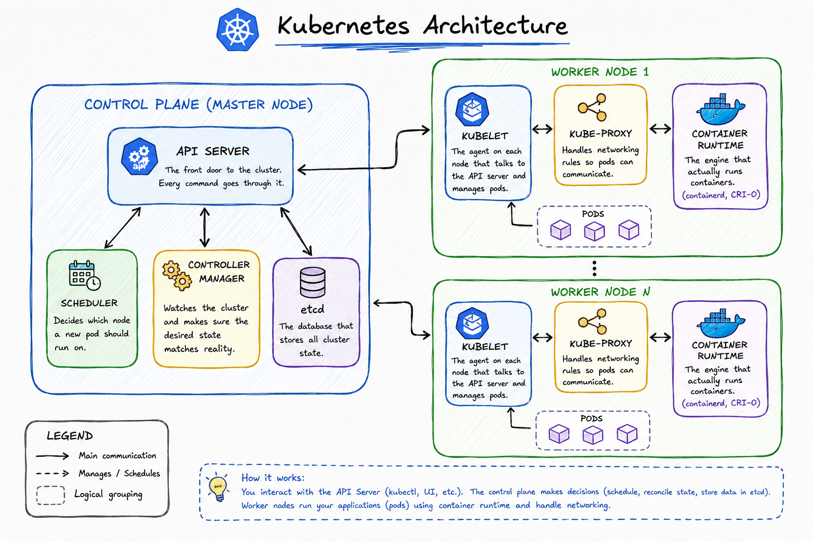

# Day 50 – Kubernetes Architecture and Cluster Setup

## Kubernetes History (in my own words)

Docker gave us a clean way to package and run a single container, but running hundreds of containers across multiple servers reliably — restarting failed ones, scheduling them onto the right machine, scaling them, rolling out updates without downtime — is a different problem entirely. Google had already solved this internally with a system called **Borg**, and in 2014 they open-sourced what they'd learned as **Kubernetes**. The name is Greek for "helmsman" (the person who steers a ship), which is also why it's abbreviated **K8s** and why the logo is a ship's wheel.

---

## Architecture Diagram



**Request trace — `kubectl apply -f pod.yaml`:**

1. `kubectl` sends the pod spec to the **API server**.
2. API server writes the desired state into **etcd**.
3. **Scheduler** picks a node for the unscheduled pod, writes the decision back through the API server.
4. **kubelet** on that node sees the assignment, tells the **container runtime** to pull the image and start the container.
5. kubelet reports pod status back to the API server continuously.

**Failure scenarios:**

- **API server down** → no new `kubectl` commands work, but already-running pods keep running (kubelet manages them locally).
- **Worker node down** → kubelet stops sending heartbeats; after a timeout, Controller Manager marks the node NotReady and reschedules its pods (if managed by a Deployment/ReplicaSet) onto healthy nodes.

---

## Tool Chosen: kind

Went with **kind** (Kubernetes in Docker) over minikube because it reuses the Docker daemon already set up on Ubuntu from the Docker phase of this challenge — no extra hypervisor or VM driver to configure. It spins up the "node" itself as a Docker container, so the whole cluster lifecycle stays inside tooling I already had working.

```bash
kind create cluster --name devops-cluster
kubectl cluster-info
kubectl get nodes
```

## 

## Screenshots

**`kubectl get nodes`:**
**`kubectl get pods -n kube-system`:**


---

## kube-system Pods → Architecture Mapping

| Pod (kube-system)                                      | Architecture Component | What it does                                              |
| ------------------------------------------------------ | ---------------------- | --------------------------------------------------------- |
| `etcd-devops-cluster-control-plane`                    | etcd                   | Stores all cluster state                                  |
| `kube-apiserver-devops-cluster-control-plane`          | API Server             | Front door for every cluster request                      |
| `kube-scheduler-devops-cluster-control-plane`          | Scheduler              | Assigns new pods to nodes                                 |
| `kube-controller-manager-devops-cluster-control-plane` | Controller Manager     | Reconciles desired vs actual state                        |
| `kube-proxy-*`                                         | kube-proxy             | Manages networking rules so pods/services can talk        |
| `coredns-*` (x2)                                       | — (cluster add-on)     | Provides internal DNS so pods can find each other by name |

The control plane isn't some external black box — it's running as regular pods on the same cluster it manages.

---

## kubeconfig

A YAML file (`~/.kube/config` by default) that stores cluster connection info (API server address, certs) and named **contexts** (cluster + user + namespace combos). `kubectl` reads it to know which cluster to talk to and how to authenticate. Every `kind create cluster` writes a new context into this file and switches `current-context` to it — that's how `kubectl` finds a new cluster without manual IP configuration.

```bash
kubectl config current-context
kubectl config get-contexts
kubectl config view
```

---

## Cluster Lifecycle Practice

```bash
kind delete cluster --name devops-cluster
kind create cluster --name devops-cluster
kubectl get nodes
```

Confirmed the cluster tears down and comes back clean — same context, same tooling, zero manual reconfiguration.
