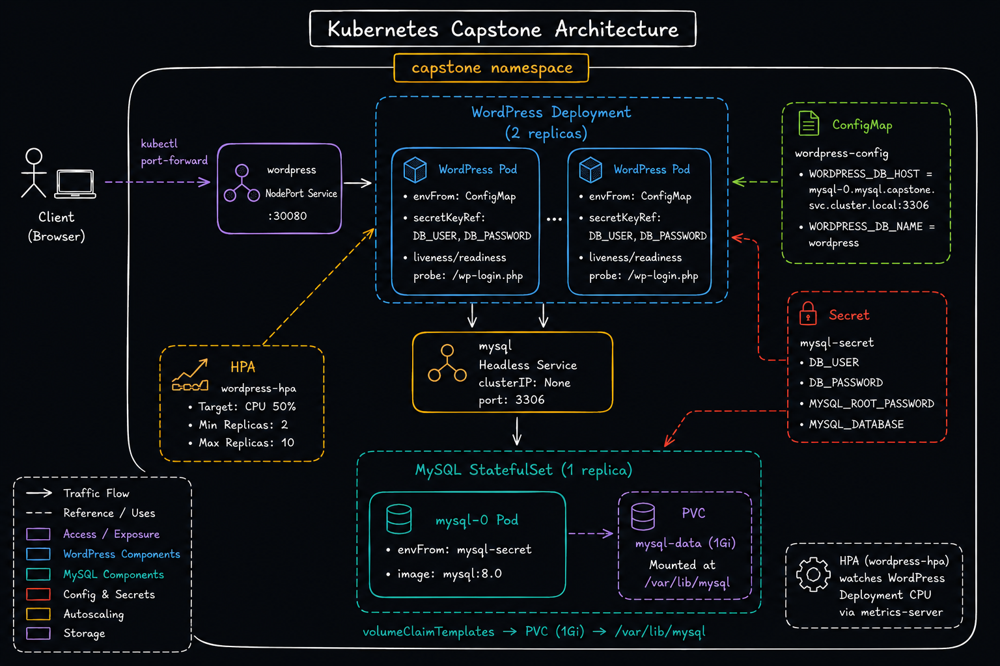

# Day 60 – Capstone: Deploy WordPress + MySQL on Kubernetes

## Overview

Ten days of Kubernetes learning brought together into a single real-world deployment: WordPress + MySQL running on a `kind` cluster, using Namespaces, Secrets, ConfigMaps, StatefulSets, Headless Services, Deployments, NodePort Services, resource limits, probes, HPA, and Helm.

---

## Task 1: Create the Namespace

```bash
kubectl create namespace capstone
kubectl config set-context --current --namespace=capstone
```

Set `capstone` as the default namespace for the rest of the session to avoid repeating `-n capstone` on every command.


---

## Task 2: Deploy MySQL

Created a Secret (`stringData` for root password, database name, user, password), a headless Service (`clusterIP: None`) for stable pod DNS, and a StatefulSet with resource requests/limits and a `volumeClaimTemplates` entry for 1Gi persistent storage mounted at `/var/lib/mysql`.

```bash
kubectl apply -f mysql-secret.yaml
kubectl apply -f mysql-service.yaml
kubectl apply -f mysql-statefulset.yaml
kubectl get pods -w
kubectl exec -it mysql-0 -- mysql -u wpuser -pwppass123 -e "SHOW DATABASES;"
```

**Verify:** `wordpress` database present in output — confirmed.


---

## Task 3: Deploy WordPress

Created a ConfigMap for `WORDPRESS_DB_HOST` (pointing at the StatefulSet DNS pattern `mysql-0.mysql.capstone.svc.cluster.local:3306`) and `WORDPRESS_DB_NAME`, then a 2-replica Deployment pulling DB user/password from the MySQL Secret via `secretKeyRef`, with resource limits and liveness/readiness probes on `/wp-login.php`.

```bash
kubectl apply -f wordpress-configmap.yaml
kubectl apply -f wordpress-deployment.yaml
kubectl get pods -w
```

**Verify:** Both WordPress pods reached `1/1 Running`.


---

## Task 4: Expose WordPress

Created a NodePort Service on `30080` targeting the WordPress pods. Since `kind` has no cloud load balancer, accessed the app via `kubectl port-forward` rather than the NodePort directly.

```bash
kubectl apply -f wordpress-nodeport.yaml
kubectl port-forward svc/wordpress 8080:80 -n capstone
```

Completed the setup wizard at `http://localhost:8080` and published a blog post.


---

## Task 5: Test Self-Healing and Persistence

**WordPress pod deletion:**

```bash
kubectl delete pod wordpress-8564c56df7-nkq9r
kubectl get pods -w
```

New pod (`wordpress-8564c56df7-ktwhr`) came up and reached `1/1 Running` in ~33 seconds. Site briefly appeared inaccessible immediately after — traced to `kubectl port-forward` being bound to the deleted pod rather than the Service's endpoint list; kind has no real load balancer to abstract this away, so the local access path (not the cluster) was the single point of failure. Access recovered on its own after a short wait.

**MySQL pod deletion:**

```bash
kubectl delete pod mysql-0
kubectl get pods -w
```

StatefulSet recreated `mysql-0` with the same name and reattached the existing PVC.

**Persistence check:** After both pods recovered, refreshed WordPress — the earlier blog post was still present, confirming the PVC data survived pod deletion.


---

## Task 6: Set Up HPA

Metrics-server (installed and patched with `--kubelet-insecure-tls` back on Day 58, on this same `devops-cluster`) was already active — confirmed via `kubectl top nodes` returning live CPU/memory figures before starting this task, so no reinstall was needed.

```yaml
apiVersion: autoscaling/v2
kind: HorizontalPodAutoscaler
metadata:
  name: wordpress-hpa
spec:
  scaleTargetRef:
    apiVersion: apps/v1
    kind: Deployment
    name: wordpress
  minReplicas: 2
  maxReplicas: 10
  metrics:
    - type: Resource
      resource:
        name: cpu
        target:
          type: Utilization
          averageUtilization: 50
```

```bash
kubectl apply -f wordpress-hpa.yaml
kubectl get hpa
kubectl get all -n capstone
```

**Verify:** HPA shows `MINPODS: 2`, `MAXPODS: 10`, target `50%` CPU.


---

## Task 7 (Bonus): Compare with Helm

```bash
helm repo add bitnami https://charts.bitnami.com/bitnami
helm repo update
kubectl create namespace wp-helm-ns
helm install wp-helm bitnami/wordpress -n wp-helm-ns
kubectl get all -n wp-helm-ns
helm uninstall wp-helm -n wp-helm-ns
kubectl delete namespace wp-helm-ns
```

**Comparison notes:**

- The Bitnami chart provisioned significantly more resources out of the box than the manual setup — it ships with MariaDB (not MySQL) as the database, plus its own Secrets, PVCs, and a `LoadBalancer` Service (which, like the manual setup, stayed `<pending>` on `kind` and needed `kubectl port-forward` to reach).
- Manual manifests gave full visibility and control over every resource — probes, resource limits, DB host wiring, and exact image versions were all explicit choices rather than chart defaults.
- Helm is faster to stand up a working stack; hand-written manifests are better for understanding exactly how each piece connects, which was the point of this capstone.


---

## Task 8: Clean Up and Reflect

```bash
kubectl get all -n capstone
kubectl delete namespace capstone
kubectl config set-context --current --namespace=default
kubectl get namespace capstone
```

**Verify:** `kubectl get namespace capstone` returned "not found" — confirms the namespace delete cascaded and removed every resource inside it (StatefulSet, Deployment, Services, ConfigMap, Secret, HPA, and the PVC) in one command.


---

## Architecture



---

## Self-Healing & Persistence Results

| Test                           | Result                                                                                                                                                         |
| ------------------------------ | -------------------------------------------------------------------------------------------------------------------------------------------------------------- |
| Delete WordPress pod           | Recreated in ~33s; site briefly unreachable due to `port-forward` binding to the deleted pod, not the cluster — access recovered on its own after a short wait |
| Delete MySQL pod (`mysql-0`)   | StatefulSet recreated it with same name + same PVC                                                                                                             |
| Blog post after both deletions | Still present — confirms PVC-backed persistence                                                                                                                |

---

## Concept-to-Day Mapping

| Concept                   | Day Learned |
| ------------------------- | ----------- |
| Namespace                 | Day 52      |
| Deployment                | Day 52      |
| ConfigMap                 | Day 54      |
| Secret                    | Day 54      |
| Persistent Volume / PVC   | Day 55      |
| StatefulSet               | Day 56      |
| Headless Service          | Day 56      |
| NodePort Service          | Day 53      |
| Resource requests/limits  | Day 57      |
| Liveness/Readiness probes | Day 57      |
| HPA + Metrics Server      | Day 58      |
| Helm                      | Day 59      |

---

## Reflection

**Hardest part:** Getting the WordPress → MySQL DB host wiring right against the StatefulSet's DNS pattern (`mysql-0.mysql.capstone.svc.cluster.local`) — a small mismatch here fails silently until WordPress tries to connect.

**What clicked:** Seeing self-healing and persistence actually hold up under real pod deletions — the StatefulSet reattaching the exact same PVC to a fresh `mysql-0` pod made the abstract "PVCs survive pod lifecycle" concept concrete. Also clarified an important distinction: Kubernetes guarantees self-healing at the pod/Deployment/StatefulSet level, but local tooling like `port-forward` on `kind` is a separate, single-point-of-failure access path that doesn't share that guarantee.

**What I'd add for production:**

- Replace `kubectl port-forward` with a proper Ingress controller
- Move Secrets to a secrets manager (Vault / cloud KMS) instead of Kubernetes Secrets in plaintext manifests
- Add a `PodDisruptionBudget` for MySQL
- Use a managed database (RDS/Cloud SQL) instead of a single-replica MySQL StatefulSet for real durability
- Add monitoring/alerting (Prometheus + Grafana) on top of metrics-server

---

**#90DaysOfDevOps** `#DevOpsKaJosh` `#TrainWithShubham`
