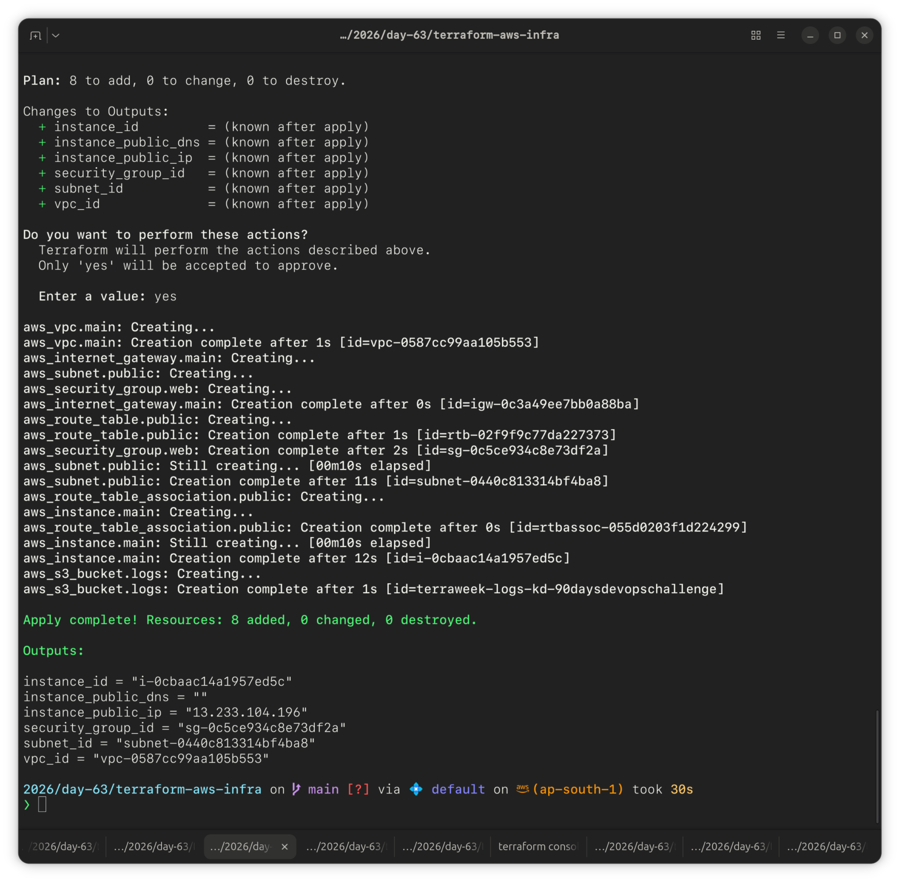
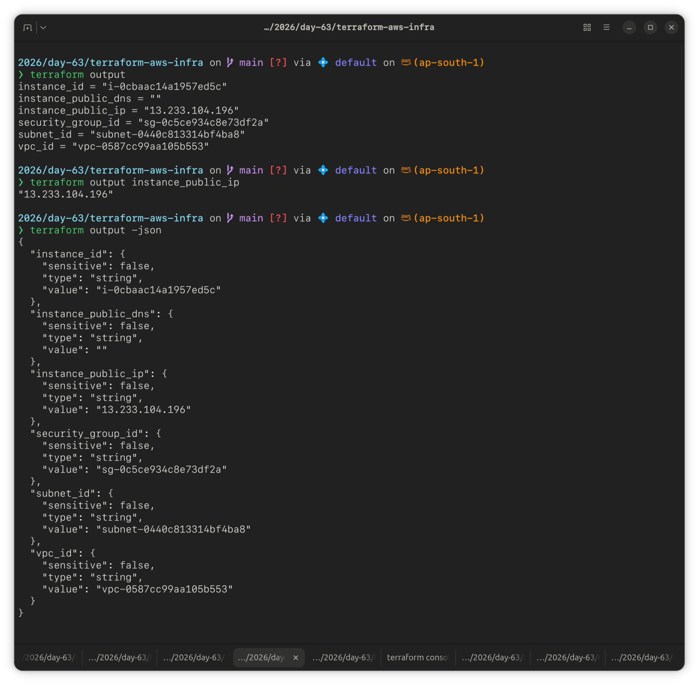
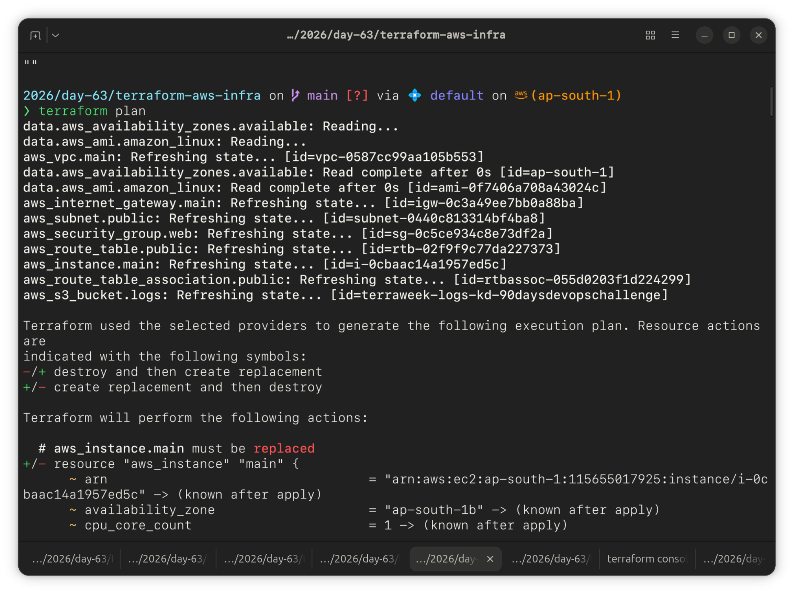

# Day 63 — Variables, Outputs, Data Sources and Expressions

Refactored the Day 62 static Terraform config into a fully parameterized, environment-aware setup — variables for every value, outputs after apply, data sources for AMI/AZ lookups, locals for consistent tagging, and conditional expressions for environment-based sizing.

---

## Task 1: Extract Variables

Created `variables.tf` with 8 input variables covering all core Terraform types, and refactored `main.tf` to reference `var.*` instead of hardcoded values.

```hcl
variable "region" {
  description = "AWS region to deploy into"
  type        = string
  default     = "ap-south-1"
}

variable "vpc_cidr" {
  description = "CIDR block for the VPC"
  type        = string
  default     = "10.0.0.0/16"
}

variable "subnet_cidr" {
  description = "CIDR block for the public subnet"
  type        = string
  default     = "10.0.1.0/24"
}

variable "instance_type" {
  description = "EC2 instance type"
  type        = string
  default     = "t2.micro"
}

variable "project_name" {
  description = "Project name used as a prefix for resource naming"
  type        = string
  # no default -- forces the user to provide it
}

variable "environment" {
  description = "Deployment environment"
  type        = string
  default     = "dev"
}

variable "allowed_ports" {
  description = "List of ports to allow inbound in the security group"
  type        = list(number)
  default     = [22, 80, 443]
}

variable "extra_tags" {
  description = "Extra tags to merge into every resource"
  type        = map(string)
  default     = {}
}
```

Ran `terraform plan` with no `project_name` set — Terraform correctly stopped and prompted for it, since it has no default. Entered `Day-63-terraform` at the prompt.

Kept the security group ingress rules (22, 80, 443) as static blocks for now rather than looping over `var.allowed_ports` — noted as a follow-up improvement.


**The five variable types in Terraform:** `string`, `number`, `bool`, `list`, `map`. (Terraform also supports more complex types like `set`, `object`, and `tuple`, but these five are the core building blocks.)

---

## Task 2: Variable Files and Precedence

Created `terraform.tfvars` (dev defaults) and `prod.tfvars` (prod overrides):

```hcl
# terraform.tfvars
project_name  = "Day-63-terraform"
environment   = "dev"
instance_type = "t2.micro"
```

```hcl
# prod.tfvars
project_name  = "Day-63-terraform"
environment   = "prod"
instance_type = "t3.small"
vpc_cidr      = "10.1.0.0/16"
subnet_cidr   = "10.1.1.0/24"
```

Tested precedence step by step:

```bash
terraform plan                                # picks up terraform.tfvars automatically
terraform plan -var-file="prod.tfvars"        # switches to prod values
terraform plan -var="instance_type=t2.nano"   # CLI flag overrides tfvars
export TF_VAR_environment="staging"
terraform plan                                # env var overrides default, not tfvars
```


**Variable precedence, lowest to highest:**
`default` in `variables.tf` → `terraform.tfvars` → `*.auto.tfvars` → `-var-file` flag → `-var` flag → `TF_VAR_*` environment variables.

---

## Task 3: Add Outputs

Created `outputs.tf` with 6 outputs pointing at the actual resource labels from `main.tf`:

```hcl
output "vpc_id" {
  value = aws_vpc.main.id
}

output "subnet_id" {
  value = aws_subnet.public.id
}

output "instance_id" {
  value = aws_instance.server.id
}

output "instance_public_ip" {
  value = aws_instance.server.public_ip
}

output "instance_public_dns" {
  value = aws_instance.server.public_dns
}

output "security_group_id" {
  value = aws_security_group.main.id
}
```



Verified individually and cross-checked against the AWS Console:

```bash
terraform output
terraform output instance_public_ip
terraform output -json
```



**Verify:** `terraform output instance_public_ip` matched the public IP shown in AWS Console → EC2 → Instances. ✅

---

## Task 4: Use Data Sources

Added two data sources to stop hardcoding the AMI and AZ:

```hcl
data "aws_ami" "amazon_linux" {
  most_recent = true
  owners      = ["amazon"]

  filter {
    name   = "name"
    values = ["amzn2-ami-hvm-*-x86_64-gp2"]
  }

  filter {
    name   = "virtualization-type"
    values = ["hvm"]
  }

  filter {
    name   = "root-device-type"
    values = ["ebs"]
  }
}

data "aws_availability_zones" "available" {
  state = "available"
}
```

Wired both into the existing resources:

```hcl
resource "aws_instance" "server" {
  ami           = data.aws_ami.amazon_linux.id
  instance_type = var.instance_type
  subnet_id     = aws_subnet.public.id
}

resource "aws_subnet" "public" {
  vpc_id            = aws_vpc.main.id
  cidr_block        = var.subnet_cidr
  availability_zone = data.aws_availability_zones.available.names[0]
}
```



**Resource vs. data source:** A `resource` block tells Terraform to create, manage, and eventually destroy an infrastructure object it owns. A `data` source is read-only — it looks up information that already exists (an AMI, an AZ list) and Terraform never creates or destroys what it reads.

---

## Task 5: Use Locals for Dynamic Values

Added a `locals` block and merged common tags across every resource:

```hcl
locals {
  name_prefix = "${var.project_name}-${var.environment}"
  common_tags = {
    Project     = var.project_name
    Environment = var.environment
    ManagedBy   = "Terraform"
  }
}
```

```hcl
tags = merge(local.common_tags, {
  Name = "${local.name_prefix}-vpc"
})
```

Applied the same pattern to the subnet and instance, with `var.extra_tags` merged in on the instance as well.

## 

## Task 6: Built-in Functions and Conditional Expressions

Ran through the built-in functions in `terraform console`:

```
> upper("terraweek")
> join("-", ["terra", "week", "2026"])
> format("arn:aws:s3:::%s", "my-bucket")
> length(["a", "b", "c"])
> lookup({dev = "t2.micro", prod = "t3.small"}, "dev")
> toset(["a", "b", "a"])
> cidrsubnet("10.0.0.0/16", 8, 1)
```


Added a conditional expression for environment-based sizing:

```hcl
instance_type = var.environment == "prod" ? "t3.small" : "t2.micro"
```

```bash
terraform apply -var-file="prod.tfvars"
```


**Five functions I found most useful:**

- `merge()` — combines two maps; used it to layer common tags with resource-specific ones without repeating myself
- `lookup()` — pulls a value from a map with a fallback, handy for environment → instance-size mappings
- `cidrsubnet()` — calculates a subnet CIDR from a parent CIDR block instead of hand-picking ranges
- `format()` — builds strings like ARNs or resource names with placeholders instead of string concatenation
- `join()` — turns a list into a single delimited string, useful for naming conventions

---

## Cleanup

```bash
terraform destroy
```

## 

## Summary: `variable` vs `local` vs `output` vs `data`

| Block      | Purpose                                                                              |
| ---------- | ------------------------------------------------------------------------------------ |
| `variable` | Input — a value the user provides (via default, tfvars, CLI, or env var)             |
| `local`    | Computed value derived from variables/resources, reused internally within the config |
| `output`   | Exposes a value after apply, for the user or for other configs/scripts to consume    |
| `data`     | Read-only lookup of existing information from the provider (never creates/destroys)  |
