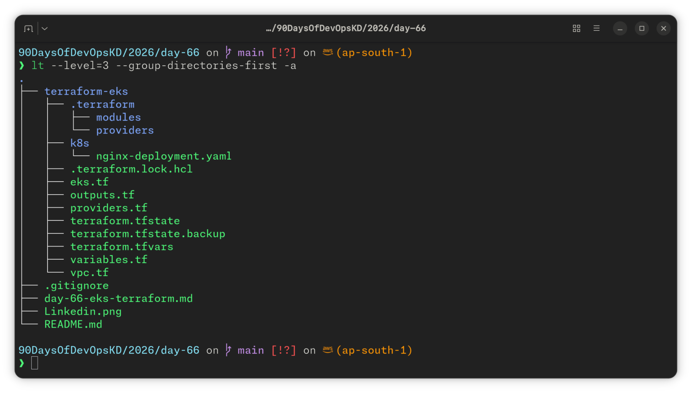

# Day 66 — Provision an EKS Cluster with Terraform Modules

## Task

Provision a fully automated, repeatable, destroyable AWS EKS cluster using Terraform registry modules — VPC, EKS control plane, managed node group — connect `kubectl`, deploy a workload, and tear it all down cleanly.

---

## Task 1: Project Setup

```
terraform-eks/
  providers.tf        # AWS + Kubernetes provider config
  vpc.tf               # VPC module call (terraform-aws-modules/vpc/aws)
  eks.tf               # EKS module call (terraform-aws-modules/eks/aws)
  variables.tf         # Input variables
  outputs.tf           # Cluster outputs (name, endpoint, region)
  terraform.tfvars     # Variable values (region = us-east-1)
  k8s/
    nginx-deployment.yaml
```

Versions pinned: `hashicorp/aws ~> 6.0`, `hashicorp/kubernetes ~> 3.0`, `terraform-aws-modules/vpc/aws ~> 6.0`, `terraform-aws-modules/eks/aws ~> 21.0`, Kubernetes `1.36`.



---

## Task 2: VPC with Registry Module

`vpc.tf` uses `terraform-aws-modules/vpc/aws` — CIDR `10.0.0.0/16`, 2 AZs, 2 public + 2 private subnets, single NAT gateway, DNS hostnames enabled, subnet role tags for ELB discovery.

**Why does EKS need both public and private subnets? What do the subnet tags do?**

Worker nodes sit in **private** subnets with no direct internet exposure; a NAT Gateway in the **public** subnet gives them outbound internet access (image pulls, API calls) without being reachable from outside. The `kubernetes.io/role/elb` and `kubernetes.io/role/internal-elb` subnet tags tell the AWS Load Balancer Controller which subnets are eligible for external vs. internal `Service type=LoadBalancer` provisioning.

`terraform plan` on the VPC alone: **19 resources** (VPC, 4 subnets, 2 route tables, 4 route table associations, 2 routes, IGW, NAT gateway, EIP, 3 default VPC resources).


---

## Task 3: EKS Cluster with Registry Module

Final, working `eks.tf`:

```hcl
module "eks" {
  source  = "terraform-aws-modules/eks/aws"
  version = "~> 21.0"

  name               = var.cluster_name
  kubernetes_version = var.cluster_version

  vpc_id     = module.vpc.vpc_id
  subnet_ids = module.vpc.private_subnets

  endpoint_public_access  = true
  endpoint_private_access = true

  addons = {
    coredns    = {}
    kube-proxy = {}
    vpc-cni = {
      before_compute = true
    }
    eks-pod-identity-agent = {
      before_compute = true
    }
  }

  enabled_log_types                      = ["api", "audit", "authenticator", "controllerManager", "scheduler"]
  cloudwatch_log_group_retention_in_days = 1

  enable_cluster_creator_admin_permissions = true

  eks_managed_node_groups = {
    terraweek_nodes = {
      ami_type       = "AL2023_x86_64_STANDARD"
      instance_types = [var.node_instance_type]
      min_size       = 1
      max_size       = 3
      desired_size   = var.node_desired_count
    }
  }

  tags = {
    Environment = "dev"
    Project     = "TerraWeek"
    ManagedBy   = "Terraform"
  }
}
```

`terraform plan` on the full stack: **55 resources** (VPC: 19, EKS cluster + node group + IAM/KMS/logging/addons: 35).


---

## Task 4: Apply and Connect kubectl

```
❯ kubectl get nodes
NAME                         STATUS   ROLES    AGE     VERSION
ip-10-0-2-125.ec2.internal   Ready    <none>   7m29s   v1.36.2-eks-bca9cf6
ip-10-0-3-234.ec2.internal   Ready    <none>   7m30s   v1.36.2-eks-bca9cf6

❯ kubectl get pods -A
NAMESPACE     NAME                           READY   STATUS    RESTARTS   AGE
kube-system   aws-node-9txm5                 2/2     Running   0          7m44s
kube-system   aws-node-p6k8j                 2/2     Running   0          7m45s
kube-system   coredns-b8b6dd877-87dw5        1/1     Running   0          5m42s
kube-system   coredns-b8b6dd877-dxjsd        1/1     Running   0          4m41s
kube-system   eks-pod-identity-agent-5m562   1/1     Running   0          7m44s
kube-system   eks-pod-identity-agent-fqvsn   1/1     Running   0          7m45s
kube-system   kube-proxy-2clc7               1/1     Running   0          6m52s
kube-system   kube-proxy-ssnnt               1/1     Running   0          6m53s
```


## Task 5: Deploy a Workload on the Cluster

Applied `k8s/nginx-deployment.yaml` — 3-replica Nginx Deployment + a `LoadBalancer` Service. Verified pods running and the Nginx welcome page reachable via the ELB's external hostname.


---

## Task 6: Destroy Everything

```bash
kubectl delete -f k8s/nginx-deployment.yaml   # remove LoadBalancer service first
terraform destroy                              # 55 resources destroyed
```

Post-destroy check via Resource Groups Tagging API confirmed clean state — the only lingering item was the EKS-managed KMS key in `PendingDeletion` (AWS's mandatory 7–30 day cooldown before physical deletion; expected, not a leftover, and not separately billed at the normal rate during that window).

**Verified clean:**

- EKS clusters: empty
- EC2 instances: terminated
- VPC: gone
- NAT Gateway: deleted
- Elastic IPs: released


---

## Troubleshooting — the two real blockers

This day had two genuinely hard issues, neither of which was covered by the challenge's own hints. Documenting both in full since they cost the most time and taught the most.

### 1. Task 1/2 — `terraform init` — modules failing with "invalid ref" (root cause: NTFS + Windows dual-boot)

**Symptom:** `terraform init` failed downloading every registry module (VPC, EKS, and EKS's nested KMS submodule) with:

```
Error: Failed to download module
error downloading '...': invalid ref: "<tag-or-commit>"
```

This happened even though the tag/commit genuinely existed upstream, `git ls-remote` could see it fine, and a manual `git clone --branch <tag>` of the same repo worked without error.

**Wrong turns first:** initially suspected go-getter's SHA-vs-tag resolution, then a corporate git config URL rewrite (`insteadOf` redirecting HTTPS to SSH) — both ruled out by checking `git config --list --show-origin` (nothing relevant scoped globally) and confirming manual clones worked fine.

**Actual root cause:** the project lives on an **NTFS-mounted drive** (`/mnt/0CFAB2CDFAB2B276/...` — a shared Windows/Ubuntu dual-boot volume). Git's dubious-ownership safety check silently blocked git operations inside the brand-new `.terraform/modules/...` directories that Terraform's module downloader creates on every run, because ownership metadata on NTFS doesn't cleanly map to the Linux user. Terraform's module installer (go-getter) swallowed git's real `fatal: detected dubious ownership` error and re-surfaced it as a generic `invalid ref`, which is what made this so hard to trace — the visible error pointed at module/tag resolution, not the actual filesystem-level cause.

**Fix (one-time, permanent):**

```bash
git config --global --add safe.directory '/mnt/0CFAB2CDFAB2B276/*'
```

Wildcarding the whole mount (rather than one path) was necessary because Terraform creates a _new_ nested repo path on every module download — trusting a single path only fixes it once.

💡 **Aha moment:** the error message lied about where the problem was. Chasing the literal text ("invalid ref") led toward module/registry theories for a long time; the real fix came from reproducing the failure with a raw `git clone` and reading git's own (unfiltered) error instead of Terraform's re-worded version of it.

### 2. Task 3/4 — EKS node group stuck `CREATE_FAILED` — `NodeCreationFailure: Unhealthy nodes` (root cause: missing CNI addon)

**Symptom:** After a clean `terraform apply` of the VPC and EKS control plane, the managed node group consistently failed after ~15-20+ minutes with:

```
Error: waiting for EKS Node Group (...) create: unexpected state 'CREATE_FAILED', wanted target 'ACTIVE'.
last error: NodeCreationFailure: Unhealthy nodes in the kubernetes cluster
```

This reproduced identically across **three separate attempts**, including after switching Kubernetes versions (1.31 → 1.36) and after granting the IAM user full `AdministratorAccess` — ruling out both the K8s version and IAM permissions as the cause.

**Diagnosis path:** enabled EKS control-plane logging (`enabled_log_types`) to get real server-side evidence instead of inferring from EC2 boot logs. The `authenticator` CloudWatch log stream showed nodes successfully authenticating and joining (`access granted`, `groups=[system:nodes]`) — so IAM auth and access entries were never the problem. The `kube-apiserver` audit log then revealed the real signal:

```
"reason":"KubeletNotReady","message":"[container runtime network not ready: NetworkReady=false
reason:NetworkPluginNotReady message:Network plugin returns error: cni plugin not initialized...]"
"daemonsets.apps \"aws-node\" not found"
```

The nodes were joining the cluster fine — but the **VPC CNI plugin (`aws-node` DaemonSet) was never installed**, so pod networking never initialized, kubelet could never report `Ready`, and EKS's node-group health check eventually gave up.

**Root cause:** the `terraform-aws-modules/eks/aws` v21 module does **not** auto-install the `vpc-cni`, `coredns`, or `kube-proxy` addons — they must be explicitly declared via an `addons` block. That block was missing from `eks.tf`.

**Fix:**

```hcl
addons = {
  coredns    = {}
  kube-proxy = {}
  vpc-cni    = { before_compute = true }   # must exist before nodes launch
  eks-pod-identity-agent = { before_compute = true }
}
```

`before_compute = true` on `vpc-cni` is what matters most — it forces the CNI addon to install _before_ the node group launches, instead of racing it.

**Repair, not full rebuild:** rather than a full `destroy`/`apply` cycle, the follow-up `plan` showed exactly `5 to add, 0 to change, 1 to destroy` — Terraform replaced only the failed node group and added the four addons, reusing the existing VPC and EKS control plane. Apply completed cleanly in a few minutes; `kubectl get nodes` showed both nodes `Ready` immediately after.

🔧 **Technical callout:** three back-to-back `CREATE_FAILED` node groups with the exact same generic AWS error message, across different K8s versions and IAM permission levels, is a strong signal the AWS-level error string is too generic to trust at face value — the real cause only became visible by turning on control-plane logging and reading the Kubernetes-level condition (`NetworkPluginNotReady`), not the Terraform/AWS-level wrapper error.

---

## Reflection: This vs. `kind` (Day 50)

Day 50 stood up a Kubernetes cluster locally with `kind` in seconds, no cloud account, no IAM, no cost — perfect for fast iteration on manifests and learning core K8s objects without real-world friction. This exercise was the opposite kind of learning: the Terraform config itself was short and mostly copy-paste from the module's own docs, but _getting it to actually work_ required understanding IAM access entries, EKS's authentication layer, CNI networking, and reading raw AWS logs instead of trusting a wrapper tool's error message. `kind` teaches Kubernetes; provisioning real EKS via Terraform teaches the infrastructure and failure modes underneath it — which is where most of the actual troubleshooting time in a real job goes.

---

`#90DaysOfDevOps` `#TerraWeek` `#DevOpsKaJosh` `#TrainWithShubham`
