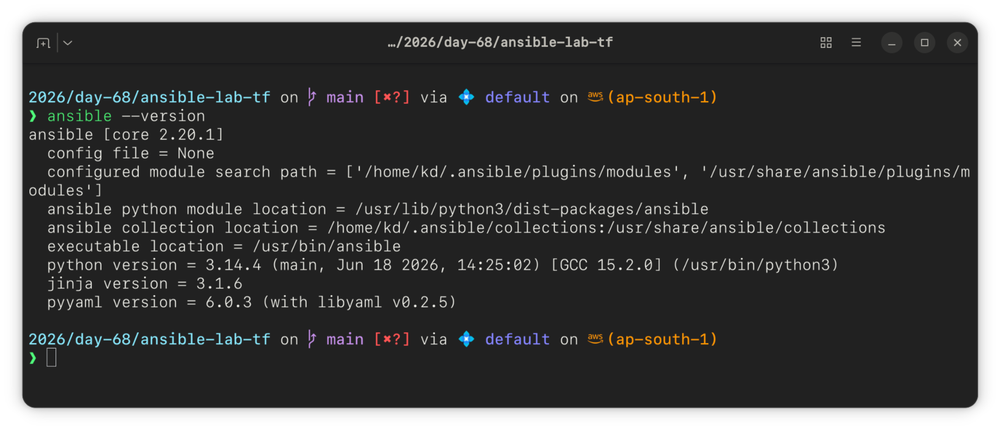

# Day 68 — Introduction to Ansible and Inventory Setup

## Task 1: Ansible Architecture (In My Own Words)

**Configuration management** is the practice of keeping servers in a known, consistent state after they're provisioned — installing packages, managing users, configs, and services. Terraform builds the infrastructure; Ansible configures and maintains what's running on it.

**Ansible vs Chef/Puppet/Salt:** Chef, Puppet, and Salt require an agent running on every managed node plus a central master server to push changes. Ansible is **agentless** — it connects over SSH, pushes small Python modules to the target, executes them, and exits. Nothing persists on the managed node.

**Agentless** means there's no daemon or background process running on the servers Ansible manages. If you can SSH into a machine, Ansible can manage it — no extra installation required on the target side.

**Architecture:**

- **Control Node** — my Ubuntu 26.04 machine, where all `ansible` commands are run from
- **Managed Nodes** — the 3 EC2 instances (web, app, db)
- **Inventory** — `inventory.ini`, the file listing managed nodes and how to reach them
- **Modules** — units of work Ansible executes (`ping`, `apt`, `copy`, `command`)
- **Playbooks** — YAML files that chain modules together into repeatable automation (next up on Day 69)

---

## Task 2: Lab Setup — Terraform

Provisioned 3 EC2 instances via Terraform in `us-east-1`, reusing skills from the TerraWeek module.

**Instance details:**
| Instance | Role | Type | AMI |
|---|---|---|---|
| web-server | Web tier | t2.micro | Ubuntu 22.04 |
| app-server | App tier | t2.micro | Ubuntu 22.04 |
| db-server | DB tier | t2.micro | Ubuntu 22.04 |

Security group allows inbound SSH (port 22). Key pair generated locally with `ssh-keygen -t ed25519` and injected via `aws_key_pair`.

`main.tf` and `outputs.tf` committed alongside this file in `2026/day-68/terraform/`.


---

## Task 3: Install Ansible

Installed on the **control node only** (Ubuntu 26.04 laptop) — not on the EC2 instances, since Ansible is agentless and doesn't need to run on managed nodes.

```bash
sudo apt update
sudo apt install ansible -y
ansible --version
```



---

## Task 4: Inventory File

```ini
[web]
web-server ansible_host=<REDACTED>

[app]
app-server ansible_host=<REDACTED>

[db]
db-server ansible_host=<REDACTED>

[all:vars]
ansible_user=ubuntu
ansible_ssh_private_key_file=~/.ssh/ansible-lab-key
ansible_python_interpreter=/usr/bin/python3
```

Verified connectivity to all 3 hosts:

```bash
ansible all -i inventory.ini -m ping
```

---

## Task 5: Ad-Hoc Commands

| #   | Command                                                                       | Purpose                         |
| --- | ----------------------------------------------------------------------------- | ------------------------------- |
| 1   | `ansible all -i inventory.ini -m command -a "uptime"`                         | Check uptime on all servers     |
| 2   | `ansible web -i inventory.ini -m command -a "free -h"`                        | Check memory on web group only  |
| 3   | `ansible all -i inventory.ini -m command -a "df -h"`                          | Check disk space on all servers |
| 4   | `ansible web -i inventory.ini -m apt -a "name=git state=present" --become`    | Install git on web group        |
| 5   | `ansible all -i inventory.ini -m copy -a "src=hello.txt dest=/tmp/hello.txt"` | Copy file to all servers        |
| 6   | `ansible all -i inventory.ini -m command -a "cat /tmp/hello.txt"`             | Verify file copy                |

**What `--become` does:** escalates to root on the remote host (Ansible's equivalent of `sudo`). Needed for anything that modifies system state — installing packages, managing services, writing to root-owned paths. Not needed for read-only ops like `ping` or `uptime`.


---

## Task 6: Inventory Groups, Patterns & ansible.cfg

Added nested groups:

```ini
[application:children]
web
app

[all_servers:children]
application
db
```

Ran group and pattern queries:

```bash
ansible application -i inventory.ini -m ping     # web + app
ansible db -i inventory.ini -m ping               # db only
ansible all_servers -i inventory.ini -m ping      # everything
ansible 'web:app' -i inventory.ini -m ping        # OR
ansible 'all:!db' -i inventory.ini -m ping        # NOT
```

Created `ansible.cfg`:

```ini
[defaults]
inventory = inventory.ini
host_key_checking = False
remote_user = ubuntu
private_key_file = ~/.ssh/ansible-lab-key
```

**Note:** hit an issue where `ansible.cfg` was being ignored — Ansible refuses to read a config file from a world-writable directory, which my NTFS-mounted dual-boot drive triggers by default. Worked around it by exporting the config path explicitly instead of relying on directory auto-discovery:

```bash
export ANSIBLE_CONFIG=~/ansible-practice/ansible.cfg
```

After that, `ansible all -m ping` worked without specifying `-i` manually.


---

## `command` vs `shell` Module

- **`command`** — runs the given command directly, without invoking a shell. No support for pipes, redirects, or environment variable expansion. Safer default choice.
- **`shell`** — runs the command through `/bin/sh`, so pipes (`|`), redirects (`>`), and shell expansions work. Use only when you actually need shell features, since it's more permissive.

---

## Cleanup

```bash
terraform destroy -auto-approve
```

All EC2 instances, security group, and key pair removed from AWS after lab completion.

---

`#90DaysOfDevOps` `#DevOpsKaJosh` `#TrainWithShubham`
