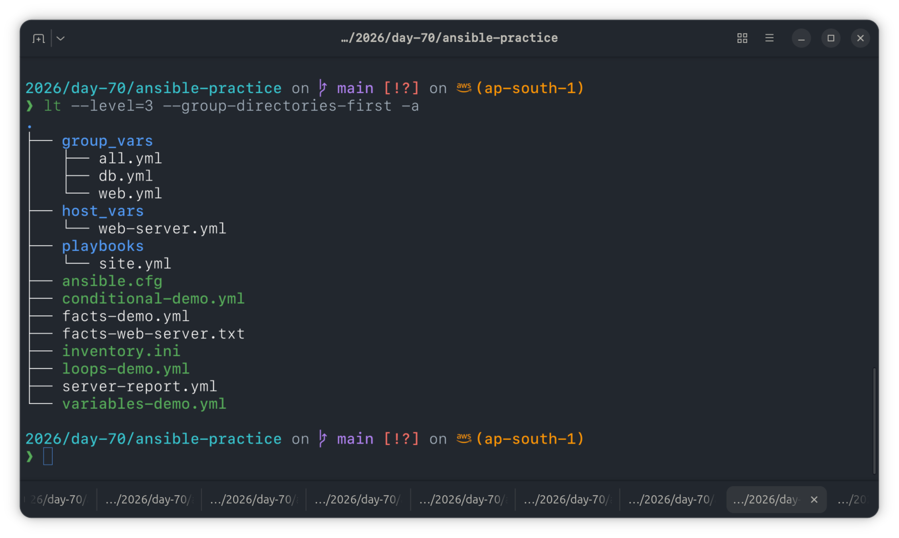

# Day 70 — Variables, Facts, Conditionals and Loops

## Task

Playbooks made smart with variables from multiple sources, OS/group-based conditionals, loops for bulk operations, and a facts-driven server health report — across a 2-node Ansible lab (`web-server`, `db-server`) provisioned via Terraform.

---

## Task 1: Variables in Playbooks

`variables-demo.yml` defines `app_name`, `app_port`, `app_dir`, and a `packages` list in the play's `vars:` block.

**Run 1 — default values:**

```bash
ansible-playbook variables-demo.yml
```

Output: `Deploying terraweek-app on port 8080 to /opt/terraweek-app`

**Run 2 — CLI override:**

```bash
ansible-playbook variables-demo.yml -e "app_name=my-custom-app app_port=9090"
```

Output: `Deploying my-custom-app on port 9090 to /opt/my-custom-app`


**Verified:** CLI `-e` extra-vars override playbook `vars:` — confirmed by the message changing from default to custom values across both hosts.

**Note:** `yum` replaced with `apt` throughout (Ubuntu 22.04 target hosts).

---

## Task 2: group_vars and host_vars

### Directory structure

```
ansible-practice/
  inventory.ini
  ansible.cfg
  group_vars/
    all.yml
    web.yml
    db.yml
  host_vars/
    web-server.yml
  playbooks/
    site.yml
```



### Precedence test

Ran `site.yml` and compared `max_connections`:

- `group_vars/web.yml` sets `max_connections: 1000`
- `host_vars/web-server.yml` overrides it to `max_connections: 2000`

Actual output on `web-server`: `HTTP port: 80, Max connections: 2000` — confirming `host_vars` wins over `group_vars`.

Also fixed a bug along the way: `apt` module failed with `No package matching 'tree' is available` on fresh instances — resolved by adding `update_cache: yes` to the "Install common packages" task, since the apt cache hadn't been refreshed on new EC2s.


**Variable precedence order (low to high):**
role defaults → `group_vars/all` → `group_vars/<group>` → `host_vars/<host>` → playbook `vars` → task vars → `-e` (extra-vars, always wins)

---

## Task 3: Ansible Facts

```bash
ansible web-server -i inventory.ini -m setup
ansible web-server -i inventory.ini -m setup -a "filter=ansible_os_family"
ansible web-server -i inventory.ini -m setup -a "filter=ansible_distribution*"
ansible web-server -i inventory.ini -m setup -a "filter=ansible_memtotal_mb"
ansible web-server -i inventory.ini -m setup -a "filter=ansible_default_ipv4"
```


Ran `facts-demo.yml` to print facts inline via `debug`.


### Five facts I'd use in real playbooks

| Fact                           | Why                                                                |
| ------------------------------ | ------------------------------------------------------------------ |
| `ansible_distribution`         | Choose correct package manager/module (apt vs yum) dynamically     |
| `ansible_memtotal_mb`          | Gate memory-heavy tasks or tune app config per host size           |
| `ansible_default_ipv4.address` | Generate configs, register services, build inventories dynamically |
| `ansible_os_family`            | Branch logic cleanly across RedHat/Debian families in shared roles |
| `ansible_hostname`             | Per-host naming in generated files, logs, and reports              |

---

## Task 4: Conditionals with `when`

`conditional-demo.yml` — ran and observed selective execution across `web-server` and `db-server`.


**Verified:** Web-only tasks (`'web' in group_names`) ran only on `web-server` and skipped on `db-server`, and vice versa for db-only tasks. Memory and OS-based conditions correctly gated on live fact values.

---

## Task 5: Loops

`loops-demo.yml` — creates users, directories, and packages via `loop`.

**Bug hit:** `Group wheel does not exist` — Ubuntu doesn't ship a `wheel` group (that's RHEL/CentOS convention). Fixed by changing `groups: wheel` → `groups: sudo` for the `deploy` and `monitor` users in the `vars` block. The `appuser`/`users` entry succeeded on the first attempt since `users` is a default Ubuntu group.

```yaml
users:
  - name: deploy
    groups: sudo
  - name: monitor
    groups: sudo
  - name: appuser
    groups: users
```


**`loop` vs `with_items`:** `loop` is the modern, module-agnostic syntax recommended going forward; `with_items` is legacy, tied to older lookup-plugin behavior, and being phased out in favor of `loop` + filters (e.g. `loop: "{{ users | selectattr(...) }}"`).

---

## Task 6: Register, Debug, and Combine

`server-report.yml` — gathered disk, memory, and running services via `register`, then generated a per-host report file.


**Verified on host:**

```bash
ansible all -i inventory.ini -a "cat /tmp/server-report-web-server.txt" -b
```


---

## Environment Notes

- Terraform-provisioned lab: 2x Ubuntu 22.04 EC2 (`web-server`, `db-server`) in `us-east-1`, reusing key pair + security group pattern from Day 68.
- `yum` → `apt` swapped in every task across all playbooks (target OS is Ubuntu, not RHEL/Amazon Linux).
- `groups: wheel` → `groups: sudo` in loops-demo (Ubuntu has no `wheel` group by default).
- `update_cache: yes` added to apt package install tasks to avoid stale-cache failures on fresh instances.

---

`#90DaysOfDevOps` `#DevOpsKaJosh` `#TrainWithShubham`
