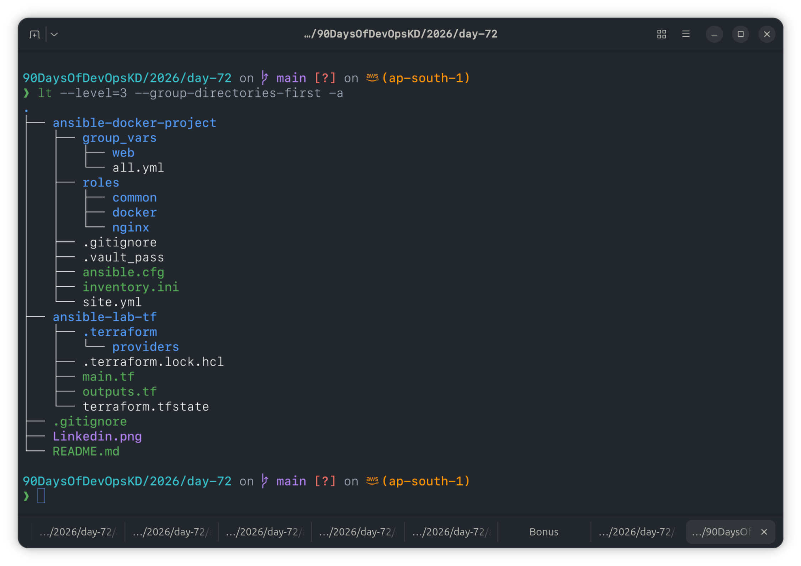
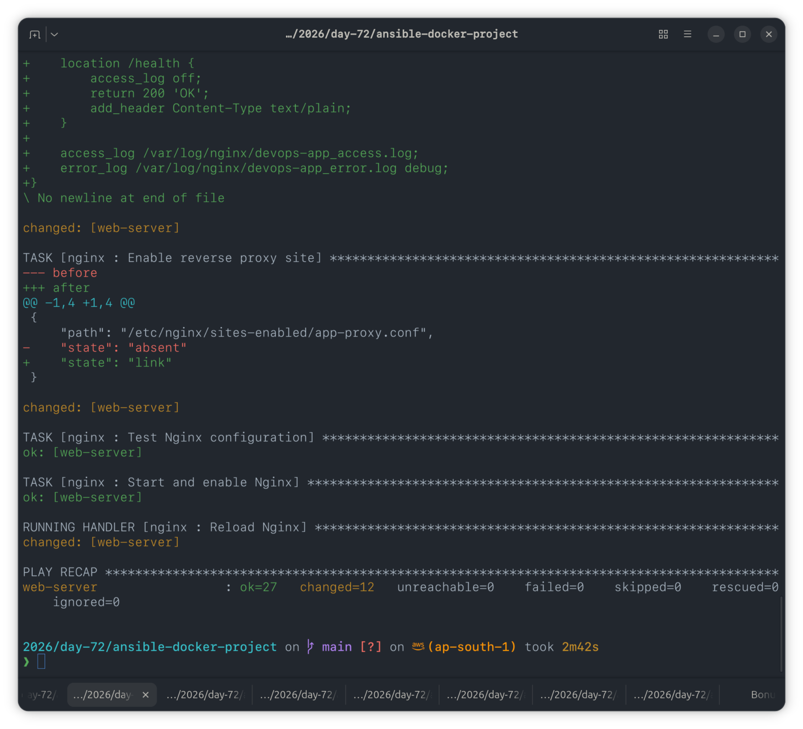

# Day 72 — Ansible Project: Automate Docker and Nginx Deployment

## Overview

Automated a complete deployment on a single Ubuntu 22.04 EC2 instance: Docker installed, application container pulled and run, Nginx configured as a reverse proxy in front of it, and Docker Hub credentials encrypted with Ansible Vault — all orchestrated through custom Ansible roles with one master playbook.

---

## Architecture

```
Ansible (control node)
        │
        ▼
   EC2 Instance (web-server)
        │
        ├── Nginx  :80   ──► reverse proxy
        │                       │
        └── Docker Container :8080  (nginx image)
```

---

## Task 1: Project Structure



**Inventory** — single `web` host (no separate db/app tier needed for this project, since the container and Nginx both run on the same box):

```ini
[web]
web-server ansible_host=<EC2_PUBLIC_IP>

[all:vars]
ansible_user=ubuntu
ansible_ssh_private_key_file=~/.ssh/ansible-lab-key
ansible_python_interpreter=/usr/bin/python3
```

---

## Task 2: Common Role

Baseline setup applied to all hosts — package cache update, common packages (`vim`, `curl`, `wget`, `git`, `htop`, `tree`, `jq`, `unzip`), timezone, and a `deploy` user.

```yaml
# roles/common/tasks/main.yml
---
- name: Update package cache
  apt:
    update_cache: true
  tags: common

- name: Install common packages
  apt:
    name: "{{ common_packages }}"
    state: present
  tags: common

- name: Set timezone
  timezone:
    name: "{{ timezone }}"
  tags: common

- name: Create deploy user
  user:
    name: deploy
    groups: sudo
    shell: /bin/bash
    state: present
  tags: common
```

---

## Task 3: Docker Role

Installs Docker CE, starts the service, logs into Docker Hub using Vault-decrypted credentials, pulls the app image, and runs the container.

```yaml
# roles/docker/tasks/main.yml (key excerpt)
---
- name: Create keyrings directory
  file:
    path: /etc/apt/keyrings
    state: directory
    mode: "0755"
  tags: docker

- name: Add Docker GPG key
  get_url:
    url: https://download.docker.com/linux/ubuntu/gpg
    dest: /etc/apt/keyrings/docker.asc
    mode: "0644"
  tags: docker

- name: Add Docker CE repository
  apt_repository:
    repo: "deb [arch=amd64 signed-by=/etc/apt/keyrings/docker.asc] https://download.docker.com/linux/ubuntu {{ ansible_distribution_release }} stable"
    state: present
    filename: docker
  tags: docker

- name: Log in to Docker Hub
  community.docker.docker_login:
    username: "{{ vault_docker_username }}"
    password: "{{ vault_docker_password }}"
  when: vault_docker_username is defined
  tags: docker

- name: Pull application image
  community.docker.docker_image:
    name: "{{ docker_app_image }}"
    tag: "{{ docker_app_tag }}"
    source: pull
  tags: docker

- name: Run application container
  community.docker.docker_container:
    name: "{{ docker_app_name }}"
    image: "{{ docker_app_image }}:{{ docker_app_tag }}"
    state: started
    restart_policy: always
    ports:
      - "{{ docker_app_port }}:{{ docker_container_port }}"
  tags: docker
```

**Technical callout:** the original brief's `apt_key` module is deprecated on Ubuntu 22.04+ and throws version warnings. Replaced with the current `signed-by=` keyrings method — clean run, no deprecation warnings.

**Also:** Docker Hub no longer accepts account passwords for CLI/API logins — had to generate a **Personal Access Token** from Docker Hub settings and use that as `vault_docker_password`.

---

## Task 4: Nginx Role

Installs Nginx, removes the default site, deploys a reverse-proxy config from a Jinja2 template pointing at the Docker container's port, tests config before reload.

```nginx
# roles/nginx/templates/app-proxy.conf.j2
upstream docker_app {
    server 127.0.0.1:{{ nginx_upstream_port }};
}

server {
    listen {{ nginx_http_port }};
    server_name {{ nginx_server_name }};

    location / {
        proxy_pass http://docker_app;
        proxy_set_header Host $host;
        proxy_set_header X-Real-IP $remote_addr;
        proxy_set_header X-Forwarded-For $proxy_add_x_forwarded_for;
        proxy_set_header X-Forwarded-Proto $scheme;
    }

    location /health {
        access_log off;
        return 200 'OK';
        add_header Content-Type text/plain;
    }
}
```

**Technical callout:** Debian/Ubuntu Nginx uses the `sites-available` / `sites-enabled` symlink pattern (not a single monolithic config as RHEL implies) — added explicit link/unlink tasks for this.

---

## Task 5: Vault-Encrypted Docker Hub Credentials

```bash
ansible-vault create group_vars/web/vault.yml
```

```yaml
vault_docker_username: kd
vault_docker_password: dckr_pat_************************
```

Password file for automatic decryption during playbook runs:

```bash
echo "YourVaultPassword" > .vault_pass
chmod 600 .vault_pass
echo ".vault_pass" >> .gitignore
```

Referenced in `ansible.cfg`:

```ini
[defaults]
inventory = inventory.ini
host_key_checking = False
vault_password_file = .vault_pass
```

The vault file is never committed in plaintext — `ansible-vault edit` decrypts/re-encrypts in place, and `.vault_pass` is git-ignored so the decryption key itself never touches version control.

---

## Task 6: Master Playbook & Full Deployment

```yaml
# site.yml
---
- name: Apply common configuration
  hosts: all
  become: true
  roles: [common]
  tags: common

- name: Install Docker and run containers
  hosts: web
  become: true
  roles: [docker]
  tags: docker

- name: Configure Nginx reverse proxy
  hosts: web
  become: true
  roles: [nginx]
  tags: nginx
```

Deployed with:

```bash
ansible-playbook site.yml --diff
```




### Verification


Both curl outputs returned identical Nginx welcome page HTML — confirming Nginx is transparently proxying port 80 traffic through to the container on port 8080.

### Tag-based selective runs

```bash
ansible-playbook site.yml --tags docker      # Docker + containers only
ansible-playbook site.yml --tags nginx       # Nginx config only
ansible-playbook site.yml --skip-tags common # Skip baseline setup
```

---

## Task 7: Bonus — Swap App Image

Attempted swapping the container to `httpd`:

```bash
ansible-playbook site.yml --tags docker \
  -e "docker_app_image=httpd docker_app_tag=latest docker_app_name=apache-app"
```

**Outcome:** ran into a port-conflict error since the old `myapp` container (same port 8080, different name) was still running and holding the port — the role as written swaps by container _name_, not by port, so a differently-named container doesn't replace the old one automatically. After manually stopping/removing the old container, a follow-up run left the new container running but without a working port mapping, and the built-in health-check task also failed because the default `httpd` image returns 403 (no `index.html`) rather than the 200 the check expects.

**Decision:** parked this bonus task for today rather than debug further — the core deliverable (Tasks 1–6) is fully verified and working. Noting the root causes here for a future revisit:

- Docker container replacement should key off port availability / explicit `state: absent` + recreate, not rely on name-only matching
- The health-check task assumes a 200-response app; it isn't generalized for arbitrary images (e.g. blank Apache returns 403)

---

## Reflection

**How many total tasks ran?** 27 tasks across common, docker, and nginx roles on the full deploy run (`ok=27, changed=12, failed=0`).

### Concept Map

| Day | Concept Used                          |
| --- | ------------------------------------- |
| 68  | Inventory, ad-hoc commands, SSH setup |
| 69  | Playbooks, modules, handlers          |
| 70  | Variables, facts, conditionals, loops |
| 71  | Roles, templates, Galaxy, Vault       |
| 72  | Everything combined in one project    |

### What would I add for production?

- SSL via Certbot / Let's Encrypt for HTTPS termination at Nginx
- Centralized log rotation and shipping (e.g. to CloudWatch)
- Monitoring/alerting (Prometheus + node_exporter, or CloudWatch agent)
- Multi-container orchestration via Docker Compose or a proper scheduler for anything beyond a single app container
- A container-replacement strategy in the docker role that doesn't depend on matching container names

### Cleanup

```bash
cd ansible-lab-tf
terraform destroy
```

---

## Submission

- `day-72-ansible-project.md` added to `2026/day-72/`
- Committed and pushed to fork
