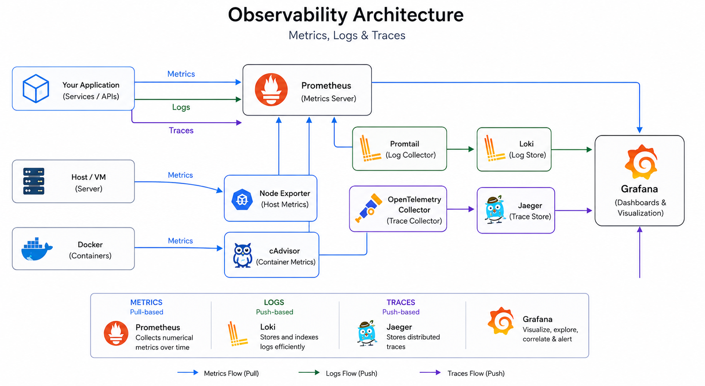
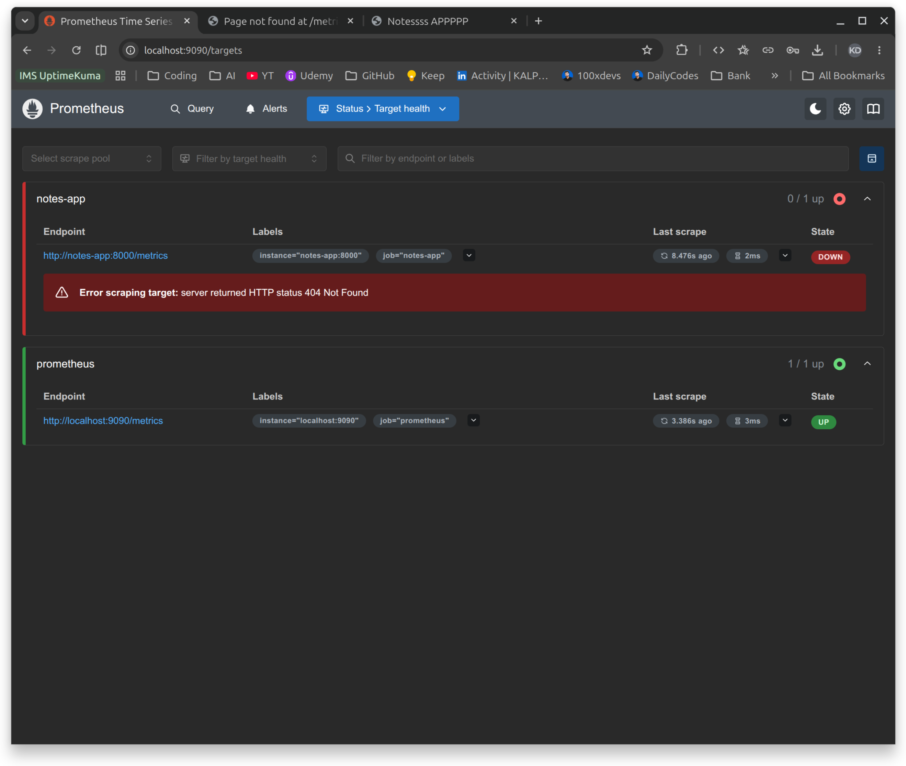
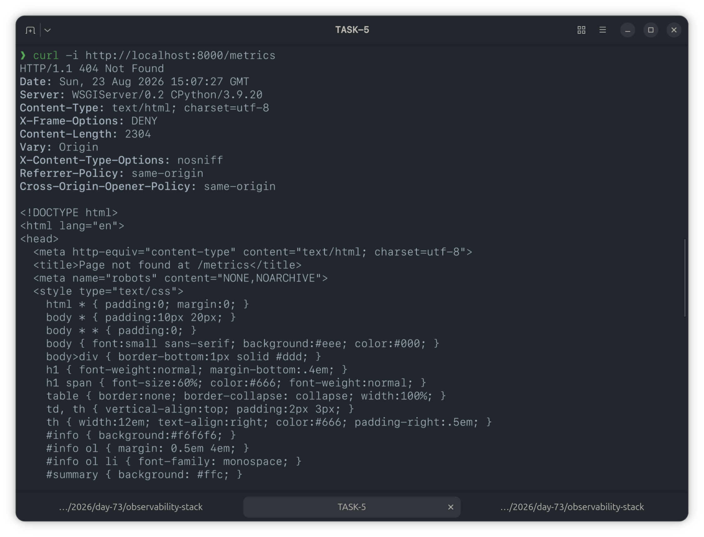

# Day 73 — Introduction to Observability and Prometheus

## Task 1: Understand Observability

**Monitoring vs Observability**

- **Monitoring** tells you _when_ something is wrong — predefined alerts and thresholds (e.g., "CPU > 90% alert fired").
- **Observability** tells you _why_ something is wrong — the ability to explore, query, and correlate data to investigate an issue you didn't anticipate.

**The Three Pillars**
| Pillar | What it captures | Tools |
|---|---|---|
| Metrics | Numerical measurements over time (CPU usage, request count, error rate) | Prometheus, Datadog, CloudWatch |
| Logs | Timestamped text records of events (app output, error messages) | Loki, ELK Stack, Fluentd |
| Traces | The journey of a single request across multiple services | OpenTelemetry, Jaeger, Zipkin |

**Why DevOps engineers need all three**

- Metrics tell you _what_ is broken (high error rate on `/api/users`)
- Logs tell you _why_ it broke (stack trace showing a database timeout)
- Traces tell you _where_ it broke (the payment service call took 12 seconds)

**Architecture — what I'll build over Days 73–77**

```
[Your App] --> metrics --> [Prometheus] --> [Grafana Dashboards]
[Your App] --> logs    --> [Promtail]   --> [Loki] --> [Grafana]
[Your App] --> traces  --> [OTEL Collector] --> [Grafana/Debug]
[Host]     --> metrics --> [Node Exporter] --> [Prometheus]
[Docker]   --> metrics --> [cAdvisor] --> [Prometheus]
```



---

## Task 2: Set Up Prometheus with Docker

**`prometheus.yml`**

```yaml
global:
  scrape_interval: 15s
  evaluation_interval: 15s

scrape_configs:
  - job_name: "prometheus"
    static_configs:
      - targets: ["localhost:9090"]
```

**`docker-compose.yml`**

```yaml
services:
  prometheus:
    image: prom/prometheus:latest
    container_name: prometheus
    ports:
      - "9090:9090"
    volumes:
      - ./prometheus.yml:/etc/prometheus/prometheus.yml
      - prometheus_data:/prometheus
    command:
      - "--config.file=/etc/prometheus/prometheus.yml"
    restart: unless-stopped

volumes:
  prometheus_data:
```

Started with:

```bash
docker compose up -d
```


**Verification:** Status → Targets → `prometheus` job showing state `UP`.


---

## Task 3: Understand Prometheus Concepts

**Scrape targets** — endpoints Prometheus pulls metrics from at regular intervals (pull-based model).

**Metric types**
| Type | Behavior | Example |
|---|---|---|
| Counter | Only increases | total requests, total errors |
| Gauge | Goes up and down | current memory, active connections |
| Histogram | Distribution of values in buckets | request duration buckets |
| Summary | Like histogram, percentiles computed client-side | request duration p50/p99 |

**Labels** — key-value pairs adding dimensions to a metric, e.g. `http_requests_total{method="GET", status="200"}`.

**Time series** — a unique combination of metric name + label set.

**Queries run:**

```promql
count({__name__=~".+"})
process_resident_memory_bytes
prometheus_http_requests_total
prometheus_http_requests_total{handler="/api/v1/query"}
```


**Counter vs Gauge — the difference**
| | Counter | Gauge |
|---|---|---|
| Direction | Only up (resets to 0 on restart) | Up or down |
| Works with `rate()` | Yes | No — meaningless on a gauge |
| Real example | `http_requests_total` — total requests since start (odometer) | `node_memory_MemAvailable_bytes` — current free RAM (speedometer) |

---

## Task 4: Learn PromQL Basics

**Instant vector** (current value):

```promql
up
```

Returns 1 (up) or 0 (down) per scrape target.

**Range vector** (raw values over a window — viewable only in Table/Console view, not Graph):

```promql
prometheus_http_requests_total[5m]
```

**Rate** (per-second rate of a counter):

```promql
rate(prometheus_http_requests_total[5m])
```

**Aggregation:**

```promql
sum(rate(prometheus_http_requests_total[5m]))
```

**Filter by label:**

```promql
prometheus_http_requests_total{code="200"}
prometheus_http_requests_total{code!="200"}
```

**Arithmetic** (bytes → MB):

```promql
process_resident_memory_bytes / 1024 / 1024
```

**Top-K:**

```promql
topk(5, prometheus_http_requests_total)
```

**Exercise — per-second rate of non-200 responses over 5 minutes:**

```promql
rate(prometheus_http_requests_total{code!="200"}[5m])
```


**Five PromQL queries and what they returned:**

1. `up` → 1 for each healthy target
2. `rate(prometheus_http_requests_total[5m])` → per-second request rate graph, several series by handler/code
3. `sum(rate(prometheus_http_requests_total[5m]))` → single aggregated per-second rate across all series
4. `process_resident_memory_bytes / 1024 / 1024` → Prometheus's own memory usage in MB
5. `rate(prometheus_http_requests_total{code!="200"}[5m])` → per-second rate of non-200 responses (near 0, as expected on a healthy instance)

---

## Task 5: Add a Sample Application as a Scrape Target

Added `notes-app` to `docker-compose.yml` and a matching `notes-app` job to `prometheus.yml`, then restarted the stack.

```bash
docker compose up -d
docker compose restart prometheus
```

Generated traffic:

```bash
curl http://localhost:8000
```



**Finding:** `notes-app` scrape shows `Error scraping target: server returned HTTP status 404 Not Found`. Checked with:

```bash
curl -i http://localhost:8000/metrics
```

This confirmed the app is a Django project (`notesapp.urls`) with only `admin/`, `api/`, and root routes defined — no `/metrics` endpoint exists in this image. This is not a Prometheus config issue; the app was never instrumented with a Prometheus client library (e.g. `django-prometheus`), so there's nothing at that path to scrape.

This directly demonstrates the README's own note: _"Not all applications expose Prometheus metrics natively"_ — exactly why exporters like Node Exporter and cAdvisor exist, to bridge apps without built-in Prometheus support (covered Days 74–75).



---

## Task 6: Explore Data Retention and Storage

Checked disk usage:

```bash
docker exec prometheus du -sh /prometheus
```


Updated `docker-compose.yml` command block to set explicit retention:

```yaml
command:
  - "--config.file=/etc/prometheus/prometheus.yml"
  - "--storage.tsdb.retention.time=30d"
  - "--storage.tsdb.retention.size=1GB"
```

Applied with:

```bash
docker compose up -d --force-recreate prometheus
```


**What happens when retention is exceeded:** Prometheus stores data in immutable 2-hour blocks that get compacted over time. When the configured `retention.time` or `retention.size` limit is hit (whichever comes first), the oldest blocks are automatically deleted to stay within bounds.

**Why the volume mount matters:** `prometheus_data:/prometheus` persists the TSDB outside the container's writable layer. Without it, recreating or restarting the container wipes all collected history. With it, data survives container restarts/recreations — only `docker compose down -v` (removing volumes) would delete it.

---

## Key Learnings / Gotchas Hit Today

- Editing `prometheus.yml` alone doesn't reload Prometheus — Compose won't recreate a container just because a _mounted file's content_ changed, only if the service definition changes. Fix: `docker compose restart prometheus` after every config edit (or use `--web.enable-lifecycle` + `/-/reload`).
- Range vector queries (`metric[5m]`) only work in **Table/Console** view, not Graph — Graph needs a single value per series per point, which is exactly what `rate()` provides.
- Changing the `command:` flags (like retention) requires `--force-recreate`, not just `up -d`, since Compose doesn't always detect that a running container's startup args are stale.
- A container being `Up` in `docker compose ps` doesn't mean its `/metrics` endpoint exists — always curl the endpoint directly to confirm before assuming a Prometheus scrape config is wrong.

---

## 💡 Aha Moment

A container showing "Up" in `docker compose ps` tells you nothing about whether it's actually exposing what Prometheus needs. Debugging the notes-app 404 was a good reminder that "the container is running" and "the container is observable" are two completely different things — observability has to be built in, not assumed.

## 🔧 Technical Callout

`docker compose up -d` will silently skip recreating a container if it doesn't detect a change in the _service definition_ — even if the file it mounts changed underneath it. Always follow config edits with an explicit `docker compose restart <service>` (or `--force-recreate` for command/flag changes) to be sure the new config is actually loaded.

---

## Submission

- Added `day-73-observability-prometheus.md` to `2026/day-73/`
- Committed and pushed to fork

---
