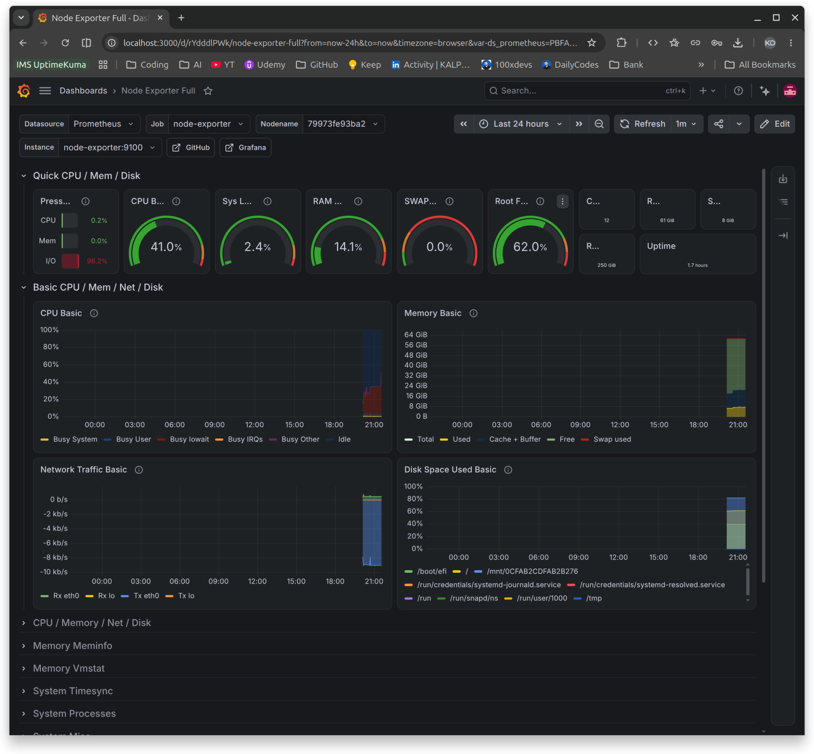

# Day 74 — Node Exporter, cAdvisor, and Grafana Dashboards

## Task 1: Node Exporter for Host Metrics

Added Node Exporter to `docker-compose.yml` to expose host-level Linux metrics (CPU, memory, disk, network) with read-only mounts of `/proc`, `/sys`, and `/` from the host.

```yaml
node-exporter:
  image: prom/node-exporter:latest
  container_name: node-exporter
  ports:
    - "9100:9100"
  volumes:
    - /proc:/host/proc:ro
    - /sys:/host/sys:ro
    - /:/rootfs:ro
  command:
    - "--path.procfs=/host/proc"
    - "--path.sysfs=/host/sys"
    - "--path.rootfs=/rootfs"
    - "--collector.filesystem.mount-points-exclude=^/(sys|proc|dev|host|etc)($$|/)"
  restart: unless-stopped
```

Scrape config added to `prometheus.yml`:

```yaml
scrape_configs:
  - job_name: "prometheus"
    static_configs:
      - targets: ["localhost:9090"]

  - job_name: "node-exporter"
    static_configs:
      - targets: ["node-exporter:9100"]
```

Verified via `curl http://localhost:9100/metrics` and confirmed `UP` on the Prometheus Targets page.

---

## Task 2: cAdvisor for Container Metrics

Added cAdvisor to monitor per-container resource usage via Docker socket and cgroup access.

```yaml
cadvisor:
  image: gcr.io/cadvisor/cadvisor:latest
  container_name: cadvisor
  ports:
    - "8080:8080"
  volumes:
    - /var/run/docker.sock:/var/run/docker.sock:ro
    - /sys:/sys:ro
    - /var/lib/docker/:/var/lib/docker:ro
  restart: unless-stopped
```

Scrape config added to `prometheus.yml`:

```yaml
- job_name: "cadvisor"
  static_configs:
    - targets: ["cadvisor:8080"]
```

Verified via the cAdvisor UI at `http://localhost:8080` and confirmed `UP` on Prometheus Targets.

### Node Exporter vs cAdvisor — difference and when to use each

|               | Node Exporter                      | cAdvisor                                |
| ------------- | ---------------------------------- | --------------------------------------- |
| Scope         | Host machine (the whole server/VM) | Individual Docker containers            |
| Data source   | Linux kernel via `/proc`, `/sys`   | Container cgroups via Docker socket     |
| Answers       | "How busy is this server overall?" | "Which container is causing that load?" |
| Metric prefix | `node_*`                           | `container_*`                           |

They're complementary: Node Exporter tells you the host is under memory pressure; cAdvisor tells you exactly which container is responsible. Both are run together in production observability stacks.

**Environment-specific note:** on this system cAdvisor reports containers under **cgroup v2**, so the `id` label follows the pattern `/system.slice/docker-<hash>.scope` rather than the older `/docker/<hash>` format. Queries and dashboard panels were filtered using `id=~".*docker.*scope"` instead of the commonly-documented `{name!=""}`, since the `name` label was not populated on this cAdvisor build.

---

## Task 3: Grafana Setup

Deployed Grafana and connected it to Prometheus as a datasource.

```yaml
  grafana:
    image: grafana/grafana-enterprise:latest
    container_name: grafana
    ports:
      - "3000:3000"
    volumes:
      - grafana_data:/var/lib/grafana
      - ./grafana/provisioning:/etc/grafana/provisioning
    environment:
      - GF_SECURITY_ADMIN_USER=admin
      - GF_SECURITY_ADMIN_PASSWORD=admin123
    restart: unless-stopped

volumes:
  prometheus_data:
  grafana_data:
```

Datasource added via **Connections → Data Sources → Prometheus**, URL set to `http://prometheus:9090` (Docker service name, not `localhost`, since Grafana resolves other services over the internal Docker network). Confirmed with "Successfully queried the Prometheus API."

---

## Task 4: Custom Dashboard — "DevOps Observability Overview"

Built a 5-panel dashboard covering host and container health at a glance.

| Panel                 | Type        | Query                                                                                                  |
| --------------------- | ----------- | ------------------------------------------------------------------------------------------------------ |
| CPU Usage %           | Gauge       | `100 - (avg(rate(node_cpu_seconds_total{mode="idle"}[5m])) * 100)`                                     |
| Memory Usage %        | Gauge       | `(1 - node_memory_MemAvailable_bytes / node_memory_MemTotal_bytes) * 100`                              |
| Container CPU Usage   | Time series | `rate(container_cpu_usage_seconds_total{id=~".*docker.*scope"}[5m]) * 100`                             |
| Container Memory (MB) | Time series | `container_memory_usage_bytes{id=~".*docker.*scope"} / 1024 / 1024`                                    |
| Disk Usage %          | Stat        | `(1 - node_filesystem_avail_bytes{mountpoint="/"} / node_filesystem_size_bytes{mountpoint="/"}) * 100` |


---

## Task 5: Datasource Provisioning via YAML

Created `grafana/provisioning/datasources/datasources.yml`:

```yaml
apiVersion: 1

datasources:
  - name: Prometheus
    type: prometheus
    access: proxy
    url: http://prometheus:9090
    isDefault: true
    editable: false
```

Mounted into the Grafana container via `./grafana/provisioning:/etc/grafana/provisioning`. After restarting Grafana, the Prometheus datasource appeared automatically with no manual UI setup.

### Why provisioning beats manual UI configuration

Grafana containers are disposable — if the container is recreated, any datasource added by hand through the UI is lost unless it happens to be in the persisted volume. Provisioning via YAML makes the setup declarative and reproducible: the config lives in version control next to the compose file, a fresh Grafana instance configures itself automatically on startup, and rebuilding the stack (or onboarding a new environment) requires zero manual clicks. Same infrastructure-as-code principle already applied to Terraform and Ansible, applied here to dashboard config.

---

## Task 6: Community Dashboards

Imported **ID 1860 (Node Exporter Full)** — dozens of pre-built panels covering CPU, memory, disk, and network, built on the same `node_*` metrics queried manually in Task 1.



Also attempted **ID 193 (Docker Monitoring via cAdvisor)** — this dashboard's default panels rely on the `name` label, which is not populated by cAdvisor on this cgroup v2 setup, so most panels showed no data out of the box. Noted as an environment-specific limitation rather than a stack misconfiguration (confirmed by the fact the custom dashboard's container panels work correctly once the `id`-based filter was used instead).

---

## Stack Verification

```
docker compose ps
```


All services running: `prometheus`, `node-exporter`, `cadvisor`, `grafana`, `notes-app`.

Prometheus Targets page confirmed `prometheus`, `node-exporter`, and `cadvisor` all `UP`.

---

## Key Learnings

- Exporters expose metrics passively; Prometheus pulls (scrapes) from them — nothing is pushed.
- Grafana talks to Prometheus over the Docker internal network by service name, not `localhost`.
- Counter metrics (`*_total`) need `rate()` to become meaningful rates rather than ever-growing totals.
- cAdvisor's label set is not universal across cgroup versions — cgroup v2 systems need `id`-based filters (`id=~".*docker.*scope"`) instead of the commonly-documented `name` label, which affects both custom queries and imported community dashboards.
