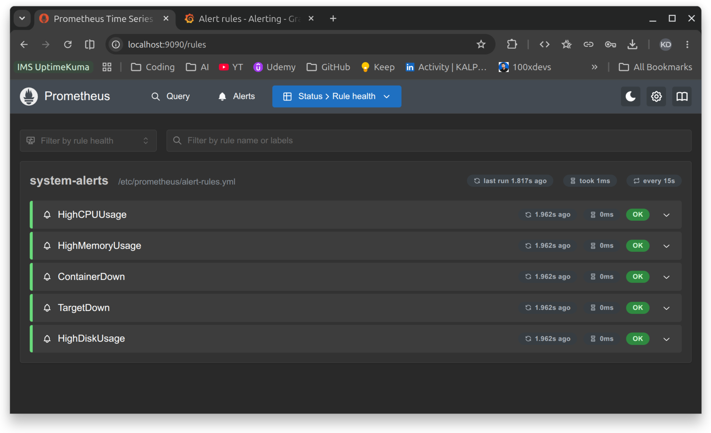

# Day 76 — OpenTelemetry and Alerting

## Task 1: Understanding OpenTelemetry

**What is OpenTelemetry (OTEL)?**
A vendor-neutral, open-source framework for generating, collecting, and exporting telemetry data — metrics, logs, and traces. OTEL itself is not a storage backend; it standardizes how telemetry is produced and shipped, then hands it off to backends like Prometheus, Loki, Jaeger, Tempo, or Datadog.

**What is the OTEL Collector?**
A standalone service sitting between applications and backends, built around a three-stage pipeline:

- **Receivers** — accept incoming telemetry (OTLP, Prometheus, Jaeger formats)
- **Processors** — transform data in-flight (batching, filtering, sampling)
- **Exporters** — forward data to one or more backends (Prometheus, debug console, Jaeger)

**What is OTLP?**
OpenTelemetry Protocol — the standard wire format for sending telemetry to a collector. Supports gRPC (port 4317) and HTTP (port 4318).

**What are distributed traces?**
A trace follows a single request as it moves through multiple services. Each hop is a **span**, carrying a trace ID, span ID, parent span ID, start time, duration, and attributes. Example: a user request through API Gateway → Auth Service → Database produces three linked spans under one trace.

---

## Task 2: OTEL Collector Setup

`otel-collector/config.yaml`:

```yaml
receivers:
  otlp:
    protocols:
      grpc:
        endpoint: 0.0.0.0:4317
      http:
        endpoint: 0.0.0.0:4318

processors:
  batch:

exporters:
  prometheus:
    endpoint: "0.0.0.0:8889"
  debug:
    verbosity: detailed

service:
  pipelines:
    metrics:
      receivers: [otlp]
      processors: [batch]
      exporters: [prometheus]
    traces:
      receivers: [otlp]
      processors: [batch]
      exporters: [debug]
    logs:
      receivers: [otlp]
      processors: [batch]
      exporters: [debug]
```

**Explanation:**

- **Receivers** accept OTLP data over gRPC (4317) and HTTP (4318) — covers both application SDKs and manual curl-based testing.
- **Processors** batch spans/metrics/logs before export, cutting network overhead versus sending one item at a time.
- **Exporters** split by signal type: metrics go to a Prometheus-scrapeable endpoint on :8889; traces and logs go to `debug`, printing to the collector's stdout — in production these would go to Jaeger or Tempo instead.

Added as a service in `docker-compose.yml` (ports 4317/4318/8889, volume-mounted config directory) and as a scrape target in `prometheus.yml` (`otel-collector:8889`).

**[SCREENSHOT: Prometheus Targets page showing otel-collector UP]**

> **Gotcha hit:** Bind-mounting a single config file onto the NTFS-mounted (DrvFs) project drive failed with a `not a directory` mount error from the container runtime. Fixed by mounting the whole `otel-collector/` directory instead of a single file, and naming the file `config.yaml` to match the collector's default lookup path.

---

## Task 3: Test Traces & Metrics

Sent a sample OTLP trace via curl to `http://localhost:4318/v1/traces` with a `test-span` under service name `my-test-service`. Collector responded `{"partialSuccess":{}}`, confirming zero rejected spans.


Sent a sample OTLP metric (`test_requests_total`, value 42) via curl to `http://localhost:4318/v1/metrics`. Queried in Prometheus and confirmed the value flowed through end-to-end:

```
test_requests_total{exported_job="my-test-service", instance="otel-collector:8889", job="otel-collector"}  42

```


Data path verified: curl → OTEL Collector (OTLP receiver) → Prometheus exporter (:8889) → Prometheus scrape → queryable metric. This is the bridge OTEL provides between arbitrary telemetry sources and existing backends.

---

## Task 4: Prometheus Alerting Rules

`alert-rules.yml` (placed alongside `prometheus.yml` and `docker-compose.yml`):

```yaml
groups:
  - name: system-alerts
    rules:
      - alert: HighCPUUsage
        expr: 100 - (avg(rate(node_cpu_seconds_total{mode="idle"}[5m])) * 100) > 80
        for: 2m
        labels:
          severity: warning
        annotations:
          summary: "High CPU usage detected"
          description: "CPU usage has been above 80% for more than 2 minutes. Current value: {{ $value }}%"

      - alert: HighMemoryUsage
        expr: (1 - node_memory_MemAvailable_bytes / node_memory_MemTotal_bytes) * 100 > 85
        for: 2m
        labels:
          severity: warning
        annotations:
          summary: "High memory usage detected"
          description: "Memory usage is above 85%. Current value: {{ $value }}%"

      - alert: ContainerDown
        expr: absent(container_last_seen{name="notes-app"})
        for: 1m
        labels:
          severity: critical
        annotations:
          summary: "Container is down"
          description: "The notes-app container has not been seen for over 1 minute"

      - alert: TargetDown
        expr: up == 0
        for: 1m
        labels:
          severity: critical
        annotations:
          summary: "Scrape target is down"
          description: "{{ $labels.job }} target {{ $labels.instance }} is unreachable"

      - alert: HighDiskUsage
        expr: (1 - node_filesystem_avail_bytes{mountpoint="/"} / node_filesystem_size_bytes{mountpoint="/"}) * 100 > 90
        for: 5m
        labels:
          severity: critical
        annotations:
          summary: "Disk space running low"
          description: "Root filesystem usage is above 90%. Current value: {{ $value }}%"
```

**Per-alert explanation:**

- **HighCPUUsage** — fires when average idle-mode CPU drops below 20% (i.e. usage > 80%) for 2 minutes straight.
- **HighMemoryUsage** — fires when available memory falls below 15% of total for 2 minutes.
- **ContainerDown** — uses `absent()` to detect when the `notes-app` container's metrics series disappears entirely, meaning the container isn't reporting (likely stopped/crashed).
- **TargetDown** — Prometheus's own `up` metric hits 0 for any scrape target, meaning that endpoint is unreachable.
- **HighDiskUsage** — root filesystem usage crosses 90%, held for 5 minutes to avoid noise from transient spikes.

`for:` on each rule is the pending period — the condition must hold continuously before the alert moves from `pending` to `firing`, which prevents flapping on brief spikes.

Wired into `prometheus.yml` via `rule_files:` and mounted into the `prometheus` service in `docker-compose.yml`.



**Live test:** Stopped `notes-app` (`docker compose stop notes-app`), waited ~2 minutes, and watched `TargetDown` transition to `firing`.


Restarted the container afterward (`docker compose start notes-app`) to restore normal state.

---

## Task 5: Grafana Alerts

- **Contact point** — created "DevOps Team" under Alerting → Contact points, using email integration.
- **Alert rule** — "High Container Memory": query `container_memory_usage_bytes{name="notes-app"} / 1024 / 1024`, condition IS ABOVE 100 (fires above 100MB), evaluated every 1m with a 2m pending period, labeled `severity=warning`, routed to the DevOps Team contact point.
- **Notification policy** — default policy routes to DevOps Team; added a nested policy matching `severity=critical` for critical-path alerts.


**Prometheus alerts vs. Grafana alerts:**
Prometheus alerting rules are evaluated by Prometheus itself and shown in its own UI, but Prometheus alone doesn't send notifications — that requires a separate Alertmanager instance for routing to email/Slack/PagerDuty. Grafana alerting evaluates rules against any connected data source (not just Prometheus) and has notification routing built in out of the box, making it the faster path to actual notifications without standing up Alertmanager separately. In practice: use Prometheus rules for infrastructure-level conditions tightly coupled to PromQL and metrics you already scrape; use Grafana alerting when you want a single place to manage notification channels across multiple data sources, or when you don't want to run Alertmanager.

---

## Task 6: Full Stack Architecture

```
                    METRICS PIPELINE
[Node Exporter] -----> [Prometheus] -----> [Grafana Dashboards]
[cAdvisor] ----------> [Prometheus] -----> [Grafana Dashboards]
[OTEL Collector:8889]> [Prometheus] -----> [Grafana Dashboards]
                                    -----> [Alert Rules -> Notifications]

                    LOGS PIPELINE
[Docker Containers] -> [Promtail] -> [Loki] -> [Grafana Explore/Dashboards]

                    TRACES PIPELINE
[curl/App OTLP] -----> [OTEL Collector] -> [Debug Output / Future: Jaeger/Tempo]
```

| Service        | Port           | Purpose                      |
| -------------- | -------------- | ---------------------------- |
| Prometheus     | 9090           | Metrics storage and querying |
| Node Exporter  | 9100           | Host system metrics          |
| cAdvisor       | 8080           | Container metrics            |
| Grafana        | 3000           | Visualization and alerting   |
| Loki           | 3100           | Log storage                  |
| Promtail       | 9080           | Log collection agent         |
| OTEL Collector | 4317/4318/8889 | Telemetry collection         |
| Notes App      | 8000           | Sample application           |

All 8 containers verified healthy and running via `docker compose ps`.

---

## Key Takeaways

- All three observability pillars — metrics, logs, traces — are now wired into a single stack, sharing Grafana as the common visualization layer.
- OTEL's receiver/processor/exporter model decouples telemetry collection from telemetry storage, so backends can be swapped without touching instrumentation.
- Alerting has two layers with different strengths: Prometheus rules for PromQL-native conditions, Grafana for cross-source notification routing without needing Alertmanager.
- Debugged a DrvFs (NTFS-mount) single-file bind-mount failure — same underlying class of issue as the earlier Terraform registry bug — resolved by mounting a directory instead of a file.
