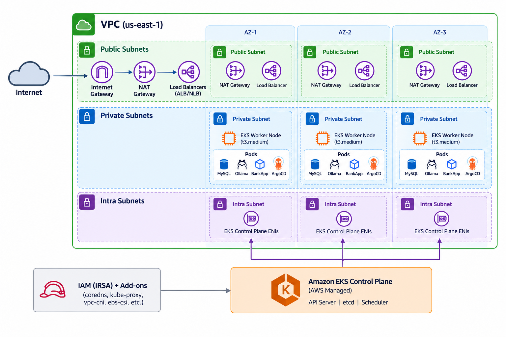

# Day 81 — Introduction to Amazon EKS with Terraform

## Task 1: EKS Architecture

**Managed Kubernetes** means AWS operates and owns the **control plane** — API server, etcd, scheduler, controller manager — including its upgrades, patching, and multi-AZ high availability. I remain responsible for the **data plane**: the worker nodes where my pods actually run.

**EKS components:**

- **EKS Control Plane** — managed by AWS, runs in an AWS-owned VPC, reachable through an API endpoint
- **Node Groups** — the compute layer for pods
  - _Managed Node Groups_ — AWS handles provisioning, scaling, and updates (used here)
  - _Self-Managed Nodes_ — I manage the EC2 instances directly
  - _Fargate Profiles_ — serverless, no nodes to manage
- **VPC and Networking** — EKS runs inside my own VPC, spanning subnets across multiple AZs
- **IAM Integration** — IAM roles control both cluster access and pod-level permissions via IRSA (IAM Roles for Service Accounts)

**Add-ons used by AI-BankApp:**
| Add-on | Purpose |
|---|---|
| `coredns` | In-cluster DNS resolution |
| `kube-proxy` | Network routing for Services |
| `vpc-cni` | Assigns VPC IPs directly to pods |
| `eks-pod-identity-agent` | Enables pod-level IAM roles |
| `aws-ebs-csi-driver` | Lets pods use EBS volumes (MySQL, Ollama storage) |
| `metrics-server` | Powers `kubectl top` and HPA |

### Architecture



VPC → Subnets (public/private/intra) → EKS Control Plane (AWS-managed) → Managed Node Group → Pods.

---

## Task 2: Terraform Configuration

Repo: [AI-BankApp-DevOps](https://github.com/TrainWithShubham/AI-BankApp-DevOps), branch `feat/gitops`, `terraform/` directory.

- **`variables.tf` / `terraform.tfvars`** — input defaults: region, cluster name, Kubernetes version, node instance type/count. I set `aws_region = "us-east-1"` and `cluster_version = "1.36"` for this run (repo defaults were `us-west-2` / `1.35`).
- **`vpc.tf`** — builds the network foundation using the `terraform-aws-modules/vpc/aws` module: 3 AZs, public subnets (LB-tagged), private subnets (node-tagged), intra subnets (control-plane ENIs), plus a NAT Gateway for outbound access from private subnets.
- **`eks.tf`** — provisions the cluster itself via `terraform-aws-modules/eks/aws` (~> 21.0): AL2023 AMI nodes, managed node group (3–5x t3.medium), all 6 add-ons, IRSA for the EBS CSI driver, public + private API endpoint access.
- **`argocd.tf`** — installs ArgoCD via the `argo-cd` Helm chart, exposed as a LoadBalancer Service, created after the EKS module so it targets a ready cluster.
- **`outputs.tf`** — surfaces the `aws eks update-kubeconfig` command and the ArgoCD initial-password retrieval command.

### Terraform module compatibility fixes made

During `terraform init`, the pinned `terraform-aws-modules/iam/aws` module (`~> 6.0`) resolved to v6.8.1, which had renamed the IRSA submodule from `iam-role-for-service-accounts-eks` to `iam-role-for-service-accounts`, and renamed the `role_name` argument to `name`, and the output `iam_role_arn` to `arn`. Updated `eks.tf` accordingly to match the current module API before the plan would validate.

---

## Task 3: Provisioning the Cluster

`terraform init` → `terraform plan` (84 resources to add, 0 to change, 0 to destroy) → `terraform apply`.


_`terraform apply` completing successfully._

---

## Task 4: Connecting to the Cluster

```bash
aws eks update-kubeconfig --name bankapp-eks --region us-east-1
```


_3 nodes `Ready`, `t3.medium`, spread across 3 AZs in `us-east-1`._


_All 6 EKS add-ons running in `kube-system`._


_ArgoCD accessible via its LoadBalancer URL, logged in as `admin`._

### AWS Console confirmation


_EKS Console — `bankapp-eks`, status `Active`, version `1.36`, region `us-east-1`._

---

## Task 5: Deploying the AI-BankApp Manually

Applied all manifests from `k8s/` in order (namespace → PV/PVC → configmap/secrets → MySQL → Ollama → BankApp → HPA).


_`kubectl get pvc -n bankapp` — 5Gi and 10Gi PVCs `Bound` to EBS volumes._


_AI-BankApp login page, reached via `kubectl port-forward svc/bankapp-service -n bankapp 8080:8080` at `localhost:8080`._


_`kubectl get hpa -n bankapp` — HPA active with current/target metrics._

---

## Task 6: Costs and Clean-Up

**Clean-up:** deleted the BankApp workload (`kubectl delete -f k8s/...`) to keep the cluster available for Days 82–83; full teardown via `terraform destroy` planned for end of Day 83.

## 

## ArgoCD Access

- **URL:** LoadBalancer hostname from `kubectl get svc -n argocd argocd-server -o jsonpath='{.status.loadBalancer.ingress[0].hostname}'`
- **Login:** `admin` / password retrieved via `kubectl -n argocd get secret argocd-initial-admin-secret -o jsonpath="{.data.password}" | base64 -d`
- **Status:** Confirmed accessible and logged in successfully — see screenshot above.

---

`#90DaysOfDevOps` `#DevOpsKaJosh` `#TrainWithShubham`
