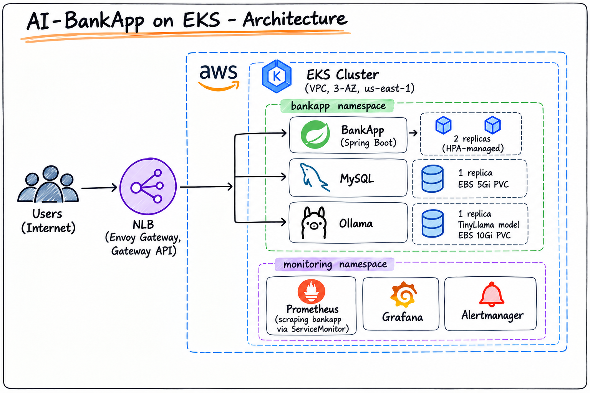
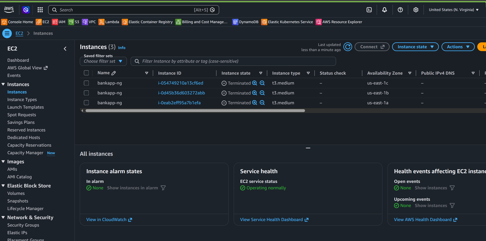
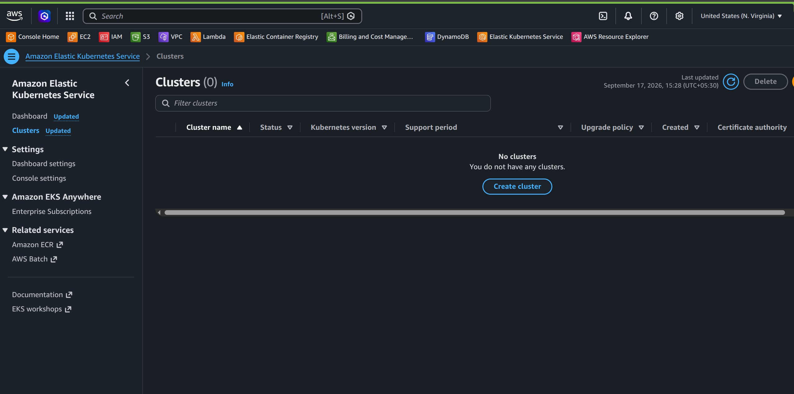
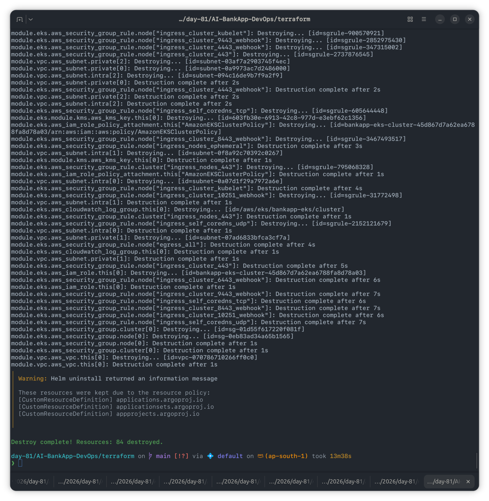
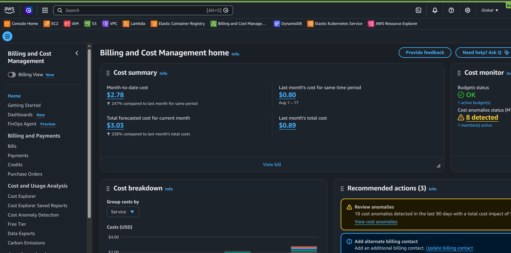

# Day 83 — EKS Project: Production Deployment of AI-BankApp

**Region:** us-east-1 | **Cluster:** bankapp-eks | **Reference repo:** [AI-BankApp-DevOps](https://github.com/TrainWithShubham/AI-BankApp-DevOps) (`feat/gitops`)

## Navigation

- [Architecture](#architecture)
- [Task 1: Full Stack Deployment](#task-1-full-stack-deployment)
- [Task 2: Gateway API + App Access](#task-2-gateway-api--app-access)
- [Task 3: Monitoring Stack](#task-3-monitoring-stack)
- [Task 4: End-to-End Validation](#task-4-end-to-end-validation)
- [Task 5: Reflection — 3-Day EKS Journey](#task-5-reflection--3-day-eks-journey)
- [Task 6: Teardown](#task-6-teardown)
- [Troubleshooting Log](#troubleshooting-log)
- [Key Takeaways](#key-takeaways)
- [Cost Report](#cost-report)

---

## Architecture

VPC → EKS → Managed Node Group → Pods (bankapp / mysql / ollama) → Gateway API (Envoy) → NLB → Internet.



---

## Task 1: Full Stack Deployment

Deployed namespace, storage (PV/PVC), configmap/secrets, MySQL, Ollama, BankApp, and HPA in order, waiting on readiness conditions between dependency stages.


Result: MySQL (1/1), Ollama (1/1), BankApp (2/2, HPA-managed), 3 ClusterIP services.

---

## Task 2: Gateway API + App Access

Installed Envoy Gateway, applied `k8s/gateway.yml`, and resolved the NLB's external address for app access over HTTP.


Verified `/actuator/health` returned `UP` and the home page returned HTTP 200 once routed with the correct Host header.

---

## Task 3: Monitoring Stack

Deployed `kube-prometheus-stack` (Prometheus + Grafana + Alertmanager) via Helm and wired up a `ServiceMonitor` to scrape BankApp's `/actuator/prometheus` endpoint.


### PromQL queries used

```promql
# JVM memory usage (per pod)
jvm_memory_used_bytes{namespace="bankapp"}

# HTTP request rate
rate(http_server_requests_seconds_count{namespace="bankapp"}[5m])

# HTTP request latency (95th percentile)
histogram_quantile(0.95, rate(http_server_requests_seconds_bucket{namespace="bankapp"}[5m]))

# Aggregate JVM memory across all replicas
sum(jvm_memory_used_bytes{namespace="bankapp"})
```


---

## Task 4: End-to-End Validation

| Layer          | Check                                            | Result  |
| -------------- | ------------------------------------------------ | ------- |
| Application    | All pods running/ready                           | ✅ Pass |
| Application    | `/actuator/health` returns UP                    | ✅ Pass |
| Application    | HPA active, monitoring CPU                       | ✅ Pass |
| Application    | `/actuator/prometheus` reachable                 | ✅ Pass |
| Data           | MySQL responds to `mysqladmin ping`              | ✅ Pass |
| Data           | PVCs bound to EBS volumes                        | ✅ Pass |
| Data           | Ollama has TinyLlama model loaded                | ✅ Pass |
| Infrastructure | Nodes healthy (`kubectl get nodes`, `top nodes`) | ✅ Pass |
| Infrastructure | Gateway serving traffic                          | ✅ Pass |
| Infrastructure | Monitoring stack running                         | ✅ Pass |
| Security       | BankApp runs as non-root (`devsecops` user)      | ✅ Pass |
| Security       | Secrets not exposed in plain env output          | ✅ Pass |


---

## Task 5: Reflection — 3-Day EKS Journey

| Day | What Was Built                                                             | AI-BankApp Connection                                                                        |
| --- | -------------------------------------------------------------------------- | -------------------------------------------------------------------------------------------- |
| 81  | EKS cluster via Terraform, kubectl connection, manual deploy               | Provisioned VPC, EKS, node group, and 6 add-ons using the project's own `terraform/` configs |
| 82  | Gateway API, Envoy, TLS via cert-manager, EBS storage, session persistence | Used `k8s/gateway.yml` and `k8s/pv.yml` for routing and persistent state                     |
| 83  | Full production deployment, monitoring, validation                         | Complete stack: app + DB + AI + networking + observability, end-to-end validated             |

**What this setup includes:**

- Terraform-provisioned VPC (3-AZ), managed node group with autoscaling
- 6 EKS add-ons (CoreDNS, VPC CNI, kube-proxy, Pod Identity, EBS CSI, Metrics Server)
- Gateway API (Envoy) for traffic management, cert-manager for automated HTTPS
- EBS persistent storage for MySQL and Ollama, HPA scale-up/down policies
- Spring Boot Actuator + Prometheus metrics, init containers for dependency ordering

**What a real production deployment would add:**

- Route 53 + ExternalDNS (to avoid IP-embedded nip.io hostnames breaking on every NLB recreation)
- Network Policies for pod-to-pod isolation
- Pod Disruption Budgets for safe node draining
- External Secrets Operator for AWS Secrets Manager integration
- Automated MySQL backups to S3
- Log aggregation with Loki
- Multi-environment clusters (dev + prod)

---

## Task 6: Teardown

Deleted workloads (monitoring, Gateway, BankApp stack, Envoy Gateway) before destroying infrastructure, to ensure the NLB and EBS volumes provisioned by Kubernetes (not Terraform) were released cleanly — then ran `terraform destroy`.






---

## Troubleshooting Log

Real-world debugging encountered while recreating the stack from scratch in us-east-1:

1. **App unreachable (`000`/`404` on curl)** — the NLB needed a few minutes to finish target-health registration after `gateway.yml` was applied; premature curls failed with connection errors.
2. **HTTPS listener stuck `Invalid` (`NoReadyListeners`)** — cert-manager was not reinstalled after the cluster recreate, so the `bankapp-tls` secret referenced by the Gateway's TLS listener never existed. HTTP (port 80) worked independently since its listener didn't depend on the missing cert.
3. **Stale nip.io hostname (`404` on the correct NLB)** — `k8s/gateway.yml` hardcoded a nip.io hostname built from a _previous_ NLB's IP. A new NLB gets a new IP on every recreate, so the Gateway/HTTPRoute hostname had to be manually updated (`sed`) to match the current NLB IP before Envoy would route requests. Flagged as a structural gap — Route 53 + ExternalDNS would remove this manual step permanently.
4. **AI chatbot returning "Sorry, something went wrong"** — traced to TinyLlama's inference latency (~16s per response) on the `t3.medium` CPU nodes. Verified via Ollama's own request timing logs (`total time = 16109.13 ms`) that generation itself succeeded; the app-side timeout was the likely cause of the user-facing failure.
5. **Prometheus showing no `bankapp` targets (`up{namespace="bankapp"}` returning empty)** — root-caused as two combined Service misconfigurations: (a) `bankapp-service` had no labels at all, so it didn't match the ServiceMonitor's `selector.matchLabels: {app: bankapp}`; (b) the Service's port was unnamed, but the ServiceMonitor referenced the port by name (`"8080"`), which only matches a named port, not a port number. Fixed by labeling the Service (`app=bankapp`) and naming its port (`http`), then updating the ServiceMonitor's `endpoints.port` to reference `http`. This is a recurring pattern worth fixing at the source in `k8s/service.yml` rather than patching after every fresh deploy.

---

## Key Takeaways

- A full production-style stack (app + DB + AI + Gateway + HPA + monitoring) can be stood up and torn down repeatably on EKS, but **anything IP-derived (like nip.io hostnames) breaks on every cluster recreate** — this is exactly why real deployments use stable DNS (Route 53/ExternalDNS) instead.
- **Prometheus service discovery is label- and port-name-exact** — a Service missing labels or an unnamed port will silently produce zero scrape targets with no error anywhere in the chain, making this a easy, quiet failure mode to reproduce across different lab days unless the root manifests are fixed once.
- Debugging Kubernetes networking issues (Gateway API + NLB) benefits from separating **infrastructure readiness** (is the NLB registered, is the listener `Programmed`) from **application-layer routing** (Host header matching) — a `curl` failure can originate from either layer and looks identical from the outside.
- CPU-only LLM inference (TinyLlama on `t3.medium`) is viable for a demo AI chatbot but latency (~16s/response) is a real constraint that surfaces as a generic app-level error unless timeouts are tuned accordingly.
- Clean teardown order matters: delete Kubernetes-created resources (NLB, EBS volumes via PVCs) _before_ `terraform destroy`, since Terraform has no knowledge of resources it didn't provision.

---

## Cost Report

- **Infra:** 3x t3.medium EKS worker nodes + EKS control plane + NLB + EBS (5Gi + 10Gi) in us-east-1
- **Duration:** ~3 days (Day 81–83 EKS block)
- **Estimated cost:** $15–25 (per lab guidance), consistent with running the cluster only during active lab hours and tearing down between sessions where possible


---
