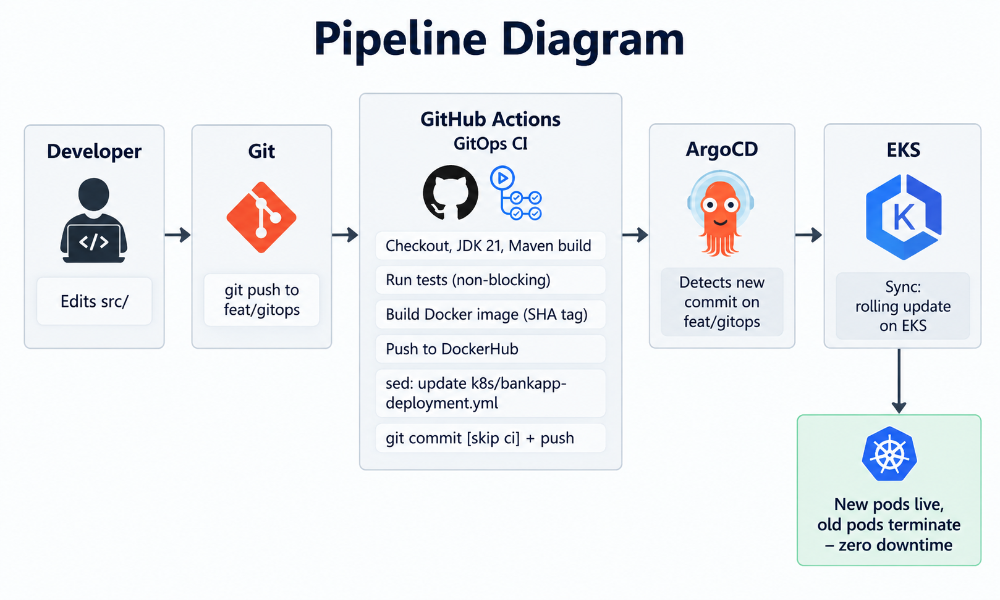

# Day 86 — GitOps Project: End-to-End CI/CD Pipeline with AI-BankApp

## Navigation

- [Overview](#overview)
- [Pipeline Diagram](#pipeline-diagram)
- [Task 1: GitHub Actions Workflow Explained](#task-1-github-actions-workflow-explained)
- [Task 2: Fork & Secrets Setup](#task-2-fork--secrets-setup)
- [Task 3: Full Pipeline Trigger](#task-3-full-pipeline-trigger)
- [Task 4: Drift Detection Results](#task-4-drift-detection-results)
- [Task 5: The Complete DevOps Pipeline Map](#task-5-the-complete-devops-pipeline-map)
- [Task 6: Teardown Verification](#task-6-teardown-verification)
- [Key Takeaways](#key-takeaways)

---

## Overview

Two days of ArgoCD groundwork (Day 84–85) came together today into a genuine, zero-touch GitOps loop: push code → GitHub Actions builds and pushes a Docker image → the pipeline commits the new image tag back to Git → ArgoCD detects the drift and rolls out the new version to EKS. No `kubectl apply`, no manual deploy step — just `git push`.

This day also turned into a real infrastructure debugging exercise on top of the assigned tasks — provisioning from scratch surfaced a chain of issues that don't show up in a guide, only in a live rebuild.

[↑ Back to top](#day-86--gitops-project-end-to-end-cicd-pipeline-with-ai-bankapp)

---

## Pipeline Diagram



[↑ Back to top](#day-86--gitops-project-end-to-end-cicd-pipeline-with-ai-bankapp)

---

## Task 1: GitHub Actions Workflow Explained

Studied `.github/workflows/gitops-ci.yml` — a single job (`build-and-push`) with sequential steps: checkout → JDK 21 setup → Maven build → tests (`continue-on-error: true`) → DockerHub login → build & push image (tagged with `git rev-parse --short HEAD`) → `sed`-patch the image tag into `k8s/bankapp-deployment.yml` → commit that change back with `[skip ci]` in the message.

The trigger is scoped to `push` on `feat/gitops` for paths `src/**`, `pom.xml`, `Dockerfile` only — deliberately excluding manifest changes, since the pipeline's own commit would otherwise re-trigger itself in an infinite loop. `[skip ci]` is the second half of that same guard.


---

## Task 2: Fork & Secrets Setup

- DockerHub access token created, `DOCKERHUB_USERNAME` / `DOCKERHUB_TOKEN` added as GitHub Secrets on the fork
- `DOCKERHUB_REPO` env var in the workflow pointed at `kalpeshdhotre/ai-bankapp-eks`
- ArgoCD Application's `repoURL` pointed at the fork (`https://github.com/kalpeshdhotre/AI-BankApp-DevOps.git`)

**Real issue hit here (not in the original task list):** the workflow file existed only on `feat/gitops`, never on the fork's default branch (`main`). GitHub only registers/discovers a workflow from commits on the default branch — a workflow living solely on a feature branch never appears in `gh workflow list` and never fires, no matter how many correct pushes land on that branch. Fixed by merging `gitops-ci.yml` onto `main` once, after which pushes to `feat/gitops` triggered normally.


[↑ Back to top](#day-86--gitops-project-end-to-end-cicd-pipeline-with-ai-bankapp)

---

## Task 3: Full Pipeline Trigger

Edited `src/main/resources/templates/fragments/layout.html` (page title), committed, pushed to `feat/gitops`.

**Pipeline run:** `GitOps CI - Build & Push to DockerHub` — completed in 2m 28s, `Status: Success`.

- Build, test, push ran cleanly (the one `exit code 1` annotation was the non-blocking test step — expected, doesn't fail the job)
- Image pushed as `kalpeshdhotre/ai-bankapp-eks:90f92ce`
- Manifest correctly patched: `image: kalpeshdhotre/ai-bankapp-eks:90f92ce` confirmed in `k8s/bankapp-deployment.yml`

**Real issue hit here:** the pipeline's own commit-back step raced against a manual `git push` happening at the same time — the bot's push was silently rejected (non-fast-forward), while the job still reported `Success` overall since the local commit itself succeeded even though the push after it didn't. The manifest content was correct either way once verified with `git diff HEAD`, so no rework was needed — just a reminder not to push manually while the pipeline is mid-run.

**Result:** ArgoCD detected the change, rolled a new ReplicaSet, old pods terminated, new pods came up on the new image tag — confirmed live at `https://<lb-ip>.nip.io` with the updated title. Full code-to-production loop, zero manual `kubectl` involvement.


[↑ Back to top](#day-86--gitops-project-end-to-end-cicd-pipeline-with-ai-bankapp)

---

## Task 4: Drift Detection Results

| Scenario           | Action                                   | Detection/Recovery time                                                     | Notes                                                                                                                                                                                                                                                                               |
| ------------------ | ---------------------------------------- | --------------------------------------------------------------------------- | ----------------------------------------------------------------------------------------------------------------------------------------------------------------------------------------------------------------------------------------------------------------------------------- |
| 1 — Scale down     | `kubectl scale --replicas=1`             | Pods returned automatically, but `Sync Status` never flipped to `OutOfSync` | Because `spec.replicas` was added to `ignoreDifferences` on the Application (fix for the Day 84 HPA-vs-selfHeal fight) — Argo's diff engine no longer treats replica drift as drift at all, though the Deployment controller / selfHeal reconciliation still restored the pod count |
| 2 — Image swap     | `kubectl set image ... nginx:latest`     | Reverted to Git's image within ArgoCD's sync window                         | Confirmed `OutOfSync` → `Synced`, pods restarted on the correct image                                                                                                                                                                                                               |
| 3 — Delete Service | `kubectl delete service bankapp-service` | Recreated from Git                                                          | Confirmed `OutOfSync` → `Synced`                                                                                                                                                                                                                                                    |

**If `selfHeal` were disabled:** drift in all three scenarios would sit permanently as `OutOfSync`/manual-fix-required — nothing self-corrects without an explicit `argocd app sync`.

**Key finding worth flagging:** `ignoreDifferences` is a trade-off, not a free fix. It solved the HPA/selfHeal fight from Day 84, but it also silently hides genuine replica-count drift from ArgoCD's own status reporting — Scenario 1 no longer demonstrates what it's meant to on this Application, even though the underlying self-healing (via the Deployment controller, not ArgoCD's diff) still technically occurs.


[↑ Back to top](#day-86--gitops-project-end-to-end-cicd-pipeline-with-ai-bankapp)

---

## Task 5: The Complete DevOps Pipeline Map

```
[Developer writes code]
    |
[Git push to GitHub]  ........... Day 22-28: Git & GitHub
    |
[GitHub Actions CI]   ........... Day 40-49: GitHub Actions
    |-- Build with Maven
    |-- Run tests
    |-- Build Docker image  ..... Day 29-37: Docker
    |-- Push to DockerHub
    |-- Update K8s manifest
    |-- Commit back to Git
    |
[ArgoCD detects change] ........ Day 84-86: GitOps
    |
[ArgoCD syncs to EKS]  ........ Day 81-83: EKS
    |-- Rolling update
    |-- Health checks pass
    |-- HPA scales as needed ... Day 78-80: Helm (HPA, values)
    |
[Prometheus scrapes metrics] ... Day 73-77: Observability
    |-- Grafana dashboards
    |-- Alerts if something breaks
    |
[App is live with zero downtime]
```

Every module of the 90-day challenge feeds directly into this one loop.

[↑ Back to top](#day-86--gitops-project-end-to-end-cicd-pipeline-with-ai-bankapp)
[↑ Back to top](#day-86--gitops-project-end-to-end-cicd-pipeline-with-ai-bankapp)

---

## Task 6: Teardown Verification

Full teardown executed and re-run once today after an intentional mid-day reset (rebuilt from scratch to get a clean run of the full sequence — see Key Takeaways):

1. `argocd app delete bankapp --cascade -y` (+ monitoring/envoy-gateway/root-app where applicable)
2. `helm uninstall` for cert-manager and Envoy Gateway (non-Terraform-managed add-ons)
3. `terraform destroy` last

AWS Console confirmed clean: no EKS clusters, no EC2 instances/load balancers/EBS volumes, VPC removed, no lingering `bankapp-eks` IAM roles.

`[SCREENSHOT: AWS Console — EKS/EC2/LB lists empty]`
`[SCREENSHOT: terraform destroy completed output]`

[↑ Back to top](#day-86--gitops-project-end-to-end-cicd-pipeline-with-ai-bankapp)

---

## Key Takeaways

- **A GitOps pipeline is only as reliable as its write-back path.** The `sed` + `git commit [skip ci]` + `git push` sequence is the entire trust boundary between CI and CD — and it's exactly where today's real issues showed up: a workflow that never registered because it lived on the wrong branch, and a silent push race between the bot and a manual push.
- **`ignoreDifferences` is a scalpel, not a bandage.** It fixed the HPA/selfHeal fight cleanly, but it also quietly removes ArgoCD's visibility into that field entirely — worth being deliberate about which fields go in that list, since it changes what "drift" even means for the Application going forward.
- **PVC sync-wave ordering can deadlock itself.** A `WaitForFirstConsumer` StorageClass will never bind without a consuming pod — so gating that pod's Deployment behind the PVC's own health in an earlier sync wave creates a real chicken-and-egg lock, not a slow convergence. Moving both into the same wave let Kubernetes' native binding behavior do its job.
- **A rebuild from scratch surfaces failure modes a guide alone never catches** — install-order dependencies (cert-manager needing Envoy Gateway's CRDs first), region/CLI-default mismatches silently returning empty results instead of errors, and CRD annotation bloat from repeated `kubectl apply` — all things that don't show up until you actually tear down and rebuild the whole stack, which is the entire point of doing that exercise today.

`#90DaysOfDevOps` `#DevOpsKaJosh` `#TrainWithShubham`
